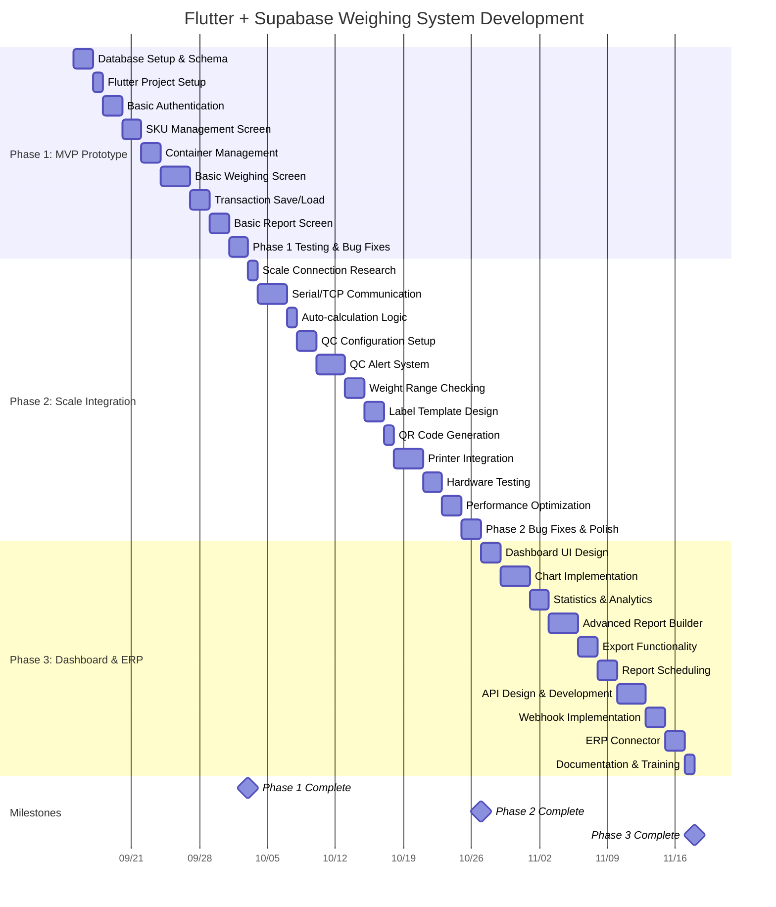
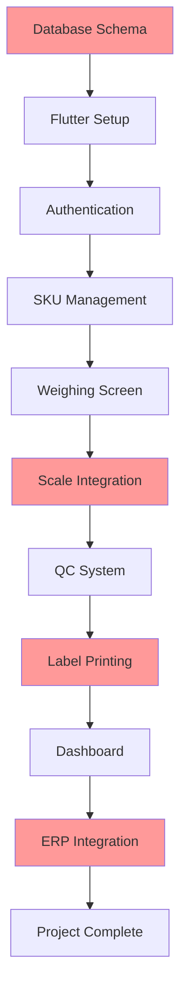
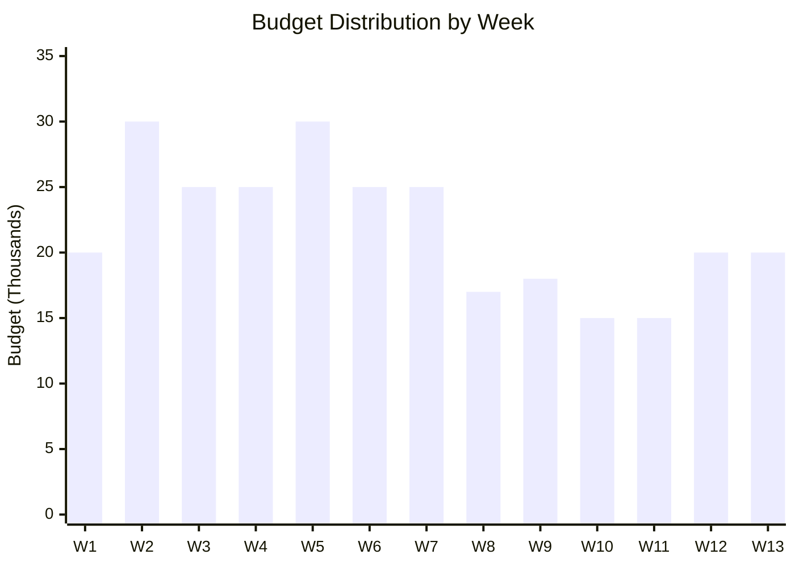

# Gantt Chart - Flutter + Supabase Weighing System

## 📊 Project Timeline Overview
- **Project Duration**: 13 weeks (65 working days)
- **Start Date**: Week 1 (September 15, 2025)
- **End Date**: Week 13 (December 8, 2025)
- **Total Budget**: 285,000 บาท

---

## 📅 Gantt Chart Visualization



---

## 📈 Phase-by-Phase Timeline

### 🎯 Phase 1: MVP Prototype (15 days - 3 weeks)
| Week | Days | Tasks | Deliverables |
|------|------|-------|--------------|
| **Week 1** | 1-5 | Database Setup + Flutter Setup + Auth | ✅ Working login system |
| **Week 2** | 6-10 | SKU Management + Container + Basic Weighing | ✅ Core weighing workflow |
| **Week 3** | 11-15 | Transaction Management + Basic Reports + Testing | ✅ MVP with basic features |

### ⚙️ Phase 2: Scale Integration & Labels (21 days - 4 weeks)
| Week | Days | Tasks | Deliverables |
|------|------|-------|--------------|
| **Week 4** | 16-20 | Scale Research + Communication + Auto-calc | ✅ Scale hardware connection |
| **Week 5** | 21-25 | QC Configuration + Alert System + Range Check | ✅ Quality control system |
| **Week 6** | 26-30 | Label Design + QR Generation + Printer | ✅ Label printing functionality |
| **Week 7** | 31-35 | Hardware Testing + Optimization + Polish | ✅ Stable hardware integration |

### 📊 Phase 3: Dashboard & ERP Integration (21 days - 6 weeks)
| Week | Days | Tasks | Deliverables |
|------|------|-------|--------------|
| **Week 8-9** | 36-45 | Dashboard Design + Charts + Analytics | ✅ Advanced dashboard |
| **Week 10-11** | 46-55 | Report Builder + Export + Scheduling | ✅ Comprehensive reporting |
| **Week 12-13** | 56-65 | API Development + ERP Integration + Docs | ✅ Complete system |

---

## 🔄 Critical Path Analysis



**Critical Path Items** (High Risk):
- 🔴 Database Schema Design
- 🔴 Scale Hardware Integration
- 🔴 Label Printing System
- 🔴 ERP API Development

---

## 📋 Weekly Breakdown with Dependencies

### Week 1 (Sep 15-19, 2025)
```
Mon: Database Schema Creation
Tue: Supabase Setup + Basic Tables
Wed: Flutter Project Init + Dependencies
Thu: Authentication UI + Logic
Fri: User Management + Roles
```

### Week 2 (Sep 22-26, 2025)
```
Mon: SKU Data Model + Repository
Tue: SKU List/Search UI
Wed: Container Management
Thu: Basic Weighing Screen Layout
Fri: Manual Weight Input + Calculation
```

### Week 3 (Sep 29 - Oct 3, 2025)
```
Mon: Transaction Save/Load Logic
Tue: Basic Report Screen
Wed: Data Validation + Error Handling
Thu: Unit Testing + Bug Fixes
Fri: Phase 1 Demo + Milestone Review
```

### Week 4 (Oct 6-10, 2025)
```
Mon: Scale Hardware Research
Tue-Wed: Serial/TCP Communication
Thu: Weight Reading Implementation
Fri: Auto-calculation Logic
```

### Week 5 (Oct 13-17, 2025)
```
Mon-Tue: QC Configuration System
Wed-Thu: QC Alert System
Fri: Weight Range Validation
```

### Week 6 (Oct 20-24, 2025)
```
Mon: Label Template Design
Tue: QR Code Generation
Wed-Thu: Printer Integration
Fri: Print Queue Management
```

### Week 7 (Oct 27-31, 2025)
```
Mon-Tue: Hardware Testing
Wed: Performance Optimization
Thu: Bug Fixes + Polish
Fri: Phase 2 Demo + Milestone Review
```

### Week 8-9 (Nov 3-14, 2025)
```
Week 8:
Mon-Tue: Dashboard UI Design
Wed-Fri: Chart Implementation

Week 9:
Mon-Tue: Statistics & Analytics
Wed-Fri: Dashboard Integration
```

### Week 10-11 (Nov 17-28, 2025)
```
Week 10:
Mon-Wed: Advanced Report Builder
Thu-Fri: Export Functionality

Week 11:
Mon-Tue: Report Scheduling
Wed-Fri: Report Testing
```

### Week 12-13 (Dec 1-12, 2025)
```
Week 12:
Mon-Wed: API Design & Development
Thu-Fri: Webhook Implementation

Week 13:
Mon-Tue: ERP Connector
Wed: Documentation
Thu: Training Materials
Fri: Final Demo + Project Handover
```

---

## ⚠️ Risk Timeline & Contingency

### High Risk Periods
| Week | Risk Factor | Contingency Plan | Extra Days |
|------|-------------|------------------|------------|
| **Week 4** | Scale Integration Complexity | Parallel research + vendor support | +2 days |
| **Week 6** | Printer Compatibility Issues | Multiple printer model testing | +2 days |
| **Week 12** | ERP API Complexity | Simplified API + documentation | +3 days |

### Buffer Time Distribution
- **Phase 1**: +1 day buffer (built-in)
- **Phase 2**: +2 days buffer (weeks 4-7)
- **Phase 3**: +2 days buffer (weeks 12-13)
- **Total Buffer**: 5 days

---

## 💰 Budget Distribution Timeline



### Phase Budget Timeline
- **Phase 1 (Weeks 1-3)**: 75,000 บาท (26.3%)
- **Phase 2 (Weeks 4-7)**: 105,000 บาท (36.8%)
- **Phase 3 (Weeks 8-13)**: 105,000 บาท (36.8%)

---

## 🎯 Milestone Checkpoints

### Milestone 1: MVP Complete (End of Week 3)
**Deliverables:**
- ✅ Working authentication system
- ✅ SKU and container management
- ✅ Basic weighing workflow
- ✅ Transaction logging
- ✅ Basic reporting

**Acceptance Criteria:**
- User can login and select SKU
- Manual weight input works
- Calculations are accurate
- Data saves to database

### Milestone 2: Hardware Integration (End of Week 7)
**Deliverables:**
- ✅ Scale hardware connection
- ✅ QC alert system
- ✅ Label printing functionality
- ✅ Complete weighing workflow

**Acceptance Criteria:**
- Scale reads weight automatically
- QC alerts trigger correctly
- Labels print with correct data
- Hardware is stable

### Milestone 3: Complete System (End of Week 13)
**Deliverables:**
- ✅ Advanced dashboard
- ✅ Comprehensive reporting
- ✅ ERP API integration
- ✅ Documentation and training

**Acceptance Criteria:**
- Dashboard shows real-time data
- Reports export successfully
- ERP integration works
- System is production-ready

---

## 📊 Resource Allocation

### Developer Time Distribution
```
Phase 1 (15 days):
- Frontend Development: 60%
- Backend/Database: 30%
- Testing: 10%

Phase 2 (21 days):
- Hardware Integration: 50%
- Frontend Development: 30%
- Testing: 20%

Phase 3 (21 days):
- Frontend Development: 40%
- API Development: 40%
- Documentation: 20%
```

### Technology Stack Timeline
| Week | Focus Technology | Key Components |
|------|------------------|----------------|
| 1-3 | Flutter + Supabase | UI + Database |
| 4-7 | Hardware Integration | Scale + Printer |
| 8-13 | Analytics + API | Charts + ERP |

---

## 🚀 Success Metrics & KPIs

### Weekly Progress Tracking
- **Completion Rate**: % of planned tasks completed
- **Budget Variance**: Actual vs planned spend
- **Quality Score**: Bug count + test coverage
- **Risk Level**: High/Medium/Low risk assessment

### Phase Success Criteria
1. **Phase 1**: Basic workflow demonstrates value
2. **Phase 2**: Hardware integration is stable
3. **Phase 3**: System ready for production deployment

---

**📅 Start Date**: September 15, 2025  
**🎯 End Date**: December 12, 2025  
**💰 Total Investment**: 285,000 บาท  
**🚀 Expected ROI**: Production-ready weighing system

---

*Note: This timeline assumes no major scope changes and standard working hours. Regular weekly reviews will help identify and address any deviations early.*