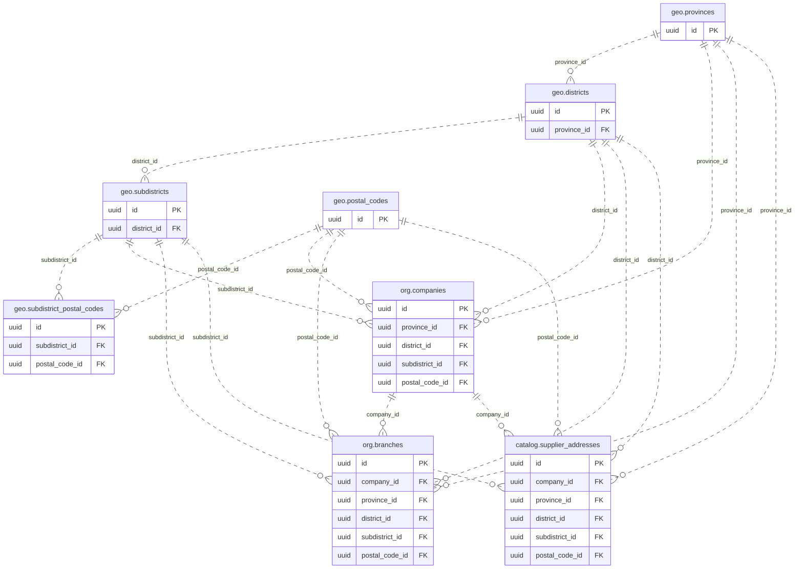
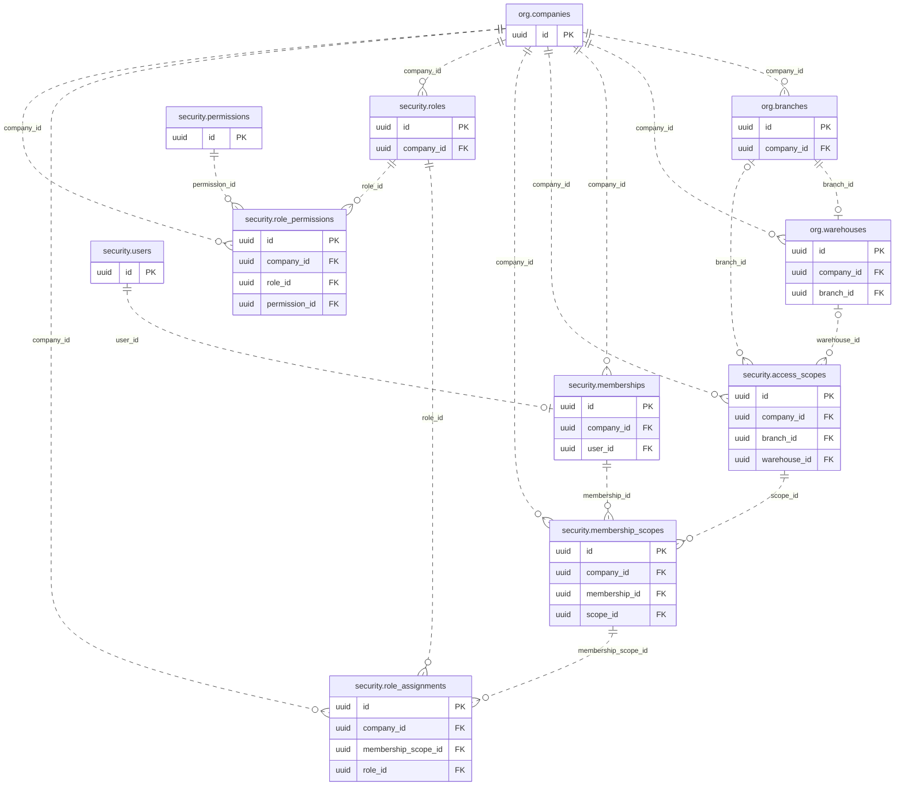
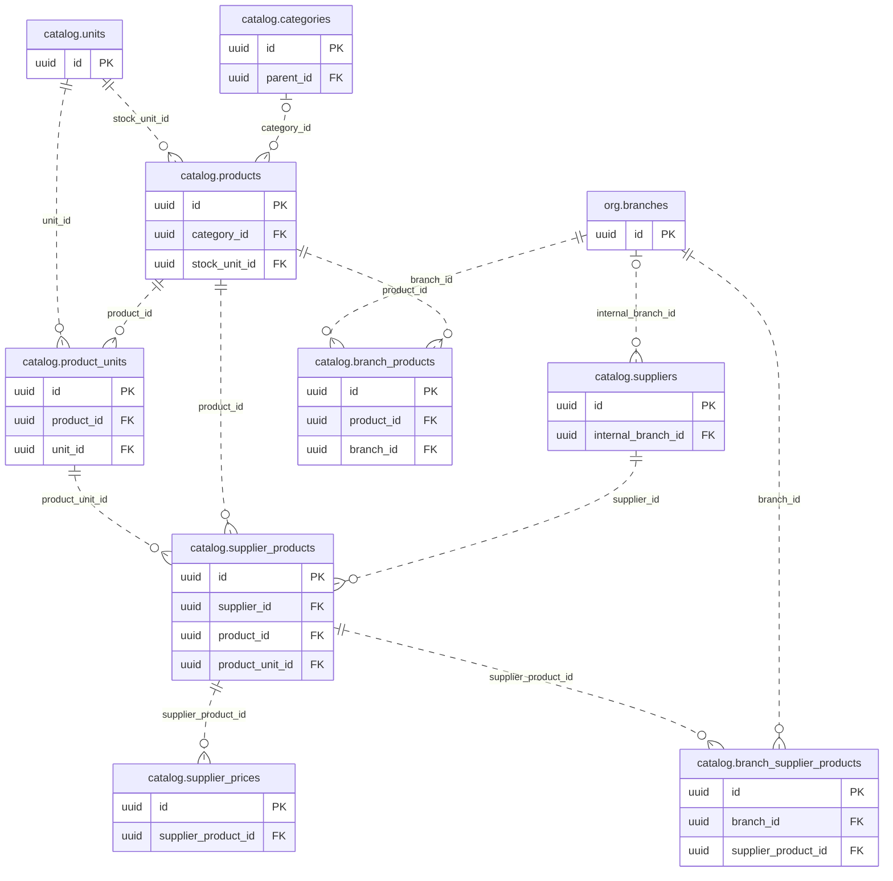
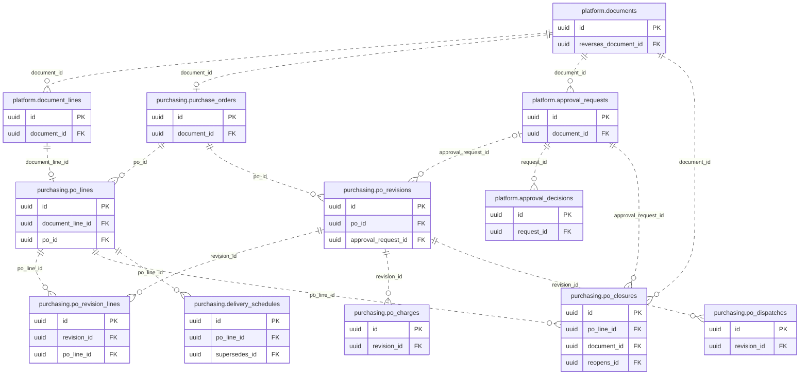
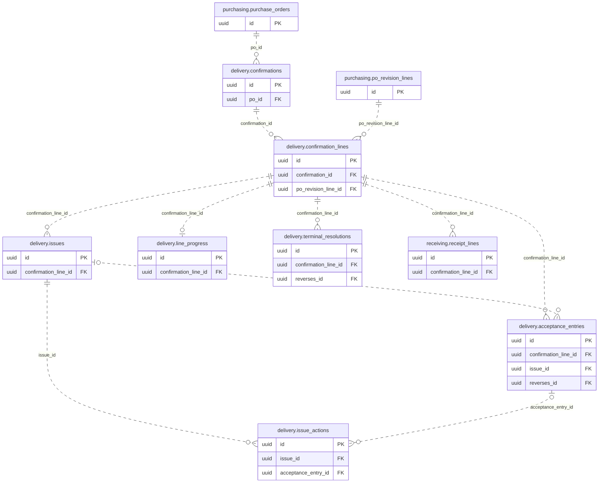
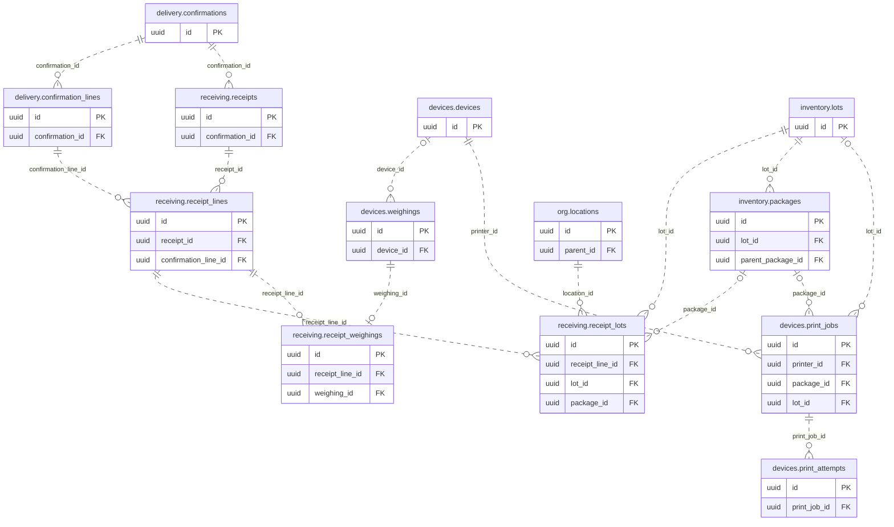
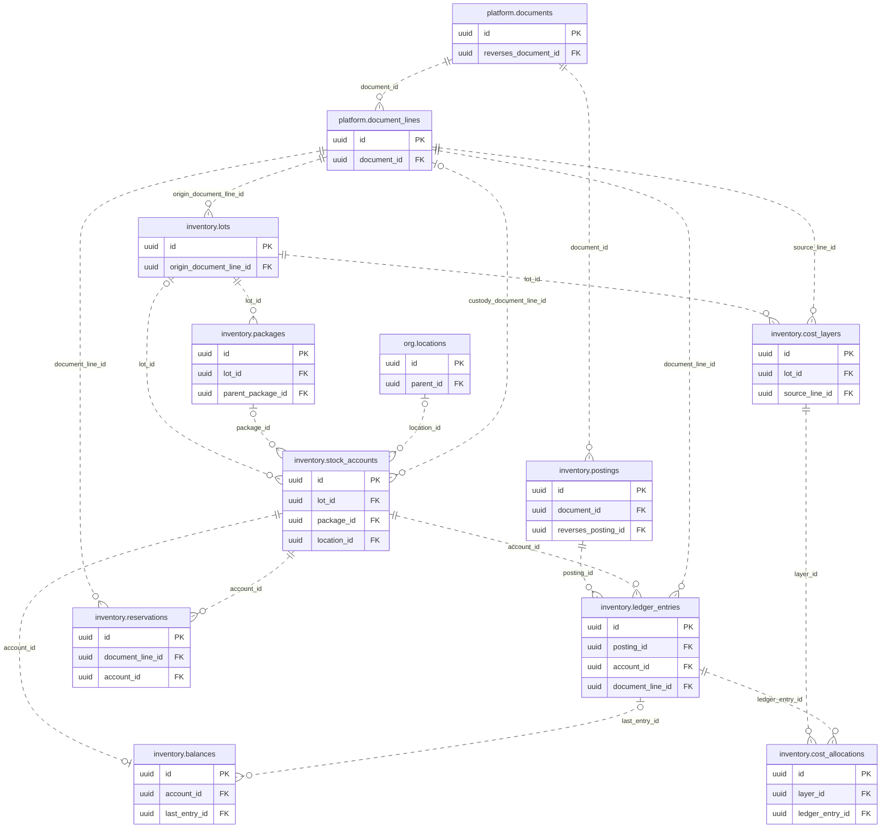
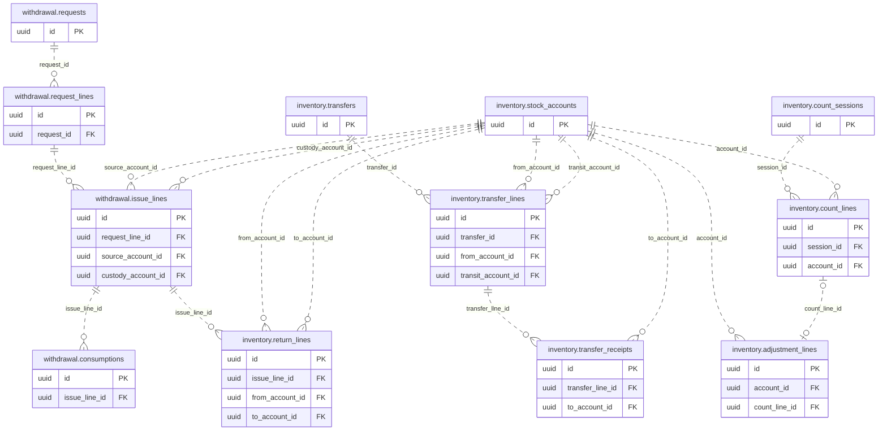
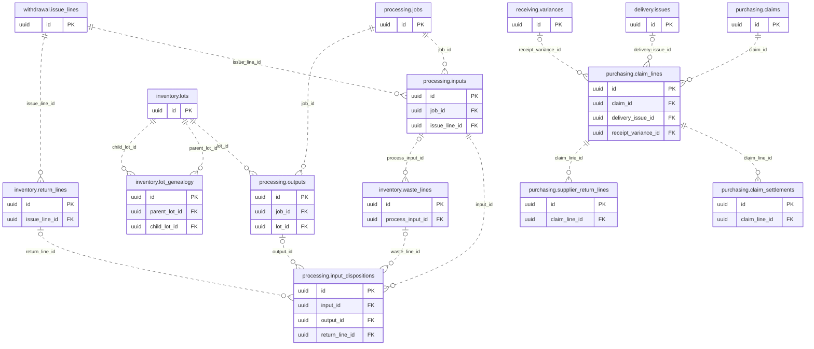
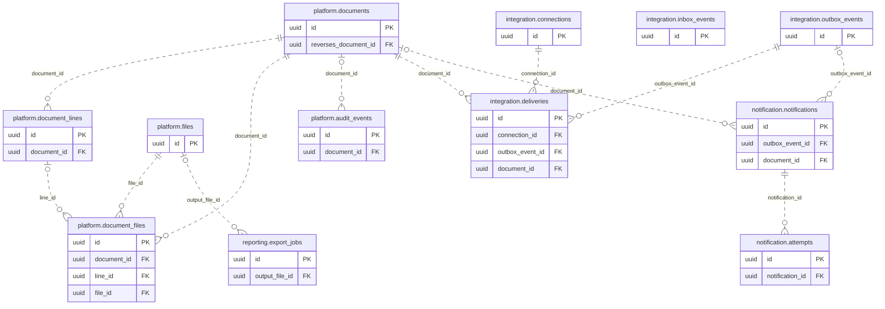

# 01 — Architecture และ ER Diagram

## 1. โครงสร้างฐานข้อมูล

PostgreSQL กลางหนึ่งฐานต่อ environment, schema แยกโดเมนใน Modular Monolith เดียว UAT และ Production แยกฐาน/credential/storage โดยเด็ดขาด Domain module เป็นเจ้าของการเขียนตารางของตน และเรียก application service ของอีกโมดูลเมื่อจำเป็นต้องทำ transaction ร่วมกัน

ชื่อฐานแนะนำ `hotpotman` (ชื่อ environment ใช้แยก instance/database configuration); schema ตาม catalog ไม่ใช้ `public` รวมทุกตาราง Prisma เป็น CRUD adapter ไม่เป็นขอบเขตสิทธิ์หรือกฎธุรกิจเพียงชั้นเดียว

| Schema | เจ้าของข้อมูล | เฟสเริ่ม |
|---|---|---|
| org | บริษัท สาขา คลัง Location จุดใช้งาน | F; Location/จุดใช้งาน W |
| security | User, Membership, Scope, Role, Permission, Session | F |
| platform | ทะเบียนเอกสาร ไฟล์ Setting Approval Audit | F/P |
| catalog | สินค้า หน่วย Supplier ราคาและรายการซื้อแต่ละสาขา | F/P |
| purchasing | PO/revision/line/ส่งเอกสาร/นัดส่ง/ปิดค้าง ราคา Claim | P; Claim O |
| delivery | ยืนยันส่งมอบ ปัญหา จำนวนยอมรับ และข้อมูลพร้อมเข้าคลัง | P |
| devices | Agent, Scale, Weighing, Printer และ Label | W |
| receiving | Warehouse Receipt, แบ่ง Lot, ข้อแตกต่างตอนชั่ง, OCR | W |
| inventory | Lot, Package, Account, Ledger, Balance, Count, Transfer, Return | W/O |
| withdrawal | ขอเบิก จ่ายออก เข้า custody และปิดใช้จริง | O |
| processing | แปรรูป Input/Output/Yield และการจัดสรรผล | O |
| integration | Mapping, Import, Outbox, Inbox, Idempotency, ส่งบัญชี | F/P/R |
| notification | กฎ เหตุการณ์แจ้งเตือน และประวัติส่ง | R |
| reporting | View/Materialized View, Export Jobs, refresh metadata | P/W/O/R ตาม source |

F = Foundation; P = จัดซื้อ/ยืนยันส่งมอบ Phase 1; W = ชั่งรับเข้าคลัง; O = งานคลังและแปรรูปต่อเนื่อง; R = รายงาน/เชื่อมต่อขั้นขยาย ลำดับนี้เป็น dependency ของ schema ไม่ได้เลื่อนรายงาน PO ที่ต้องมีใน Phase 1 ไปท้ายโครงการ

## 2. เส้นทางข้อมูลหลัก

- PurchaseOrder มี stable line identity และ immutable issued revisions ทำให้เอกสารส่งมอบอ้างรุ่นที่ถูกต้อง
- Delivery Confirmation เก็บสิ่งที่พบจริง ส่วน acceptance ledger เก็บจำนวนที่ “ยอมรับแล้ว” แยกจากข้อเท็จจริงและปัญหา
- Warehouse Receipt ใช้ส่วนที่ยอมรับแต่ยังไม่ถูกนำเข้าคลัง ชั่งน้ำหนักจริง แล้วเพิ่ม stock ledger เท่านั้น
- Lot ไม่มี `current_warehouse_id` เพราะ Lot เดียวอยู่หลายคลัง/Location ได้ ยอดปัจจุบันอยู่ stock account/balance
- Package/Barcode เป็นตัวระบุ physical trace; สแกนไม่ตัดสต็อกจนยืนยันธุรกรรม
- เบิกออกเข้า custody account ก่อน เพื่อรับคืนหรือส่งแปรรูปได้โดยไม่ตัดซ้ำ; สิ้นสุดการใช้จึงออก external consumption
- Document registry และ DocumentLine registry เป็น FK กลางสำหรับธุรกรรม/ไฟล์/Approval/Audit ไม่ใช้คู่ `type+id` ลอย ๆ เป็นหลักฐานสต็อก

## 3. ER Diagram

แผนภาพแบ่งกลุ่มเพื่ออ่านง่าย แสดงเฉพาะความสัมพันธ์แกนหลักและ PK/FK สำคัญ ไม่รวมทุกคอลัมน์หรือ every composite key ดู Data Dictionary/กฎประกอบสำหรับการบังคับบริษัทเดียวกัน ตารางข้างขวา `o{` คือศูนย์หรือหลายแถว; `||` คือหนึ่งแถว; `o|` คือไม่มีก็ได้แต่ถ้ามีต้องหนึ่งแถว

<!-- GENERATED_DIAGRAMS -->

### ที่อยู่และรหัสพื้นที่

[เปิดแผนภาพ SVG](erd/10-addresses.svg) · [Mermaid source](erd/10-addresses.mmd)

### องค์กร สมาชิก และสิทธิ์

[เปิดแผนภาพ SVG](erd/01-organization-access.svg) · [Mermaid source](erd/01-organization-access.mmd)

### สินค้า หน่วย Supplier และราคา

[เปิดแผนภาพ SVG](erd/02-catalog.svg) · [Mermaid source](erd/02-catalog.mmd)

### PO ที่มีรุ่นและการอนุมัติ

[เปิดแผนภาพ SVG](erd/03-purchasing.svg) · [Mermaid source](erd/03-purchasing.mmd)

### การยืนยันส่งมอบและปัญหา

[เปิดแผนภาพ SVG](erd/04-delivery.svg) · [Mermaid source](erd/04-delivery.mmd)

### ชั่งรับเข้าคลังและฉลาก

[เปิดแผนภาพ SVG](erd/05-receiving.svg) · [Mermaid source](erd/05-receiving.mmd)

### Ledger ต้นทุน และยอดคงเหลือ

[เปิดแผนภาพ SVG](erd/06-ledger.svg) · [Mermaid source](erd/06-ledger.mmd)

### โอน ตรวจนับ และเบิก

[เปิดแผนภาพ SVG](erd/07-operations.svg) · [Mermaid source](erd/07-operations.mmd)

### แปรรูป คืน Trace และ Claim

[เปิดแผนภาพ SVG](erd/08-processing-claims.svg) · [Mermaid source](erd/08-processing-claims.mmd)

### เอกสาร ไฟล์ Audit และระบบเบื้องหลัง

[เปิดแผนภาพ SVG](erd/09-platform.svg) · [Mermaid source](erd/09-platform.mmd)

<!-- END_GENERATED_DIAGRAMS -->

## 4. สิ่งที่ตั้งใจไม่ออกแบบเป็นระบบเต็ม

- POS โต๊ะ บิล การรับเงิน โปรโมชั่น สมาชิก CRM/HR และ Marketplace sales ไม่อยู่ใน HOTPOTMAN บรีพนี้
- ไม่ทำ General Ledger/AP/Payment engine; เก็บข้อมูล/ไฟล์อ้างอิงเพื่อส่งให้บัญชีผ่าน Integration
- ไม่ทำ Production Planning/BOM scheduling; Process Definition ใช้บันทึกงานและเกณฑ์ Yield เท่านั้น
- ไม่แยกฐานต่อบริษัทและไม่ใช้ database-per-branch; isolation ผ่าน composite FK, checked scope และแนวทาง RLS ที่กำหนดใน 03
- ไม่ออกแบบ distributed transaction ระหว่าง Microservices ในเฟสนี้ การ extract ภายหลังต้องมี migration plan และ local invariant ownership ใหม่
