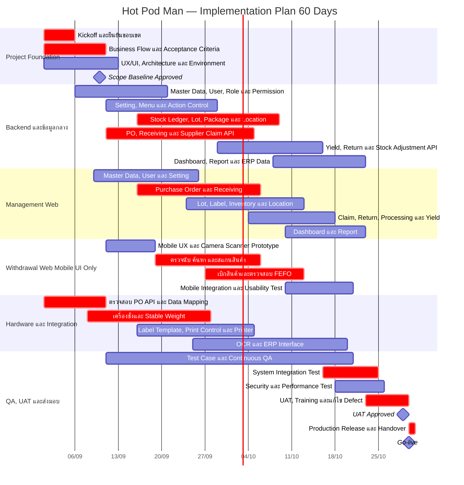

# Hot Pod Man — Gantt Chart 60 วัน

> **รูปแบบแผน:** Fast-track Implementation Plan
>
> **ระยะเวลา:** 1 กันยายน 2026 – 30 ตุลาคม 2026 รวม 60 วันปฏิทิน
>
> **ขอบเขตระบบ:** Management Web และ Withdrawal Web (Mobile UI Only)

## 1. Gantt Chart

## 2. Milestone สำคัญ

| วัน | วันที่ | Milestone | ผลลัพธ์ที่ต้องได้ |
|---:|---|---|---|
| 1 | 1 ก.ย. 2026 | Kickoff | ทีมงาน ผู้รับผิดชอบ ช่องทางตัดสินใจ และแผนประชุม |
| 10 | 10 ก.ย. 2026 | Scope Baseline | Requirement, Dashboard/Report, Integration และ Acceptance Criteria ได้รับการยืนยัน |
| 20 | 20 ก.ย. 2026 | Foundation Ready | Master Data, User, Role, Permission และ Setting หลักพร้อมทดสอบ |
| 35 | 5 ต.ค. 2026 | Receiving Flow Ready | PO, รับสินค้า, เครื่องชั่ง, Lot/Package และ Label ทำงานครบเส้นทางหลัก |
| 45 | 15 ต.ค. 2026 | Core Inventory Ready | Location, Stock Movement, ตรวจนับ และเบิกผ่าน Mobile ทำงานร่วมกันได้ |
| 52 | 22 ต.ค. 2026 | Feature Complete | Yield, Return, Claim, Dashboard, Report และ Integration พร้อมเข้า UAT |
| 59 | 29 ต.ค. 2026 | UAT Approved | Critical Scenario ผ่านและไม่มี Critical Defect ค้างอยู่ |
| 60 | 30 ต.ค. 2026 | Go-live/Handover | Production Release, คู่มือ, Training และรายการส่งมอบครบ |

## 3. ผลงานส่งมอบภายใน 60 วัน

### Management Web

- Dashboard และ Report ตามรายการที่ยืนยัน
- Master Data, Supplier, User, Role, Permission, Menu และ Setting
- Purchase Order, Receiving, OCR และการเชื่อมเครื่องชั่ง
- Lot, Package, Barcode/QR Code, Label และ Print Control
- Location, Stock Balance, Stock Movement, Transfer, Claim และ Adjustment
- Processing, Yield, Waste และ Return Remaining Stock
- Audit Log และข้อมูลสำหรับระบบบัญชี/ERP

### Withdrawal Web (Mobile UI Only)

- ตรวจนับสินค้าแบบชิ้นและน้ำหนัก
- ค้นหาและสแกน Barcode/QR Code ผ่านโทรศัพท์มือถือ
- แสดงสินค้า Lot, Location, ยอดคงเหลือ และวันหมดอายุ
- แนะนำ Lot ตาม FEFO และบันทึกเหตุผลเมื่อเลือก Lot อื่น
- เบิกสินค้าและแสดงผลการทำรายการ

## 4. เงื่อนไขที่ทำให้แผน 60 วันเป็นไปได้

1. ยืนยัน Requirement และขอบเขต Dashboard/Report ภายในวันที่ 10 ของโครงการ
2. ระบบ PO เดิมมี API และเอกสารพร้อมให้ทีม Development ใช้งานตั้งแต่วันแรก
3. ได้รับรุ่น เครื่องจริง Protocol/SDK ของเครื่องชั่งและเครื่องพิมพ์ Label ภายในสัปดาห์แรก
4. Master Data ตัวอย่าง เช่น สินค้า หน่วย Supplier สาขา คลัง และ Location พร้อมภายใน 10 วัน
5. ผู้มีอำนาจตัดสินใจตอบคำถามและอนุมัติงานได้ภายใน 1 วันทำการ
6. มีผู้ใช้งานจริงเข้าร่วม Review และ UAT ตามรอบที่กำหนด
7. เริ่มใช้งานหนึ่งสาขาก่อน และใช้ข้อมูลกลางร่วมกัน
8. ไม่เพิ่ม POS หน้าร้าน Offline Mode Native Mobile App หรือ Feature Phase 2 ระหว่างโครงการ
9. การเปลี่ยน Requirement หลัง Scope Baseline ต้องประเมินผลต่อเวลาและงบประมาณใหม่

## 5. ความเสี่ยงต่อ Timeline

| ความเสี่ยง | ผลกระทบ | แนวทางควบคุม |
|---|---|---|
| PO API ไม่พร้อมหรือข้อมูลไม่ครบ | งาน PO และ Receiving ล่าช้า | ใช้ Mock API ก่อนและกำหนด Cut-off สำหรับ Integration จริง |
| เครื่องชั่งไม่มี Protocol/SDK | ไม่สามารถรับน้ำหนักอัตโนมัติ | ทดสอบอุปกรณ์จริงในสัปดาห์แรกและเตรียม Admin Override ที่มี Audit Log |
| เครื่องพิมพ์หรือ Label ไม่ผ่านสภาพห้องเย็น | ต้องแก้ Template/Hardware | ทดสอบฉลากจริงก่อนจบครึ่งแรกของโครงการ |
| Dashboard/Report เปลี่ยนระหว่างพัฒนา | กระทบ Backend และ UAT | ล็อก KPI, สูตร, คอลัมน์ และตัวอย่างผลลัพธ์ภายในวันที่ 10 |
| UAT Feedback ล่าช้า | ไม่สามารถ Go-live วันที่ 60 | กำหนดผู้อนุมัติและรอบ UAT ล่วงหน้า |
| เพิ่ม Feature นอกขอบเขต | Timeline เกิน 60 วัน | ใช้ Change Request และย้ายไป Phase ถัดไป |

---

แผนนี้เป็นแผนเร่งรัด 60 วันปฏิทิน กิจกรรมหลายส่วนดำเนินการพร้อมกัน จึงต้องมีทีม Development, QA, ผู้ใช้งาน และผู้มีอำนาจตัดสินใจพร้อมทำงานตามรอบที่กำหนด
