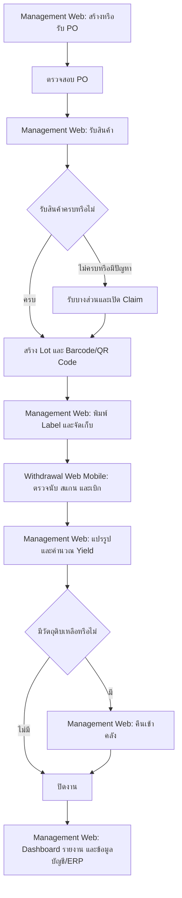

# Hot Pod Man — Business Requirements

> เอกสาร Requirement สำหรับผู้บริหารและผู้เกี่ยวข้องทางธุรกิจ
>
> รายละเอียดสำหรับทีม Development: [technical.md](./technical.md)
>
> แผนดำเนินงาน: [Gantt Chart 60 วัน](./gantt-60-days.md)
>
> **สถานะเอกสาร:** Draft สำหรับยืนยันขอบเขตงานก่อนจัดทำใบเสนอราคาและ Timeline

## 1. บทสรุปโครงการ

โครงการนี้มีเป้าหมายเพื่อพัฒนาระบบบริหารจัดซื้อและคลังสินค้าสำหรับธุรกิจร้านอาหาร Hot Pod Man ให้สามารถติดตามสินค้าและวัตถุดิบตั้งแต่การสั่งซื้อ รับเข้าคลัง จัดเก็บ ย้าย ตรวจนับ เบิก แปรรูป คืน ตลอดจนส่งข้อมูลให้ระบบบัญชีหรือ ERP

ระบบประกอบด้วย 2 ส่วนหลัก:

1. **Management Web** สำหรับจัดการข้อมูล Dashboard รายงาน Purchase Order การรับสินค้า และงานบริหารคลัง
2. **Withdrawal Web (Mobile UI Only)** สำหรับตรวจนับ สแกน และเบิกสินค้าผ่านโทรศัพท์มือถือ

ระบบต้องตรวจสอบย้อนหลังได้ว่าสินค้าแต่ละรายการมาจาก PO ใด ซื้อจาก Supplier รายใด รับเข้าเมื่อใด อยู่ตำแหน่งใด ถูกเบิกหรือแปรรูปเมื่อใด และเหลือเท่าใด

## 2. เป้าหมายทางธุรกิจ

1. ลดความผิดพลาดในการรับสินค้าและบันทึกสต็อก
2. ทำให้ยอดสินค้าในระบบตรงกับตำแหน่งและจำนวนจริง
3. ติดตามสินค้าได้ตั้งแต่ PO จนถึงการเบิกใช้หรือแปรรูป
4. ควบคุม Lot วันหมดอายุ และการหยิบแบบ FIFO/FEFO
5. รองรับการตรวจนับทั้งแบบชิ้นและน้ำหนัก
6. คำนวณ Yield และของเสียจากการแปรรูปได้
7. ติดตามราคาซื้อและประสิทธิภาพของ Supplier
8. ลดงานเอกสารซ้ำด้วย OCR, Barcode/QR Code และ Label
9. แสดง Dashboard และรายงานแยกตามสาขา
10. กำหนดสิทธิ์การใช้งานตามหน้าที่ สาขา และคลังได้อย่างละเอียด
11. เปิด–ปิดเมนูและ Action ของระบบได้โดยไม่ต้องแก้โปรแกรมใหม่
12. เชื่อมข้อมูลกับระบบบัญชีหรือ ERP ได้

## 3. ขอบเขตระบบที่ยืนยัน

ระบบในโครงการนี้มีเพียง 2 Web Application และใช้ข้อมูลกลางร่วมกัน

| ระบบ | อุปกรณ์หลัก | ขอบเขตงาน |
|---|---|---|
| **Management Web** | คอมพิวเตอร์/โน้ตบุ๊ก | Dashboard, Report, Master Data, Purchase Order, รับสินค้า, OCR, Lot/Package, Label, Location, โอนย้าย, คืนสินค้า, แปรรูป/Yield, Claim, ปรับยอด, ตั้งค่า, สิทธิ์ และ Audit Log |
| **Withdrawal Web (Mobile UI Only)** | โทรศัพท์มือถือ | ตรวจนับ ค้นหา/สแกน Barcode หรือ QR Code และเบิกสินค้า |

### 3.1 ขอบเขตงานหลัก

- ข้อมูลสินค้า วัตถุดิบ หน่วยนับ หน่วยแปลง Supplier สาขา คลัง และ Location
- Purchase Order และยอดรับ/ยอดค้างรับ
- การรับสินค้าแบบเต็มจำนวน บางส่วน รับเกิน หรือปฏิเสธรับตามกฎ
- การแนบบิลและใช้ OCR ช่วยอ่านข้อมูล โดยผู้ใช้ตรวจสอบก่อนยืนยัน
- Supplier Claim และการติดตามความแตกต่างด้านจำนวน น้ำหนัก ราคา และคุณภาพ
- Lot, Package, Barcode/QR Code และการพิมพ์ Label
- การจัดเก็บ โอนย้าย ค้นหา ตรวจนับ ปรับยอด และหยิบแบบ FIFO/FEFO
- การเบิกสินค้าผ่าน Withdrawal Web บนโทรศัพท์มือถือ
- การคืนสินค้า แปรรูปวัตถุดิบ คำนวณ Yield และบันทึกของเสียผ่าน Management Web
- Dashboard และรายงานแยกตามสิทธิ์และสาขา
- ผู้ใช้งาน บทบาท สิทธิ์ เมนู Action และระบบตั้งค่าแบบละเอียด
- Audit Log และการตรวจสอบย้อนกลับจากสินค้าไปถึง PO, Supplier, Lot และการเคลื่อนไหว
- การเตรียมข้อมูลเพื่อเชื่อมระบบบัญชีหรือ ERP ตาม Interface ที่ยืนยัน
- ภาษาไทย ลาว จีน และพม่าตามขอบเขตการแปลที่ได้รับอนุมัติ

### 3.2 ไม่รวมในขอบเขตปัจจุบัน

- POS หน้าร้าน เช่น เปิดโต๊ะ รับออเดอร์ แยก/รวมบิล ชำระเงิน โปรโมชั่น สมาชิก ใบเสร็จ และ KDS
- การตัดสต็อกจากยอดขาย POS หรือ Recipe/BOM แบบ Real-time
- Offline Mode และการ Sync รายการภายหลังเมื่อ Internet กลับมา
- Native Mobile Application
- Layout ของ Withdrawal Web สำหรับ Tablet, Notebook หรือ Desktop
- Supplier Portal, AI Forecasting, AI Price Prediction และ Automatic Reorder
- Temperature Sensor/Cold Chain Monitoring และ Production Planning
- Feature อื่นที่ระบุเป็น Phase 2 และยังไม่ได้รับอนุมัติเป็นลายลักษณ์อักษร

## 4. กระบวนการทำงานหลัก

## 5. ผู้ใช้งานหลัก

### 5.1 เจ้าหน้าที่จัดซื้อ

- สร้างหรือตรวจสอบ PO
- ติดตามสินค้าที่ยังส่งไม่ครบ
- ตรวจสอบข้อมูลจากบิลและ OCR
- เปิดและติดตาม Supplier Claim
- ดูประวัติและเปรียบเทียบราคาซื้อ

### 5.2 เจ้าหน้าที่รับสินค้า

- ค้นหา PO ที่รอรับ
- รับสินค้าเต็มจำนวนหรือบางส่วน
- แยกสินค้าดีและสินค้าเคลม
- ระบุ Lot วันผลิต วันหมดอายุ จำนวนและน้ำหนัก
- สร้าง Barcode/QR Code และพิมพ์ Label
- ระบุตำแหน่งจัดเก็บเริ่มต้น

### 5.3 พนักงานคลังสินค้า

- นำเข้าจัดเก็บและย้ายสินค้า
- สแกน Barcode/QR Code และตรวจนับผ่าน Withdrawal Web บนโทรศัพท์มือถือ
- เบิกสินค้าผ่าน Withdrawal Web และคืนสินค้าผ่าน Management Web ตามสิทธิ์
- แจ้งสินค้าหมดอายุ เสียหาย หรือสูญเสีย

### 5.4 พนักงานแปรรูป

- เบิกวัตถุดิบด้วย Barcode/QR Code
- บันทึกปริมาณก่อนและหลังแปรรูปผ่าน Management Web
- บันทึกของเสียและวัตถุดิบคงเหลือ
- คืนวัตถุดิบที่เหลือกลับเข้าคลัง

### 5.5 ผู้จัดการสาขา

- อนุมัติการเบิก ย้าย ปรับยอด และรายการผิดปกติ
- ดู Dashboard และรายงานของสาขา
- ตรวจสอบ Audit Log ตามสิทธิ์

### 5.6 ผู้ดูแลระบบ

- จัดการผู้ใช้งาน บทบาท และสิทธิ์
- เปิด–ปิดเมนูและ Action
- จัดการสาขา คลัง Location และค่าพื้นฐาน
- ตั้งค่ากระบวนการ เอกสาร ภาษา และการเชื่อมต่อ
- ตรวจสอบประวัติการแก้ไขระบบ

## 6. ความต้องการทางธุรกิจ

### BR-01 ข้อมูลสินค้าและ Supplier

- จัดเก็บข้อมูลสินค้า วัตถุดิบ หมวด หน่วยนับ น้ำหนัก และอัตราแปลงหน่วย
- กำหนดอายุสินค้า วิธีจัดเก็บ จุดสั่งซื้อ และการติดตาม Lot ได้
- จัดเก็บข้อมูล Supplier ประวัติราคา คุณภาพการส่ง และประวัติ Claim
- เปรียบเทียบราคา Supplier ภายในหมวดสินค้าเดียวกันได้

### BR-02 Purchase Order

- สร้าง PO หรือรับ PO จากระบบจัดซื้อเดิมได้
- แสดงจำนวนสั่ง จำนวนรับ และจำนวนค้างรับแต่ละรายการ
- รองรับสถานะตั้งแต่ร่าง อนุมัติ รับบางส่วน รับครบ ยกเลิก และปิดเอกสาร
- การแก้ไขหรือยกเลิกหลังอนุมัติต้องเป็นไปตามสิทธิ์และมีประวัติ

### BR-03 การรับสินค้า

- รับสินค้าโดยอ้างอิง PO
- รองรับรับครบ รับบางส่วน รับเกิน และปฏิเสธรับตามกฎที่กำหนด
- แยกสินค้าดีและสินค้าเคลมได้
- ระบุจำนวน น้ำหนัก หน่วย วันผลิต วันหมดอายุ และ Lot ของ Supplier ได้
- รับค่าน้ำหนักจากเครื่องชั่งและบันทึก Device, ผู้ดำเนินการ และเวลาได้
- การกรอกหรือแก้น้ำหนักด้วยตนเองต้องจำกัดสิทธิ์ ระบุเหตุผล และมี Audit Log
- แนบภาพหรือบิลรับสินค้าและใช้ OCR ช่วยอ่านข้อมูลได้
- ผู้ใช้งานต้องตรวจสอบผล OCR ก่อนยืนยัน

### BR-04 Lot, Barcode และ Label

- สร้าง Lot แยกตามการรับหรือการแปรรูปได้
- Lot ต้องเชื่อมกับ PO, Supplier, สาขา, วันรับและวันหมดอายุ
- สร้าง Barcode/QR Code ที่ไม่ซ้ำและใช้ค้นหาสินค้าได้
- พิมพ์ Label ที่มีชื่อสินค้า Lot จำนวน/น้ำหนัก วันรับและวันหมดอายุได้
- การพิมพ์ซ้ำต้องบันทึกผู้ดำเนินการและเหตุผล

### BR-05 คลังและ Location

- กำหนดโครงสร้างสาขา คลัง โซน ห้องเย็น ชั้น และช่องจัดเก็บได้
- การจัดเก็บ ย้าย เบิกและคืนต้องอ้างอิง Location จริง
- แสดงยอดคงเหลือแยกตามสาขา Location และ Lot
- รองรับการหยิบแบบ FIFO และ FEFO ตามประเภทสินค้า
- หากผู้ใช้ไม่เลือก Lot ที่ระบบแนะนำตาม FIFO/FEFO ต้องแจ้งเตือนและบันทึกเหตุผล
- รองรับการโอนย้ายภายในคลังและระหว่างสาขา พร้อมผู้ส่ง ผู้รับ และผลต่างตอนรับ
- แจ้งเตือนสต็อกต่ำ สินค้าใกล้หมดอายุ และสินค้าหมดอายุ

### BR-06 การตรวจนับผ่าน Mobile และการปรับยอดผ่าน Management Web

- สร้างรอบตรวจนับตามสาขา คลัง Location หรือหมวดสินค้าได้
- พนักงานตรวจนับผ่าน Withdrawal Web บนโทรศัพท์มือถือได้ทั้งแบบชิ้นและน้ำหนัก
- เปรียบเทียบยอดตรวจนับกับยอดในระบบและแสดงผลต่าง
- ผู้มีสิทธิ์ตรวจสอบและปรับยอดผ่าน Management Web โดยต้องมีเหตุผล หลักฐาน และการอนุมัติ
- เก็บยอดก่อนปรับและหลังปรับไว้ตรวจสอบย้อนหลัง

### BR-07 การเบิกสินค้าผ่าน Withdrawal Web

- ใช้ Withdrawal Web แบบ Mobile UI Only
- ค้นหาหรือสแกน Barcode/QR Code เพื่อเบิกสินค้า
- ตรวจสอบสิทธิ์ ยอดคงเหลือ Lot, Location และวันหมดอายุก่อนเบิก
- แนะนำ Lot ตาม FEFO และให้ระบุเหตุผลเมื่อเลือก Lot อื่น
- บันทึกจำนวนหรือน้ำหนัก จุดใช้งาน ผู้เบิก วันที่ เวลา และ Location ต้นทาง
- แสดงผลสำเร็จหรือสาเหตุที่ไม่สามารถเบิกได้อย่างชัดเจน
- ไม่รวมหน้าจอรับสินค้า คืนสินค้า แปรรูป อนุมัติ ปรับยอด หรือตั้งค่าระบบบน Mobile

### BR-08 การแปรรูป, Yield และคืนสินค้าใน Management Web

- สร้างใบงานแปรรูปโดยอ้างอิง Lot ต้นทาง
- บันทึกปริมาณก่อนแปรรูป ผลผลิต ของเสีย และวัตถุดิบที่เหลือ
- คำนวณ Yield ด้วยสูตร `ผลผลิตที่ใช้ได้ ÷ วัตถุดิบก่อนแปรรูป × 100`
- สร้าง Lot ใหม่ของผลผลิตและเชื่อมกลับ Lot ต้นทางได้
- แจ้งเตือนเมื่อ Yield ต่ำกว่าค่าเป้าหมาย
- รองรับการชั่งของเหลือปลายวัน คำนวณปริมาณใช้จริง และคืนสินค้าเข้า Location
- ของที่คืนต้องคงการเชื่อมโยงกับ Lot/Package ต้นทางและพิมพ์ Label ใหม่ได้เมื่อจำเป็น
- ระบบต้องกำหนดวันหมดอายุใหม่ของสินค้าที่คืนตามกฎของแต่ละสินค้า

### BR-09 Supplier Claim และราคา

- เปิด Claim จากรายการรับสินค้าได้
- กำหนดหมวดเหตุผล แนบหลักฐาน และติดตามสถานะจนปิดรายการ
- บันทึกผล จำนวนและมูลค่าของ Claim
- ดูราคาล่าสุด ประวัติราคา และเปอร์เซ็นต์การเปลี่ยนแปลง
- เปรียบเทียบ Supplier โดยพิจารณาราคา คุณภาพ ระยะเวลาส่ง และอัตรา Claim

### BR-10 การตรวจสอบย้อนหลัง

ระบบต้องค้นหาจากสินค้า Lot, Barcode/QR Code, PO หรือเอกสารรับเข้า แล้วแสดง:

- Supplier และ PO ต้นทาง
- วันรับ ผู้รับ จำนวนและน้ำหนัก
- Lot วันผลิตและวันหมดอายุ
- Location ปัจจุบันและประวัติการย้าย
- ประวัติการตรวจนับ ปรับยอด เบิก คืน และแปรรูป
- Output Lot, Yield, Claim และยอดคงเหลือ

### BR-11 Dashboard และรายงาน

Dashboard อยู่ใน Management Web และต้องแสดงข้อมูลตามสิทธิ์ สาขา และช่วงเวลา โดยมีข้อมูลตั้งต้นดังนี้

| กลุ่มข้อมูล | ตัวเลข/ข้อมูลที่ต้องการเห็น |
|---|---|
| Purchase Order | จำนวน PO รอรับ, รับบางส่วน, รับครบ และยอดค้างรับ |
| Receiving | จำนวน/น้ำหนัก/มูลค่าที่รับ, รายการรับขาด/เกิน, ราคาต่างจาก PO และรายการรอตรวจสอบ |
| Inventory | จำนวนและมูลค่าสต็อก, สต็อกต่ำ, สินค้าใกล้หมดอายุ/หมดอายุ และสินค้ากักกัน |
| Withdrawal | จำนวน/น้ำหนัก/มูลค่าที่เบิก แยกตามสาขา คลัง สินค้า และช่วงเวลา |
| Yield/Waste | Yield จริงเทียบมาตรฐาน, ของเสีย และรายการต่ำกว่าเกณฑ์ |
| Supplier | ราคาล่าสุด แนวโน้มราคา ปริมาณซื้อ ยอด Claim และรายการส่งไม่ครบ |
| Alert | PO ค้างรับ, Stock ต่ำ, ใกล้หมดอายุ, Yield ผิดปกติ, Claim และ Integration Error |

รายงานขั้นต่ำ:

- Stock Balance และ Stock Movement/Stock Card
- Purchase Order และ Outstanding
- Receiving และ Receiving Variance
- Consumption/Withdrawal และ Return
- Stock Count และ Stock Adjustment
- Price History และ Supplier Comparison
- Supplier Claim
- Yield และ Waste
- Expiry และ Quarantine
- Audit Log

รายงานต้องกรองตามสาขา ช่วงเวลา สินค้า หมวด Supplier และสถานะ รวมทั้งส่งออก Excel/CSV หรือ PDF ตามสิทธิ์

รายการข้างต้นเป็นหัวข้อเริ่มต้น ก่อนล็อกใบเสนอราคาต้องยืนยันสูตรคำนวณ คอลัมน์ในตาราง หน่วยข้อมูล การจัดกลุ่ม ความถี่ในการอัปเดต และรูปแบบ Export ของ Dashboard/Report แต่ละรายการ

### BR-12 การตั้งค่าและสิทธิ์

- ตั้งค่าระบบระดับส่วนกลาง สาขา และคลังได้
- สาขาหรือคลัง Override ค่ากลางได้เฉพาะรายการที่อนุญาต
- แสดงค่ามาตรฐาน ค่า Override และค่าที่มีผลจริง
- จัดการผู้ใช้และกำหนดได้หลายบทบาท
- กำหนดสิทธิ์แยกตามเมนู หน้าจอ และ Action เช่น ดู เพิ่ม แก้ไข อนุมัติ ยกเลิก พิมพ์ซ้ำ และส่งออก
- เปิด–ปิด Menu/Submenu และกำหนดการแสดงใน Navigation ได้
- เปิด–ปิด Action ทั้งระบบหรือให้เฉพาะบางบทบาทได้
- กำหนดสาขาและคลังที่ผู้ใช้เข้าถึงได้
- ระบบต้องป้องกันการเข้าถึง แม้ผู้ใช้พยายามเข้าใช้งานนอกเมนูปกติ
- ป้องกันการปิดผู้ดูแลระบบคนสุดท้าย
- บันทึกประวัติการเปลี่ยน Setting, Menu, Role และ Permission

หมวดการตั้งค่าหลัก ได้แก่ องค์กร สาขา/คลัง เอกสาร PO รับสินค้า Lot/วันหมดอายุ FIFO/FEFO, Label, ตรวจนับ เบิกสินค้า แปรรูป/Yield, Claim, Dashboard/Report, Notification, Integration, Security และภาษา

### BR-13 ระบบบัญชีหรือ ERP

- เตรียมข้อมูลรับสินค้า มูลค่าสต็อก การปรับยอด การเบิก ของเสีย และข้อมูลที่เกี่ยวข้อง
- กำหนด Mapping สินค้า Supplier สาขา หน่วย ภาษี และบัญชีได้
- แสดงสถานะการส่งข้อมูลและสาเหตุเมื่อส่งไม่สำเร็จ
- ส่งซ้ำได้โดยไม่สร้างรายการซ้ำ
- เก็บประวัติการส่งข้อมูลไว้ตรวจสอบ

### BR-14 ภาษาและสาขา

- รองรับภาษาไทย ลาว จีน และพม่า
- ผู้ใช้เลือกภาษาส่วนตัวได้
- จำกัดข้อมูลและรายงานตามสาขาหรือกลุ่มสาขา
- ผู้มีสิทธิ์ส่วนกลางดูข้อมูลรวมและแยกตามสาขาได้

## 7. กฎทางธุรกิจสำคัญ

1. ทุกการรับเข้าต้องอ้างอิง PO เว้นแต่มีประเภทที่อนุญาตเป็นกรณีพิเศษ
2. สินค้าที่กำหนดให้ติดตาม Lot ต้องไม่มีการเคลื่อนไหวโดยไม่มี Lot
3. การย้าย เบิก คืน และปรับยอดต้องอ้างอิง Location จริง
4. สินค้าหมดอายุห้ามเบิกใช้และต้องแยกกักกัน
5. การรับเกิน PO การปรับยอด และการยกเลิกรายการสำคัญต้องผ่านการอนุมัติ
6. ธุรกรรมที่ยืนยันแล้วห้ามลบ ให้ยกเลิกหรือกลับรายการพร้อมเหตุผล
7. ระบบต้องป้องกันยอดสต็อกติดลบ
8. ผู้ใช้ต้องมีทั้งสิทธิ์การทำรายการและสิทธิ์สาขา/คลัง
9. การซ่อนเมนูหรือปุ่มไม่ถือเป็นการจำกัดสิทธิ์ ระบบต้องปฏิเสธการทำรายการจากทุกช่องทาง
10. การอนุมัติรายการสำคัญต้องรองรับผู้สร้างและผู้อนุมัติเป็นคนละคน
11. การแก้ไข Setting ต้องไม่เปลี่ยนผลของธุรกรรมย้อนหลัง
12. การทำรายการสำคัญและการแก้ไขค่าระบบต้องมี Audit Log

## 8. เกณฑ์ยอมรับระดับโครงการ

1. สามารถสร้างหรือรับ PO และรับสินค้าแบบเต็มจำนวน/บางส่วนได้
2. สามารถแยกสินค้าดีและสินค้าเคลม พร้อมติดตามยอดค้างรับได้
3. สามารถสร้าง Lot และ Barcode/QR Code และค้นกลับไปยังข้อมูลต้นทางได้
4. สามารถพิมพ์ Label และตรวจสอบผลการพิมพ์ได้
5. สามารถจัดเก็บและหยิบสินค้าตาม FIFO/FEFO ได้
6. สามารถติดตามสินค้าในแต่ละ Location และดูประวัติการย้ายได้
7. สามารถตรวจนับแบบชิ้นและน้ำหนักผ่านโทรศัพท์มือถือได้
8. สามารถเบิกสินค้าผ่าน Withdrawal Web แบบ Mobile UI Only ได้
9. Withdrawal Web ต้องไม่มีหน้าจอนอกเหนือจากการตรวจนับ สแกน และเบิกสินค้า
10. สามารถแปรรูป คำนวณ Yield และคืนวัตถุดิบเข้าสต็อกผ่าน Management Web ได้
11. สามารถตรวจสอบย้อนหลังจาก Lot ไปถึง PO, Supplier และผลผลิตหลังแปรรูปได้
12. สามารถดู Dashboard และรายงานแยกตามสาขาได้
13. สามารถติดตามราคาและเปรียบเทียบ Supplier ได้
14. สามารถส่งข้อมูลไปยังระบบบัญชีหรือ ERP และตรวจสอบผลการส่งได้
15. สามารถสร้างบทบาทและกำหนดสิทธิ์รายเมนู/Action ได้
16. สามารถเปิด–ปิด Menu/Submenu และ Action โดยไม่ต้อง Deploy ระบบใหม่
17. ผู้ใช้ที่ไม่มีสิทธิ์ต้องไม่สามารถเข้าหน้าหรือเรียกข้อมูลผ่านช่องทางอื่นได้
18. สามารถตั้งค่าระบบระดับส่วนกลางและ Override ระดับสาขา/คลังได้
19. การเปลี่ยน Setting และ Permission ต้องมี Audit Log พร้อมข้อมูลก่อนและหลัง
20. ระบบต้องป้องกันการปิดผู้ดูแลระบบคนสุดท้าย
21. รองรับภาษาตามขอบเขตที่ได้รับอนุมัติ

## 9. ประเด็นธุรกิจที่ต้องยืนยัน

- ระบบจัดซื้อเดิมและรูปแบบการรับ PO
- ระบบบัญชี/ERP ปลายทางและข้อมูลที่ต้องส่ง
- Dashboard แต่ละหน้า: KPI, สูตร, หน่วย, Filter, Drill-down และสิทธิ์การมองเห็น
- Report แต่ละรายงาน: คอลัมน์ ตารางสรุป สูตร Grouping และรูปแบบ Export
- กฎ “รับตามลำดับ PO”
- เปอร์เซ็นต์ที่อนุญาตให้รับเกิน PO
- ผู้อนุมัติ Claim, ปรับยอด, ย้ายข้ามสาขา และทิ้งสินค้า
- สูตร Yield และค่าเป้าหมายของแต่ละสินค้า/วิธีแปรรูป
- กฎวันหมดอายุของสินค้าที่คืน เช่น ต้องหมดอายุภายใน 24 ชั่วโมง และข้อยกเว้นของแต่ละสินค้า
- จำนวนสาขา คลัง ผู้ใช้ และธุรกรรมต่อวัน
- รุ่นเครื่องชั่ง เครื่องพิมพ์ Label และโทรศัพท์มือถือ
- วิธีเชื่อมต่อเครื่องชั่ง และรายการสินค้าที่บังคับชั่งหรือรับเป็นจำนวนชิ้น
- รูปแบบบิลและข้อมูลที่ต้องอ่านด้วย OCR
- ยืนยันว่า OCR อ่านเฉพาะเอกสารพิมพ์ หรือรวมเอกสารเขียนมือ
- ขอบเขตงานคืนสินค้าและแปรรูปบน Management Web รวมถึงอุปกรณ์ที่ใช้ชั่ง
- รายการ Setting ที่ต้องมีผู้อนุมัติก่อนเริ่มใช้
- วิธีแสดง Action ที่ไม่มีสิทธิ์: ซ่อนหรือแสดงเป็นปุ่ม Disabled
- ระยะเวลาเก็บ Audit Log

## 10. สมมติฐานของเอกสาร

- ทุกสาขาใช้ฐานข้อมูลกลางและแยกการเข้าถึงด้วยสิทธิ์
- Management Web ใช้สำหรับงานบริหาร รับเข้า รายงาน และพิมพ์ Label
- งานคืนสินค้า แปรรูป Yield อนุมัติ และปรับยอดอยู่ใน Management Web
- Withdrawal Web เป็น Mobile UI Only ใช้ผ่านโทรศัพท์มือถือ และมีเฉพาะตรวจนับ สแกน และเบิกสินค้า
- OCR เป็นเครื่องมือช่วยกรอกข้อมูล ผู้ใช้งานต้องตรวจสอบก่อนยืนยัน
- รูปแบบการเชื่อมบัญชีหรือ ERP จะเพิ่มหลังได้รับข้อมูลยืนยัน
- POS หน้าร้าน Offline Mode Native Mobile App และ Feature Phase 2 ไม่รวมในขอบเขตปัจจุบัน

---

เอกสารนี้ใช้สำหรับยืนยันขอบเขตและความต้องการทางธุรกิจ รายละเอียดด้าน Technology, Architecture, Database, Permission Code, Security และ Testing อยู่ใน [technical.md](./technical.md)
