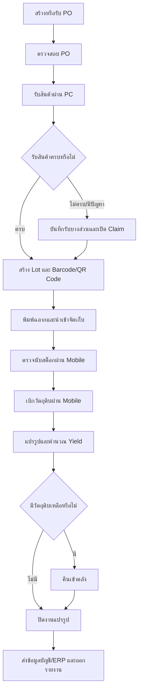

# Hotpotman POS & Inventory Management System

> เอกสารร่างความต้องการระบบ (Draft Software Requirements Specification)
>
> สถานะ: ร่างเพื่อใช้เก็บ Requirement และยืนยันขอบเขตกับผู้เกี่ยวข้อง

## 1. ภาพรวมโครงการ

โครงการนี้มีเป้าหมายเพื่อพัฒนาระบบ POS และระบบบริหารจัดซื้อ/คลังสินค้าสำหรับธุรกิจร้านอาหาร Hotpotman ให้สามารถติดตามวัตถุดิบและสินค้าได้ตั้งแต่การเปิดใบสั่งซื้อ การรับสินค้าเข้าคลัง การจัดเก็บ การย้ายสินค้า การเบิกไปแปรรูป การคืนวัตถุดิบคงเหลือ การตรวจนับสต็อก ตลอดจนการส่งข้อมูลให้ระบบบัญชีหรือ ERP

ระบบต้องรองรับการตรวจสอบย้อนหลัง (Traceability) เพื่อให้ทราบว่าสินค้าแต่ละรายการมาจากใบสั่งซื้อใด ซื้อจาก Supplier รายใด รับเข้าเมื่อใด อยู่ที่ตำแหน่งใด ถูกเบิกไปใช้หรือแปรรูปเมื่อใด และมีปริมาณคงเหลือเท่าใด

> **หมายเหตุเรื่องขอบเขต:** ข้อมูลต้นทางที่ได้รับในรอบนี้เน้นงานจัดซื้อ รับเข้า คลัง และแปรรูปวัตถุดิบ ยังไม่มีรายละเอียดเพียงพอสำหรับฟังก์ชันหน้าขาย เช่น รับออเดอร์ โต๊ะอาหาร ชำระเงิน โปรโมชัน และใบกำกับภาษี จึงแยกหัวข้อดังกล่าวไว้เป็นประเด็นรอยืนยัน

## 2. วัตถุประสงค์

1. จัดการและติดตาม Purchase Order (PO)
2. รับสินค้าเข้าคลังด้วยคอมพิวเตอร์และอุปกรณ์ที่เกี่ยวข้อง
3. สร้าง Lot และ Barcode/QR Code สำหรับติดตามสินค้า
4. นำสินค้าเข้าตำแหน่งจัดเก็บตาม Location ที่กำหนด
5. ควบคุมการย้ายสินค้าให้ข้อมูลในระบบตรงกับตำแหน่งจริง
6. เบิกสินค้าออกจากคลังตามสิทธิ์และวัตถุประสงค์
7. รองรับการแปรรูปหรือหั่นวัตถุดิบ
8. คำนวณ Yield ของวัตถุดิบหลังแปรรูป
9. นำวัตถุดิบที่เหลือกลับเข้าสต็อก
10. ตรวจนับและปรับปรุงยอดสต็อกอย่างมีหลักฐาน
11. ติดตามราคาซื้อและปริมาณการใช้
12. ส่งข้อมูลไปยังระบบบัญชีหรือ ERP
13. แสดงรายงานแยกตามสาขา
14. รองรับผู้ใช้งานหลายภาษา ได้แก่ ไทย ลาว จีน และพม่า

## 3. ขอบเขตระบบ

### 3.1 อยู่ในขอบเขตของเอกสารฉบับนี้

- ข้อมูลสินค้า วัตถุดิบ หน่วยนับ และหน่วยแปลง
- ข้อมูล Supplier และประวัติราคาซื้อ
- Purchase Order
- การรับสินค้าแบบเต็มจำนวนและบางส่วน
- การบันทึกปัญหาการรับสินค้าและการเคลม Supplier
- การอ่านข้อมูลจากบิลรับสินค้าด้วย OCR
- การสร้าง Lot และ Barcode/QR Code
- การพิมพ์สติกเกอร์สำหรับสินค้าที่มีน้ำหนัก
- คลัง ตำแหน่งจัดเก็บ และการย้ายสินค้า
- การตรวจนับสต็อกผ่าน Mobile
- การเบิกวัตถุดิบผ่าน Mobile
- การคืนวัตถุดิบเข้าคลัง
- การแปรรูปวัตถุดิบและการคำนวณ Yield
- การตรวจสอบย้อนหลังของสินค้าแต่ละ Lot
- รายงานจัดซื้อ สต็อก การใช้ ราคา และการเคลม
- การส่งข้อมูลให้ระบบบัญชีหรือ ERP
- การกำหนดสิทธิ์ผู้ใช้งานและบันทึก Audit Log

### 3.2 รอยืนยันว่าอยู่ในขอบเขตหรือไม่

- POS หน้าร้าน: เปิดโต๊ะ รับออเดอร์ แยกบิล รวมบิล และย้ายโต๊ะ
- การชำระเงิน: เงินสด บัตรเครดิต QR Payment และช่องทางอื่น
- โปรโมชัน คูปอง สมาชิก และสะสมแต้ม
- ใบเสร็จ ใบกำกับภาษี และการคืนเงิน
- การเชื่อมยอดขายกับสูตรอาหารเพื่อตัดวัตถุดิบอัตโนมัติ
- ครัว/KDS และการพิมพ์ใบสั่งอาหาร
- การทำงานแบบ Offline เมื่ออินเทอร์เน็ตขัดข้อง

## 4. คำศัพท์สำคัญ

| คำศัพท์ | ความหมาย |
|---|---|
| PO | ใบสั่งซื้อสินค้า (Purchase Order) |
| Supplier | ผู้จำหน่ายสินค้าหรือวัตถุดิบ |
| Lot | ชุดสินค้าที่รับเข้าหรือผลิตในครั้งเดียวกันและติดตามย้อนหลังร่วมกัน |
| Location | ตำแหน่งจัดเก็บจริง เช่น สาขา คลัง ห้องเย็น ชั้น และช่อง |
| Yield | อัตราส่วนปริมาณที่ใช้งานได้หลังแปรรูปเทียบกับปริมาณก่อนแปรรูป |
| Claim | รายการเรียกร้องหรือแจ้งปัญหากับ Supplier |
| OCR | การอ่านตัวอักษรและจำนวนเงินจากภาพหรือเอกสารโดยอัตโนมัติ |
| FEFO | การเลือกใช้สินค้าที่หมดอายุก่อนเป็นลำดับแรก |
| Stock Adjustment | การปรับยอดสต็อกให้ตรงกับผลตรวจนับจริง |

## 5. ผู้ใช้งานและสิทธิ์

### 5.1 Purchasing Officer — เจ้าหน้าที่จัดซื้อ

- สร้าง PO ใหม่ หรือรับ PO จากระบบจัดซื้อเดิม
- ตรวจสอบรายการและสถานะของ PO
- ติดตามสินค้าที่ยังส่งไม่ครบ
- ตรวจสอบและยืนยันข้อมูลที่อ่านจากบิลด้วย OCR
- เปิดรายการเคลมและเลือกเหตุผลตามหมวดที่กำหนด เช่น สินค้าเสียหาย หรือส่งไม่ครบ
- บันทึกผลการเคลมและเรียกรายงานการเคลม
- ตรวจสอบประวัติราคาสินค้าและเปอร์เซ็นต์การเปลี่ยนแปลงราคา
- เปรียบเทียบราคา Supplier ตามหมวดสินค้า เช่น ผัก หรือของสด

### 5.2 Receiving Officer — เจ้าหน้าที่รับสินค้า

- ค้นหาและเปิด PO ที่รอรับ
- รับสินค้าแบบเต็มจำนวนหรือบางส่วน
- ระบุสินค้าดี สินค้าเคลม และหมายเหตุการรับเข้า
- ระบุวันผลิต วันหมดอายุ จำนวน น้ำหนัก และหน่วยนับ
- สร้าง Lot และ Barcode/QR Code
- พิมพ์ฉลากหรือสติกเกอร์สินค้า
- ระบุตำแหน่งจัดเก็บเริ่มต้น

### 5.3 Warehouse Officer — พนักงานคลังสินค้า

- ตรวจสอบ นำเข้าจัดเก็บ และย้ายสินค้า
- สแกน Barcode/QR Code ก่อนทำรายการ
- ตรวจนับสต็อกผ่าน Mobile
- เบิกและคืนสินค้าได้ตามสิทธิ์
- แจ้งสินค้าหมดอายุ เสียหาย หรือสูญเสีย

### 5.4 Processing Officer — พนักงานแปรรูป

- สแกน Barcode/QR Code เพื่อเบิกวัตถุดิบ
- บันทึกน้ำหนักหรือจำนวนก่อนแปรรูป
- บันทึกสินค้าที่ได้ ของเสีย และวัตถุดิบคงเหลือ
- คืนวัตถุดิบที่เหลือกลับเข้าคลังภายในเวลาที่กำหนด

### 5.5 Branch Manager — ผู้จัดการสาขา

- อนุมัติการเบิก การย้าย การปรับยอด และการทิ้งสินค้าตามวงเงินหรือเงื่อนไข
- ดูรายงานของสาขาที่รับผิดชอบ
- ตรวจสอบรายการผิดปกติและ Audit Log

### 5.6 System Administrator — ผู้ดูแลระบบ

- จัดการผู้ใช้งาน บทบาท และสิทธิ์
- จัดการข้อมูลสาขา คลัง Location หน่วยนับ และค่าพื้นฐาน
- กำหนดหมวดเหตุผลการเคลมและการปรับสต็อก
- ตั้งค่าภาษา การเชื่อมต่อ และเลขที่เอกสาร
- ดูประวัติการทำรายการของทุกสาขาตามสิทธิ์

## 6. กระบวนการทำงานหลัก

## 7. ความต้องการเชิงฟังก์ชัน

### FR-01 ข้อมูลสินค้าและวัตถุดิบ

1. ระบบต้องจัดเก็บรหัส ชื่อ หมวด ประเภท และสถานะของสินค้า
2. ระบบต้องรองรับสินค้าที่นับเป็นชิ้นและสินค้าที่วัดด้วยน้ำหนัก
3. ระบบต้องกำหนดหน่วยซื้อ หน่วยสต็อก และอัตราแปลงหน่วยได้
4. ระบบต้องกำหนดอายุสินค้า เงื่อนไขการจัดเก็บ และจุดสั่งซื้อขั้นต่ำได้
5. ระบบต้องกำหนดได้ว่าสินค้าใดต้องติดตาม Lot วันผลิต หรือวันหมดอายุ
6. ระบบต้องรองรับ Barcode ของ Supplier และ Barcode/QR Code ที่ระบบสร้างเอง

### FR-02 Purchase Order

1. ระบบต้องสร้าง PO ได้ หรือรับข้อมูล PO จากระบบจัดซื้อเดิมได้
2. PO ต้องมีเลขที่เอกสาร Supplier สาขาปลายทาง วันที่สั่ง วันที่คาดว่าจะรับ และรายการสินค้า
3. รายการ PO ต้องมีจำนวน หน่วย ราคา ส่วนลด ภาษี และยอดรวมตามข้อมูลที่ตกลงใช้
4. ระบบต้องแสดงสถานะอย่างน้อย ได้แก่ ร่าง รออนุมัติ อนุมัติแล้ว รับบางส่วน รับครบ ยกเลิก และปิดเอกสาร
5. ระบบต้องแสดงยอดสั่ง ยอดรับ และยอดค้างรับแยกรายการ
6. การแก้ไขหรือยกเลิก PO หลังอนุมัติต้องเป็นไปตามสิทธิ์และมีประวัติการเปลี่ยนแปลง

### FR-03 การรับสินค้า

1. เจ้าหน้าที่ต้องเลือก PO ก่อนรับสินค้า และรับตามลำดับหรือกฎที่ธุรกิจกำหนด
2. ระบบต้องเชื่อมรายการรับเข้ากับรายการ PO เดิม
3. ระบบต้องรองรับการรับเต็มจำนวน รับบางส่วน รับเกิน และปฏิเสธรับ โดยการรับเกินต้องผ่านเงื่อนไขอนุมัติ
4. เจ้าหน้าที่ต้องจำแนกสินค้าดีและสินค้าเคลมได้
5. กรณีเคลม ต้องเลือกเหตุผลและบันทึกหมายเหตุตามรูปแบบที่กำหนด
6. ระบบต้องรองรับวันผลิต วันหมดอายุ Lot ของ Supplier จำนวน น้ำหนัก และหน่วยนับ
7. ระบบต้องช่วยกำหนดวันหมดอายุอัตโนมัติจากอายุสินค้าที่ตั้งไว้ และอนุญาตให้ผู้มีสิทธิ์แก้ไขได้
8. เมื่อเลือก Supplier ระบบต้องแสดงราคาซื้อล่าสุดของสินค้านั้นเพื่อประกอบการตรวจสอบ
9. ระบบต้องบันทึกผู้รับสินค้า วันเวลา อุปกรณ์ และสาขาที่ทำรายการ

### FR-04 การอัปโหลดบิลและ OCR

1. ระบบต้องแนบภาพหรือไฟล์บิลรับสินค้าจาก Supplier ได้
2. ระบบควรอ่านเลขที่เอกสาร วันที่ Supplier ยอดเงิน และรายการที่ตรวจจับได้โดยอัตโนมัติ
3. ระบบต้องรองรับทั้งเอกสารพิมพ์และเอกสารที่มีลายมือ โดยผลลัพธ์ขึ้นอยู่กับคุณภาพเอกสาร
4. ผู้ใช้งานต้องตรวจสอบและยืนยันผล OCR ก่อนบันทึกเป็นข้อมูลจริง
5. ระบบต้องแสดงค่าที่ OCR อ่านไม่แน่ใจเพื่อให้ผู้ใช้งานแก้ไข
6. ระบบต้องเก็บไฟล์ต้นฉบับ ผล OCR และประวัติการแก้ไขไว้ตรวจสอบย้อนหลัง

### FR-05 Lot, Barcode/QR Code และฉลาก

1. ระบบต้องสร้าง Lot เมื่อรับสินค้า โดยหนึ่งรายการรับสามารถแยกเป็นหลาย Lot ได้
2. Lot ต้องเชื่อมโยงกับ PO, Supplier, เอกสารรับเข้า, สาขา, วันรับ, วันผลิต และวันหมดอายุ
3. Barcode/QR Code ต้องไม่ซ้ำและสามารถใช้ค้นหา Lot ได้
4. ระบบต้องพิมพ์ฉลากที่แสดงข้อมูลขั้นต่ำ ได้แก่ ชื่อสินค้า Lot น้ำหนัก/จำนวน วันรับ และวันหมดอายุ
5. สินค้าที่มีน้ำหนักต้องพิมพ์สติกเกอร์แปะสินค้าได้
6. การพิมพ์ฉลากซ้ำต้องมีการบันทึกผู้สั่งพิมพ์ วันเวลา และเหตุผล

### FR-06 คลังและ Location

1. ระบบต้องกำหนดโครงสร้าง Location เช่น สาขา คลัง โซน ห้องเย็น ชั้น และช่องได้
2. การนำเข้าจัดเก็บต้องระบุ Lot ปริมาณ และ Location ปลายทาง
3. การย้ายสินค้าต้องสแกนหรือเลือกรายการจาก Location ต้นทางและยืนยัน Location ปลายทาง
4. ยอดสินค้าในระบบต้องเปลี่ยนตามการเคลื่อนย้ายจริงและห้ามติดลบ เว้นแต่ผู้มีสิทธิ์อนุมัติ
5. ระบบต้องแสดงยอดคงเหลือแยกตามสาขา Location Lot และสถานะสินค้า
6. ระบบต้องแนะนำการหยิบแบบ FEFO สำหรับสินค้าที่มีวันหมดอายุ
7. ระบบต้องแจ้งเตือนสินค้าใกล้หมดอายุ สินค้าหมดอายุ และสต็อกต่ำกว่าเกณฑ์

### FR-07 การตรวจนับและปรับปรุงสต็อก

1. ระบบต้องสร้างรอบตรวจนับตามสาขา คลัง Location หรือหมวดสินค้าได้
2. ผู้ใช้งานต้องตรวจนับผ่าน Mobile ได้ทั้งแบบชิ้นและแบบน้ำหนัก
3. ระบบต้องติดตามผลตรวจนับเทียบกับยอดในระบบ
4. ระบบต้องแสดงผลต่างและมูลค่าผลต่างก่อนปรับยอด
5. การปรับยอดต้องระบุเหตุผล หลักฐาน ผู้ดำเนินการ และผู้อนุมัติตามสิทธิ์
6. ระบบต้องเก็บยอดก่อนปรับ ยอดหลังปรับ และประวัติการอนุมัติ

### FR-08 การเบิกสินค้า

1. ผู้ใช้งานต้องสแกน Barcode/QR Code เพื่อเลือก Lot ที่ต้องการเบิกได้
2. ระบบต้องตรวจสอบสิทธิ์ก่อนอนุญาตให้เบิก
3. ระบบต้องบันทึกผู้เบิก จุดประสงค์ สาขา/หน่วยงาน จำนวนหรือน้ำหนัก และวันเวลา
4. ระบบต้องตัดสต็อกจาก Lot และ Location ที่เบิกจริง
5. ระบบต้องรองรับขั้นตอนขอเบิก อนุมัติ จ่ายสินค้า รับสินค้า และยกเลิก ตามกฎธุรกิจ
6. ระบบต้องป้องกันการเบิกเกินยอดคงเหลือ

### FR-09 การแปรรูปและ Yield

1. ระบบต้องสร้างใบงานแปรรูปโดยอ้างอิงวัตถุดิบ Lot ต้นทาง
2. ระบบต้องบันทึกน้ำหนักหรือจำนวนก่อนแปรรูป
3. ระบบต้องบันทึกผลผลิตที่ใช้งานได้ ของเสีย และวัตถุดิบที่เหลือ
4. ระบบต้องคำนวณ Yield ด้วยสูตรต่อไปนี้

   `Yield (%) = ปริมาณผลผลิตที่ใช้งานได้ ÷ ปริมาณวัตถุดิบก่อนแปรรูป × 100`

5. ระบบต้องสร้าง Lot ใหม่สำหรับผลผลิตหลังแปรรูปเมื่อจำเป็น และรักษาความเชื่อมโยงกับ Lot ต้นทาง
6. ระบบต้องเปรียบเทียบ Yield จริงกับค่าเป้าหมายและแสดงรายการผิดปกติ
7. ระบบต้องบันทึกผู้ปฏิบัติงาน วันเวลา และสาขาที่แปรรูป

### FR-10 การคืนสินค้าเข้าคลัง

1. ระบบต้องรองรับการคืนแบบชิ้นและแบบน้ำหนัก
2. การคืนแบบน้ำหนักต้องอัปเดตน้ำหนักล่าสุดของ Barcode/QR Code เดิมที่เคยเบิก
3. ระบบต้องคืนสินค้าเข้า Lot และ Location ที่ตรวจสอบได้
4. การคืนต้องดำเนินการภายใน 24 ชั่วโมงหลังเบิก เว้นแต่มีการอนุมัติข้อยกเว้น
5. ระบบต้องระบุสภาพสินค้าและอนุญาตให้คืนเฉพาะสินค้าที่ยังใช้งานได้ตามกฎธุรกิจ
6. ระบบต้องบันทึกผู้คืน ผู้รับคืน วันเวลา ปริมาณก่อนเบิก ปริมาณใช้ และปริมาณคืน

### FR-11 การเคลม Supplier

1. ระบบต้องเปิด Claim จากรายการรับสินค้าได้
2. เหตุผล Claim ต้องจัดการเป็นหมวด เช่น เสียหายจาก Supplier ส่งไม่ครบ คุณภาพไม่ผ่าน หรือราคาไม่ตรง
3. ระบบต้องแนบภาพ เอกสาร และหมายเหตุได้
4. ระบบต้องติดตามสถานะ ได้แก่ เปิดรายการ ส่งให้ Supplier รอผล อนุมัติ ชดเชย/เปลี่ยนสินค้า ปฏิเสธ และปิดรายการ
5. ระบบต้องบันทึกผลการเคลม จำนวน มูลค่า และวันที่ปิดรายการ
6. ระบบต้องออกรายงาน Claim แยกตาม Supplier สินค้า เหตุผล สาขา และช่วงเวลา

### FR-12 การติดตามราคาและ Supplier

1. ระบบต้องเก็บประวัติราคาซื้อแยกตามสินค้า Supplier สาขา และวันที่มีผล
2. ระบบต้องคำนวณจำนวนเงินและเปอร์เซ็นต์ที่ราคาเพิ่มขึ้นหรือลดลงจากครั้งก่อน
3. ระบบต้องเปรียบเทียบราคา Supplier ภายในหมวดสินค้าเดียวกันได้
4. ระบบต้องแสดงราคาล่าสุด ราคาต่ำสุด ราคาสูงสุด และแนวโน้มราคาในช่วงเวลาที่เลือก
5. ระบบต้องแยกราคาออกจากปัจจัยด้านคุณภาพ ระยะเวลาส่ง และอัตรา Claim เพื่อใช้ประกอบการตัดสินใจ

### FR-13 การตรวจสอบย้อนหลัง

ระบบต้องสามารถค้นหาจากรหัสสินค้า Lot Barcode/QR Code PO หรือเอกสารรับเข้า แล้วแสดงข้อมูลอย่างน้อยดังนี้

- Supplier และ PO ต้นทาง
- วันเวลาและผู้รับสินค้า
- จำนวนหรือน้ำหนักที่รับ
- Lot วันผลิต และวันหมดอายุ
- Location ปัจจุบันและประวัติการย้าย
- ประวัติการตรวจนับและปรับยอด
- ประวัติการเบิก คืน และแปรรูป
- Lot ผลผลิตปลายทางและ Yield
- Claim หรือเหตุผิดปกติที่เกี่ยวข้อง
- ยอดคงเหลือปัจจุบัน

### FR-14 รายงาน

ระบบต้องมีรายงานอย่างน้อยดังนี้

1. รายงาน PO และยอดค้างรับ
2. รายงานรับสินค้าแยกตาม Supplier สินค้า สาขา และช่วงเวลา
3. รายงานสินค้าคงเหลือแยกตามสาขา คลัง Location และ Lot
4. รายงานสินค้าใกล้หมดอายุและหมดอายุ
5. รายงานการเคลื่อนไหวของสต็อก (Stock Card)
6. รายงานผลตรวจนับและการปรับยอด
7. รายงานการเบิก ปริมาณการใช้ และการคืน
8. รายงาน Yield และของเสียจากการแปรรูป
9. รายงานประวัติราคาและเปอร์เซ็นต์การเปลี่ยนแปลง
10. รายงานเปรียบเทียบ Supplier
11. รายงาน Claim และผลการเคลม
12. รายงาน Audit Log

รายงานต้องกรองตามสาขา ช่วงเวลา สินค้า หมวด Supplier และสถานะที่เกี่ยวข้องได้ รวมทั้งส่งออกเป็น Excel/CSV หรือ PDF ตามรูปแบบที่ตกลงกัน

### FR-15 การเชื่อมต่อบัญชีหรือ ERP

1. ระบบต้องเตรียมข้อมูลรายการรับสินค้า มูลค่าสต็อก การปรับยอด การเบิกใช้ ของเสีย และข้อมูลที่เกี่ยวข้องเพื่อส่งไปยังระบบบัญชีหรือ ERP
2. ต้องกำหนด Mapping รหัสสินค้า Supplier สาขา ภาษี บัญชี และหน่วยนับระหว่างระบบได้
3. ระบบต้องแสดงสถานะการส่งข้อมูล ได้แก่ รอส่ง สำเร็จ และไม่สำเร็จ
4. กรณีส่งไม่สำเร็จ ระบบต้องแสดงสาเหตุและให้ผู้มีสิทธิ์ส่งซ้ำได้โดยไม่สร้างรายการซ้ำ
5. ระบบต้องเก็บ Request, Response, วันเวลา และผู้สั่งส่งเพื่อการตรวจสอบ
6. รูปแบบการเชื่อมต่อ เช่น API, ไฟล์ CSV/Excel หรือวิธีอื่น ต้องยืนยันตามระบบปลายทาง

### FR-16 ภาษาและสาขา

1. ระบบต้องรองรับหน้าจอภาษาไทย ลาว จีน และพม่า
2. ผู้ใช้งานต้องเลือกภาษาส่วนตัวได้โดยไม่กระทบข้อมูลธุรกรรม
3. ชื่อสินค้าและข้อมูล Master ที่ต้องแปลควรรองรับหลายภาษา
4. สิทธิ์การดูและทำรายการต้องจำกัดตามสาขาหรือกลุ่มสาขาได้
5. ผู้มีสิทธิ์ส่วนกลางต้องดูรายงานรวมทุกสาขาและแยกตามสาขาได้

## 8. กฎทางธุรกิจเบื้องต้น

1. ทุกการรับเข้าต้องอ้างอิง PO เว้นแต่ประเภทรายการที่ผู้ดูแลระบบอนุญาตเป็นกรณีพิเศษ
2. สินค้าที่กำหนดให้ติดตาม Lot ต้องไม่มีการเคลื่อนไหวโดยไม่มี Lot
3. การย้าย เบิก คืน และปรับยอดต้องอ้างอิง Location จริง
4. สินค้าหมดอายุห้ามเบิกใช้งาน และต้องแยกสถานะหรือพื้นที่กักกัน
5. การรับเกิน PO การปรับยอด และการยกเลิกรายการสำคัญต้องผ่านสิทธิ์อนุมัติ
6. ห้ามลบธุรกรรมที่บันทึกสมบูรณ์แล้ว ให้ใช้การยกเลิกหรือรายการกลับรายการพร้อมเหตุผล
7. การคืนวัตถุดิบต้องทำภายใน 24 ชั่วโมงหลังเบิก เว้นแต่มีข้อยกเว้นที่อนุมัติและตรวจสอบย้อนหลังได้
8. จำนวนหรือน้ำหนักต้องไม่เป็นค่าติดลบ และต้องใช้จำนวนตำแหน่งทศนิยมตามชนิดสินค้า
9. การเปลี่ยนสถานะ Claim ต้องระบุผู้ดำเนินการและวันเวลา
10. การแก้ไขข้อมูลสำคัญต้องถูกบันทึกใน Audit Log

## 9. ความต้องการที่ไม่ใช่ฟังก์ชัน

### 9.1 ความปลอดภัย

- ผู้ใช้งานต้องเข้าสู่ระบบก่อนใช้งาน
- ระบบต้องควบคุมสิทธิ์ตามบทบาท สาขา และประเภทการทำรายการ
- ข้อมูลสำคัญต้องถูกส่งผ่านการเชื่อมต่อที่เข้ารหัส
- ระบบต้องบันทึกการเข้าสู่ระบบ การอนุมัติ การยกเลิก และการแก้ไขข้อมูลสำคัญ
- Session ต้องหมดอายุเมื่อไม่มีการใช้งานตามเวลาที่กำหนด

### 9.2 ประสิทธิภาพและการใช้งาน

- หน้าค้นหาและหน้าทำรายการทั่วไปควรตอบสนองภายใน 3 วินาทีภายใต้ปริมาณใช้งานปกติ
- การสแกน Barcode/QR Code ต้องแสดงผลรายการได้รวดเร็วและเหมาะกับงานต่อเนื่อง
- หน้าจอ Mobile ต้องรองรับการใช้งานด้วยมือเดียวและปุ่มที่กดได้สะดวก
- ระบบต้องแสดงข้อความผิดพลาดที่เข้าใจง่ายและไม่ทำให้เกิดรายการซ้ำ

### 9.3 ความน่าเชื่อถือและการสำรองข้อมูล

- ระบบต้องป้องกันรายการซ้ำเมื่อผู้ใช้งานกดบันทึกหรือส่งข้อมูลซ้ำ
- ต้องมีการสำรองข้อมูลและขั้นตอนกู้คืนตามนโยบายที่ตกลงกัน
- ธุรกรรมสต็อกต้องมีความถูกต้องครบถ้วน แม้เกิดข้อผิดพลาดระหว่างทำรายการ
- ต้องมีระบบติดตามข้อผิดพลาดและแจ้งเตือนผู้ดูแลเมื่อการเชื่อมต่อสำคัญล้มเหลว

## 10. เกณฑ์ยอมรับระบบระดับภาพรวม

1. สามารถสร้างหรือรับ PO และรับสินค้าแบบเต็มจำนวน/บางส่วนได้
2. สามารถแยกสินค้าดีและสินค้าเคลม พร้อมติดตามยอดค้างรับได้
3. สามารถสร้าง Lot และ Barcode/QR Code แล้วสแกนกลับมาพบข้อมูลต้นทางได้
4. สามารถติดตามสินค้าในแต่ละ Location และดูประวัติการย้ายได้
5. สามารถตรวจนับแบบชิ้นและแบบน้ำหนักผ่าน Mobile พร้อมปรับยอดตามสิทธิ์ได้
6. สามารถเบิก แปรรูป คำนวณ Yield และคืนวัตถุดิบเข้าสต็อกได้
7. สามารถตรวจสอบย้อนกลับจาก Lot ไปถึง PO และ Supplier รวมถึงติดตามไปยังผลผลิตหลังแปรรูปได้
8. สามารถดูประวัติราคา เปอร์เซ็นต์การเปลี่ยนแปลง และเปรียบเทียบ Supplier ได้
9. สามารถออกรายงานแยกตามสาขาและส่งออกข้อมูลได้
10. สามารถส่งข้อมูลไปยังระบบบัญชีหรือ ERP และตรวจสอบผลการส่งได้
11. ผู้ใช้งานแต่ละบทบาทต้องเห็นและทำรายการได้เฉพาะตามสิทธิ์
12. หน้าจอหลักต้องแสดงผลในภาษาไทย ลาว จีน และพม่าได้ตามขอบเขตคำแปลที่ได้รับอนุมัติ

## 11. ข้อมูลที่ต้องยืนยันเพิ่มเติม

### 11.1 ขอบเขต POS หน้าร้าน

- ต้องการฟังก์ชันขายหน้าร้านและจัดการโต๊ะในโครงการเดียวกันหรือไม่
- ต้องรองรับช่องทางชำระเงินและเอกสารภาษีประเภทใดบ้าง
- ยอดขายต้องตัดวัตถุดิบจากสูตรอาหารแบบ Real-time หรือสรุปเป็นรอบ

### 11.2 ระบบเดิมและการเชื่อมต่อ

- ระบบจัดซื้อเดิมคือระบบใด และมี API หรือรูปแบบไฟล์สำหรับรับ PO หรือไม่
- ระบบบัญชี/ERP ปลายทางคือระบบใด
- ต้องส่งข้อมูลใด เมื่อใด และใครเป็นผู้อนุมัติก่อนส่ง
- ต้องนำเข้าข้อมูลเดิม เช่น สินค้า Supplier PO หรือยอดยกมาหรือไม่

### 11.3 ขั้นตอนปฏิบัติงาน

- คำว่า “รับตามลำดับ PO” หมายถึงเรียงตามวันที่ เลขที่ PO หรือกำหนดคิวรับสินค้าแบบใด
- การรับเกิน PO อนุญาตหรือไม่ และอนุโลมได้กี่เปอร์เซ็นต์
- ใครมีสิทธิ์อนุมัติ Claim ปรับยอด ย้ายข้ามสาขา และทิ้งสินค้า
- สูตร Yield และค่าเป้าหมายกำหนดแยกตามสินค้า สาขา หรือวิธีแปรรูปหรือไม่
- การคืนภายใน 24 ชั่วโมงนับจากเวลาเบิกหรือภายในวันทำการ และมีข้อยกเว้นใดบ้าง

### 11.4 อุปกรณ์และโครงสร้างพื้นฐาน

- รุ่นเครื่องชั่ง เครื่องพิมพ์สติกเกอร์ เครื่องสแกน Barcode/QR Code และ Mobile ที่จะใช้งาน
- เครื่องชั่งต้องส่งน้ำหนักเข้าสู่ระบบโดยตรงหรือให้ผู้ใช้งานกรอกเอง
- ต้องรองรับการทำงาน Offline หรือไม่
- จำนวนสาขา คลัง ผู้ใช้งาน และธุรกรรมต่อวันโดยประมาณ

### 11.5 OCR และเอกสาร

- รูปแบบบิลจาก Supplier ที่ใช้งานจริงและจำนวน Supplier
- ฟิลด์ที่ต้องอ่านด้วย OCR และค่าความแม่นยำที่ยอมรับได้
- ต้องเก็บไฟล์เอกสารนานเท่าใด
- ต้องมีขั้นตอนผู้ตรวจสอบคนที่สองก่อนยืนยันยอดหรือไม่

## 12. สมมติฐานของเอกสารฉบับร่าง

- ใช้ PC สำหรับงาน PO การรับเข้า การคืนสินค้า และงานรายงานหลัก
- ใช้ Mobile สำหรับตรวจนับและเบิกสินค้า
- สินค้าหนึ่งรายการอาจมีหลายหน่วย เช่น กิโลกรัม แพ็ก และชิ้น
- ทุกสาขาใช้ฐานข้อมูลกลางและแยกการเข้าถึงด้วยสิทธิ์
- OCR เป็นเครื่องมือช่วยกรอกข้อมูล ผู้ใช้งานยังต้องตรวจสอบก่อนยืนยัน
- รายละเอียดฟังก์ชัน POS หน้าร้านและรูปแบบการเชื่อม ERP จะเพิ่มหลังได้รับข้อมูลยืนยัน

---

เอกสารนี้จัดทำจากข้อมูลเบื้องต้นเพื่อใช้เป็นฐานสำหรับ Workshop เก็บ Requirement ไม่ถือเป็นขอบเขตส่งมอบสุดท้ายจนกว่าจะได้รับการตรวจสอบและอนุมัติจากผู้เกี่ยวข้อง
