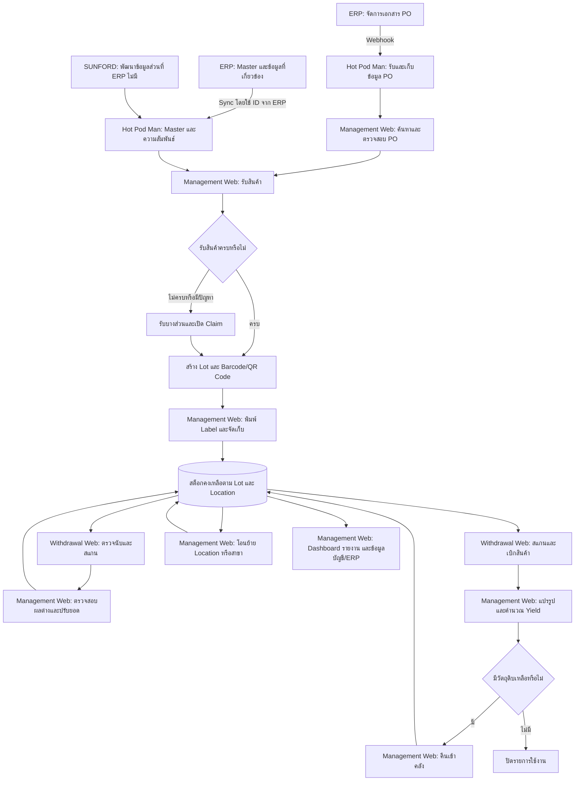
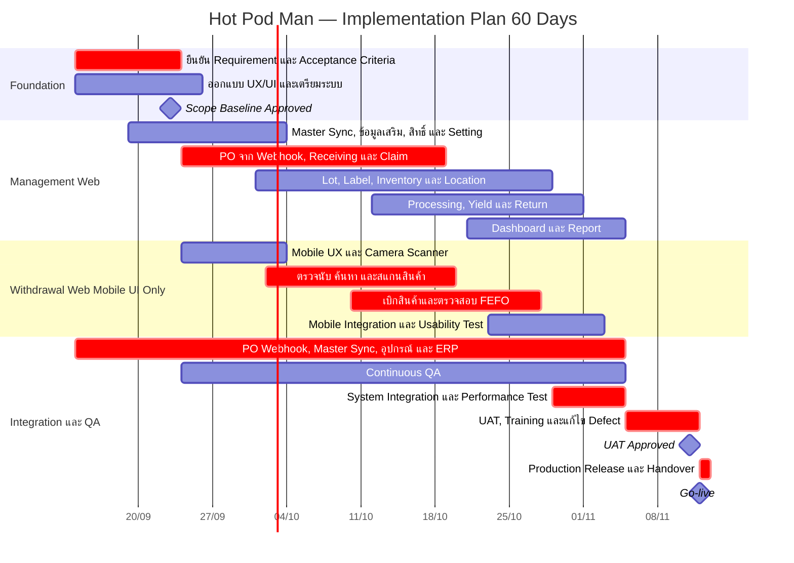

# Hot Pod Man — Business Requirements

## 1. บทสรุปโครงการ

โครงการนี้มีเป้าหมายเพื่อพัฒนาระบบติดตาม PO จาก ERP และบริหารคลังสินค้าสำหรับธุรกิจร้านอาหาร Hot Pod Man ให้สามารถติดตามสินค้าและวัตถุดิบตั้งแต่ PO รับเข้าคลัง จัดเก็บ ย้าย ตรวจนับ เบิก แปรรูป คืน ตลอดจนส่งข้อมูลให้ระบบบัญชีหรือ ERP

ERP เป็นระบบหลักสำหรับการสร้างและจัดการเอกสาร PO และข้อมูล Master ทั้งหมดที่ ERP มี Hot Pod Man รับข้อมูล PO ผ่าน Webhook และดึง/Sync Master โดยใช้ ID จาก ERP เป็น Primary Key หากข้อมูล Master ตารางที่เกี่ยวข้อง หรือความสัมพันธ์ที่จำเป็นต่อฟังก์ชันในขอบเขตนี้ไม่มีใน ERP ทีม SUNFORD จะพัฒนาเพิ่มเติมในระบบ Hot Pod Man เพื่อให้ใช้งานได้ครบ โดยลดการตั้งค่าข้อมูลที่มีอยู่แล้วซ้ำหลายระบบ

ระบบประกอบด้วย 2 ส่วนหลัก:

1. **Management Web** สำหรับจัดการข้อมูล Dashboard รายงาน Purchase Order การรับสินค้า และงานบริหารคลัง
2. **Withdrawal Web (Mobile UI Only)** สำหรับตรวจนับ สแกน และเบิกสินค้าผ่านโทรศัพท์มือถือ

ระบบต้องตรวจสอบย้อนหลังได้ว่าสินค้าแต่ละรายการมาจาก PO ใด ซื้อจาก Supplier รายใด รับเข้าเมื่อใด อยู่ตำแหน่งใด ถูกเบิกหรือแปรรูปเมื่อใด และเหลือเท่าใด

## 2. เป้าหมายทางธุรกิจ

1. ลดความผิดพลาดในการรับสินค้าและบันทึกสต็อก
2. ทำให้ยอดสินค้าในระบบตรงกับตำแหน่งและจำนวนจริง
3. ติดตามสินค้าได้ตั้งแต่ PO จนถึงการเบิกใช้หรือแปรรูป
4. ควบคุม Lot วันหมดอายุ และการหยิบแบบ FIFO/FEFO
5. รองรับการตรวจนับทั้งแบบชิ้นและน้ำหนัก
6. คำนวณ Yield และของเสียจากการแปรรูปได้
7. ติดตามราคาซื้อและประสิทธิภาพของ Supplier
8. ลดงานเอกสารซ้ำด้วย OCR, Barcode/QR Code และ Label
9. แสดง Dashboard และรายงานแยกตามสาขา
10. กำหนดสิทธิ์การใช้งานตามหน้าที่ สาขา และคลังได้อย่างละเอียด
11. เปิด–ปิดเมนูและ Action ของระบบได้โดยไม่ต้องแก้โปรแกรมใหม่
12. เชื่อมข้อมูลกับระบบบัญชีหรือ ERP ได้

## 3. ขอบเขตระบบที่ยืนยัน

ระบบในโครงการนี้มีเพียง 2 Web Application และใช้ข้อมูลกลางร่วมกัน

| ระบบ | อุปกรณ์หลัก | ขอบเขตงาน |
|---|---|---|
| **Management Web** | คอมพิวเตอร์/โน้ตบุ๊ก | Dashboard, Report, Master จาก ERP และข้อมูลเสริมที่ SUNFORD พัฒนา, ดู PO ที่รับผ่าน Webhook, รับสินค้า, OCR, Lot/Package, Label, Location, โอนย้าย, คืนสินค้า, แปรรูป/Yield, Claim, ปรับยอด, ตั้งค่า, สิทธิ์ และ Audit Log |
| **Withdrawal Web (Mobile UI Only)** | โทรศัพท์มือถือ | ตรวจนับ ค้นหา/สแกน Barcode หรือ QR Code และเบิกสินค้า |

### 3.1 ขอบเขตงานหลัก

- ดึง/Sync Master ทั้งหมดจาก ERP เป็นหลัก รวมสินค้า วัตถุดิบ หมวด หน่วย หน่วยแปลง Supplier บริษัท สาขา คลัง Location และข้อมูลที่เกี่ยวข้อง โดยใช้ ID จาก ERP เป็น Primary Key
- ทีม SUNFORD พัฒนา Master ข้อมูลเสริม ตารางที่เกี่ยวข้อง และตารางเชื่อมความสัมพันธ์ที่ ERP ไม่มีแต่จำเป็นต่อฟังก์ชันในขอบเขตนี้ พร้อมผูก Foreign Key ให้ Master และธุรกรรมทำงานร่วมกันได้
- รับข้อมูล Purchase Order จาก ERP ผ่าน Webhook เพื่อค้นหา อ้างอิงรับสินค้า และติดตามยอดรับ/ยอดค้างรับ
- การรับสินค้าแบบเต็มจำนวน บางส่วน รับเกิน หรือปฏิเสธรับตามกฎ
- การแนบบิลและใช้ OCR ช่วยอ่านข้อมูล โดยผู้ใช้ตรวจสอบก่อนยืนยัน
- Supplier Claim และการติดตามความแตกต่างด้านจำนวน น้ำหนัก ราคา และคุณภาพ
- เก็บประวัติซัพพลายเออร์และราคาซื้อทุกรายการรับสินค้าที่ยืนยันแล้ว เพื่อทำ Dashboard ประวัติราคา จำนวนครั้งและความถี่การเปลี่ยนราคาแยกสินค้า/ซัพพลายเออร์
- Lot, Package, Barcode/QR Code และการพิมพ์ Label
- ทีมโครงการเป็นผู้กำหนด จัดหา เชื่อมต่อ และทดสอบเครื่องชั่ง เครื่องพิมพ์ Label, Print Control และวัสดุฉลากที่ใช้กับระบบ
- การจัดเก็บ โอนย้าย ค้นหา ตรวจนับ ปรับยอด และหยิบแบบ FIFO/FEFO
- การเบิกสินค้าผ่าน Withdrawal Web บนโทรศัพท์มือถือ
- การคืนสินค้า แปรรูปวัตถุดิบ คำนวณ Yield และบันทึกของเสียผ่าน Management Web
- Dashboard และรายงานแยกตามสิทธิ์และสาขา
- ผู้ใช้งาน บทบาท สิทธิ์ เมนู Action และระบบตั้งค่าแบบละเอียด
- Audit Log และการตรวจสอบย้อนกลับจากสินค้าไปถึง PO, Supplier, Lot และการเคลื่อนไหว
- การเตรียมข้อมูลเพื่อเชื่อมระบบบัญชีหรือ ERP ตาม Interface ที่ยืนยัน
- ภาษาไทย ลาว จีน และพม่าตามขอบเขตการแปลที่ได้รับอนุมัติ

### 3.2 ไม่รวมในขอบเขตปัจจุบัน

- การสร้าง แก้ไข อนุมัติ ยกเลิก หรือปิดเอกสาร PO ใน Hot Pod Man; การจัดการเอกสาร PO ทำใน ERP
- การสร้างหรือแก้ไข Master ที่ ERP ดูแลซ้ำใน Hot Pod Man; ข้อนี้ไม่รวม Master หรือข้อมูลเสริมที่ ERP ไม่มีและ SUNFORD พัฒนาเพิ่มตาม BR-01
- POS หน้าร้าน เช่น เปิดโต๊ะ รับออเดอร์ แยก/รวมบิล ชำระเงิน โปรโมชั่น สมาชิก ใบเสร็จ และ KDS
- การตัดสต็อกจากยอดขาย POS หรือ Recipe/BOM แบบ Real-time
- Offline Mode และการ Sync รายการภายหลังเมื่อ Internet กลับมา
- Native Mobile Application
- Layout ของ Withdrawal Web สำหรับ Tablet, Notebook หรือ Desktop
- Supplier Portal, AI Forecasting, AI Price Prediction และ Automatic Reorder
- Temperature Sensor/Cold Chain Monitoring และ Production Planning
- Feature อื่นที่ระบุเป็น Phase 2 และยังไม่ได้รับอนุมัติเป็นลายลักษณ์อักษร

## 4. กระบวนการทำงานหลัก

## 5. ผู้ใช้งานหลัก

### 5.1 เจ้าหน้าที่จัดซื้อ

- ตรวจสอบ PO ที่รับจาก ERP ผ่าน Webhook และอ้างอิงเลขเอกสารต้นทาง
- สร้าง แก้ไข อนุมัติ หรือยกเลิก PO ผ่าน ERP แล้วติดตามข้อมูลที่ส่งมายัง Hot Pod Man
- ติดตามสินค้าที่ยังส่งไม่ครบ
- ตรวจสอบข้อมูลจากบิลและ OCR
- เปิดและติดตาม Supplier Claim
- ดูประวัติและเปรียบเทียบราคาซื้อ

### 5.2 เจ้าหน้าที่รับสินค้า

- ค้นหา PO ที่รอรับ
- รับสินค้าเต็มจำนวนหรือบางส่วน
- แยกสินค้าดีและสินค้าเคลม
- ระบุ Lot วันผลิต วันหมดอายุ จำนวนและน้ำหนัก
- สร้าง Barcode/QR Code และพิมพ์ Label
- ระบุตำแหน่งจัดเก็บเริ่มต้น

### 5.3 พนักงานคลังสินค้า

- นำเข้าจัดเก็บและย้ายสินค้า
- สแกน Barcode/QR Code และตรวจนับผ่าน Withdrawal Web บนโทรศัพท์มือถือ
- เบิกสินค้าผ่าน Withdrawal Web และคืนสินค้าผ่าน Management Web ตามสิทธิ์
- แจ้งสินค้าหมดอายุ เสียหาย หรือสูญเสีย

### 5.4 พนักงานแปรรูป

- เบิกวัตถุดิบด้วย Barcode/QR Code
- บันทึกปริมาณก่อนและหลังแปรรูปผ่าน Management Web
- บันทึกของเสียและวัตถุดิบคงเหลือ
- คืนวัตถุดิบที่เหลือกลับเข้าคลัง

### 5.5 ผู้จัดการสาขา

- อนุมัติการเบิก ย้าย ปรับยอด และรายการผิดปกติ
- ดู Dashboard และรายงานของสาขา
- ตรวจสอบ Audit Log ตามสิทธิ์

### 5.6 ผู้ดูแลระบบ

- จัดการผู้ใช้งาน บทบาท และสิทธิ์
- เปิด–ปิดเมนูและ Action
- ดู Master สาขา คลัง Location ที่รับจาก ERP และจัดการข้อมูลส่วนที่ SUNFORD พัฒนาเพิ่มตามสิทธิ์
- ตั้งค่ากระบวนการ เอกสาร ภาษา และการเชื่อมต่อ
- ตรวจสอบประวัติการแก้ไขระบบ

### 5.7 ผู้บริหาร

- ดู Dashboard ภาพรวมและแยกตามสาขาตามสิทธิ์
- ดูจำนวนและมูลค่าสินค้าคงเหลือ
- ติดตาม PO ค้างรับ การรับสินค้า การเบิกใช้ และรายการผิดปกติ
- ดูแนวโน้มราคาวัตถุดิบและเปรียบเทียบ Supplier
- ติดตาม Yield, Waste, Claim และสินค้าใกล้หมดอายุ
- เปรียบเทียบผลการดำเนินงานระหว่างสาขา

## 6. ความต้องการทางธุรกิจ

### BR-01 Master จาก ERP และข้อมูลเสริมที่ SUNFORD พัฒนา

- ใช้ Master ทั้งหมดจาก ERP เป็นหลัก รวมสินค้า วัตถุดิบ หมวด Barcode หน่วย น้ำหนัก อัตราแปลง อายุสินค้า วิธีจัดเก็บ จุดสั่งซื้อ การติดตาม Lot, Supplier บริษัท สาขา คลัง Location และข้อมูลที่เกี่ยวข้องตามที่ ERP มี
- มีฟีเจอร์ Sync ข้อมูลดังกล่าวเข้าฐานข้อมูล Hot Pod Man ทั้งการนำเข้าครั้งแรกและการอัปเดตภายหลัง เพื่อใช้กับ PO รับสินค้า คลัง และรายงานโดยไม่ต้องตั้งค่า Master ที่ ERP มีซ้ำ
- Master ที่รับจาก ERP ใช้ ID จาก ERP เป็น Primary Key โดยใช้รหัสบริษัทร่วมด้วยหาก ID ซ้ำข้ามบริษัท และคงความสัมพันธ์ระหว่างข้อมูลต้นทาง
- หาก ERP ไม่มี Master รายละเอียด หรือตารางที่จำเป็นต่อฟังก์ชันในขอบเขตนี้ ทีม SUNFORD พัฒนาเพิ่มเติมใน Hot Pod Man พร้อมหน้าจอจัดการตามสิทธิ์
- ข้อมูลที่ SUNFORD เพิ่มใช้ ID ของระบบเราและแยกจาก ID ต้นทางเพื่อป้องกันการชนกับข้อมูล ERP โดยไม่กำหนดรูปแบบรหัสหรือตารางละเอียดในเอกสารนี้
- มีตารางที่เกี่ยวข้องและตารางเชื่อมความสัมพันธ์ตามจำเป็น พร้อม Foreign Key อ้างอิง Master ที่เก็บใน Hot Pod Man เช่น สินค้า–หน่วย สินค้า–Supplier และสาขา–คลัง–Location รวมถึงการอ้างอิงจากรายการรับ เบิก แปรรูป และคืน
- ผู้มีสิทธิ์สั่ง Sync ซ้ำและดูสถานะ ผลการ Sync ล่าสุด หรือสาเหตุที่ไม่สำเร็จได้
- Master ที่ ERP ดูแลใช้สำหรับดูและอ้างอิง การแก้ข้อมูลต้นทางทำใน ERP แล้ว Sync เข้ามา ส่วนข้อมูลที่ ERP ไม่มีจัดการใน Hot Pod Man ตามสิทธิ์
- การ Sync ซ้ำต้องไม่สร้าง Master ซ้ำ ไม่ทับข้อมูลเสริมที่ SUNFORD ดูแล และไม่ลบหรือเปลี่ยนประวัติธุรกรรมเดิม
- หาก Master หรือความสัมพันธ์ที่จำเป็นยังไม่ครบ ให้แสดงรายการที่รอและระงับเฉพาะธุรกรรมที่ต้องใช้ข้อมูลนั้น จนกว่า Sync หรือการจัดเตรียมข้อมูลเสริมจะครบ
- จัดเก็บข้อมูล Supplier ประวัติราคา คุณภาพการส่ง และประวัติ Claim
- เปรียบเทียบราคา Supplier ภายในหมวดสินค้าเดียวกันได้

### BR-02 อ้างอิง Purchase Order จาก ERP ผ่าน Webhook

- รับข้อมูล PO และรายการสินค้าจาก ERP ผ่าน Webhook แล้วเก็บข้อมูลใน Hot Pod Man เพื่อค้นหา เปิดดู และใช้อ้างอิงการรับสินค้า
- ERP เป็นผู้สร้าง แก้ไข อนุมัติ ยกเลิก และปิดเอกสาร PO โดย Hot Pod Man ไม่มีหน้าจอหรือคำสั่งสำหรับจัดการเอกสาร PO เหล่านี้
- รับการเปลี่ยนแปลงข้อมูลและสถานะ PO จาก ERP โดยคงเลขอ้างอิงเอกสารต้นทาง
- แสดงจำนวนสั่ง จำนวนรับ และจำนวนค้างรับแต่ละรายการ
- แสดงสถานะเอกสารตาม ERP และแยกความคืบหน้าการรับสินค้าใน Hot Pod Man เช่น ยังไม่รับ รับบางส่วน และรับครบ ออกจากสถานะเอกสารต้นทาง
- Webhook ซ้ำต้องไม่สร้าง PO หรือรายการรับสินค้าซ้ำ และข้อมูลเก่าต้องไม่ทับข้อมูลรุ่นใหม่ที่รับแล้ว
- การเปลี่ยนหรือยกเลิก PO จาก ERP ต้องไม่ลบรายการรับสินค้าที่เกิดขึ้นแล้ว หากขัดกับยอดที่รับจริงให้แสดงปัญหาและรอผู้มีสิทธิ์ตรวจสอบก่อนรับเพิ่ม

### BR-03 การรับสินค้า

- รับสินค้าโดยอ้างอิง PO
- รองรับรับครบ รับบางส่วน รับเกิน และปฏิเสธรับตามกฎที่กำหนด
- แยกสินค้าดีและสินค้าเคลมได้
- ระบุจำนวน น้ำหนัก หน่วย วันผลิต วันหมดอายุ และ Lot ของ Supplier ได้
- รับค่าน้ำหนักจากเครื่องชั่งและบันทึก Device, ผู้ดำเนินการ และเวลาได้
- การกรอกหรือแก้น้ำหนักด้วยตนเองต้องจำกัดสิทธิ์ ระบุเหตุผล และมี Audit Log
- แนบภาพหรือบิลรับสินค้าและใช้ OCR ช่วยอ่านข้อมูลได้
- ผู้ใช้งานต้องตรวจสอบผล OCR ก่อนยืนยัน
- ทุกครั้งที่ยืนยันรับสินค้า ต้องบันทึกประวัติแยกรายการ โดยเก็บสินค้า Supplier, PO, วันที่รับ จำนวน/น้ำหนัก หน่วย ราคาต่อหน่วย และยอดรวม ณ เวลารับจริง เพื่อใช้วิเคราะห์ราคาย้อนหลัง
- ประวัติราคาที่บันทึกแล้วต้องไม่เปลี่ยนตาม Master หรือราคาใน ERP ที่อัปเดตภายหลัง และต้องตรวจสอบย้อนกลับถึงเอกสารรับสินค้าได้

### BR-04 Lot, Barcode และ Label

- สร้าง Lot แยกตามการรับหรือการแปรรูปได้
- Lot ต้องเชื่อมกับ PO, Supplier, สาขา, วันรับและวันหมดอายุ
- สร้าง Barcode/QR Code ที่ไม่ซ้ำและใช้ค้นหาสินค้าได้
- พิมพ์ Label ที่มีชื่อสินค้า Lot จำนวน/น้ำหนัก วันรับและวันหมดอายุได้
- การพิมพ์ซ้ำต้องบันทึกผู้ดำเนินการและเหตุผล

### BR-05 คลังและ Location

- ใช้โครงสร้างสาขา คลัง โซน ห้องเย็น ชั้น และช่องจัดเก็บจาก Master ใน ERP เป็นหลัก ส่วนที่ ERP ไม่มีและจำเป็นต่อการใช้งานให้ SUNFORD พัฒนาเพิ่ม โดยคงความสัมพันธ์กับ Master ที่เกี่ยวข้อง
- การจัดเก็บ ย้าย เบิกและคืนต้องอ้างอิง Location จริง
- แสดงยอดคงเหลือแยกตามสาขา Location และ Lot
- รองรับการหยิบแบบ FIFO และ FEFO ตามประเภทสินค้า
- หากผู้ใช้ไม่เลือก Lot ที่ระบบแนะนำตาม FIFO/FEFO ต้องแจ้งเตือนและบันทึกเหตุผล
- รองรับการโอนย้ายภายในคลังและระหว่างสาขา พร้อมผู้ส่ง ผู้รับ และผลต่างตอนรับ
- แจ้งเตือนสต็อกต่ำ สินค้าใกล้หมดอายุ และสินค้าหมดอายุ

### BR-06 การตรวจนับผ่าน Mobile และการปรับยอดผ่าน Management Web

- สร้างรอบตรวจนับตามสาขา คลัง Location หรือหมวดสินค้าได้
- พนักงานตรวจนับผ่าน Withdrawal Web บนโทรศัพท์มือถือได้ทั้งแบบชิ้นและน้ำหนัก
- เปรียบเทียบยอดตรวจนับกับยอดในระบบและแสดงผลต่าง
- ผู้มีสิทธิ์ตรวจสอบและปรับยอดผ่าน Management Web โดยต้องมีเหตุผล หลักฐาน และการอนุมัติ
- เก็บยอดก่อนปรับและหลังปรับไว้ตรวจสอบย้อนหลัง

### BR-07 การเบิกสินค้าผ่าน Withdrawal Web

- ใช้ Withdrawal Web แบบ Mobile UI Only
- ค้นหาหรือสแกน Barcode/QR Code เพื่อเบิกสินค้า
- ตรวจสอบสิทธิ์ ยอดคงเหลือ Lot, Location และวันหมดอายุก่อนเบิก
- แนะนำ Lot ตาม FEFO และให้ระบุเหตุผลเมื่อเลือก Lot อื่น
- บันทึกจำนวนหรือน้ำหนัก จุดใช้งาน ผู้เบิก วันที่ เวลา และ Location ต้นทาง
- แสดงผลสำเร็จหรือสาเหตุที่ไม่สามารถเบิกได้อย่างชัดเจน
- ไม่รวมหน้าจอรับสินค้า คืนสินค้า แปรรูป อนุมัติ ปรับยอด หรือตั้งค่าระบบบน Mobile

### BR-08 การแปรรูป, Yield และคืนสินค้าใน Management Web

- สร้างใบงานแปรรูปโดยอ้างอิง Lot ต้นทาง
- บันทึกปริมาณก่อนแปรรูป ผลผลิต ของเสีย และวัตถุดิบที่เหลือ
- คำนวณ Yield ด้วยสูตร `ผลผลิตที่ใช้ได้ ÷ วัตถุดิบก่อนแปรรูป × 100`
- สร้าง Lot ใหม่ของผลผลิตและเชื่อมกลับ Lot ต้นทางได้
- แจ้งเตือนเมื่อ Yield ต่ำกว่าค่าเป้าหมาย
- รองรับการชั่งของเหลือปลายวัน คำนวณปริมาณใช้จริง และคืนสินค้าเข้า Location
- ของที่คืนต้องคงการเชื่อมโยงกับ Lot/Package ต้นทางและพิมพ์ Label ใหม่ได้เมื่อจำเป็น
- ระบบต้องกำหนดวันหมดอายุใหม่ของสินค้าที่คืนตามกฎของแต่ละสินค้า

### BR-09 Supplier Claim และราคา

- เปิด Claim จากรายการรับสินค้าได้
- กำหนดหมวดเหตุผล แนบหลักฐาน และติดตามสถานะจนปิดรายการ
- บันทึกผล จำนวนและมูลค่าของ Claim
- ดูราคาล่าสุด ประวัติราคา และเปอร์เซ็นต์การเปลี่ยนแปลง
- แสดงประวัติราคาจากการรับจริงทุกครั้งแยกตามสินค้าและ Supplier พร้อมวันรับ จำนวน/น้ำหนัก หน่วย ราคาต่อหน่วย และยอดรวม โดยเปิดกลับไปยังรายการรับต้นทางได้
- แสดงจำนวนครั้งที่รับ จำนวนครั้งที่ราคาเปลี่ยน วันที่เปลี่ยน และส่วนต่างราคา/เปอร์เซ็นต์เพิ่มหรือลดในช่วงเวลาที่เลือก เพื่อวิเคราะห์ความถี่การเปลี่ยนราคา
- นับการเปลี่ยนราคาจากราคาต่อหน่วยของรายการรับที่ยืนยันแล้วและไม่ถูกยกเลิก เทียบกับรายการรับก่อนหน้าของสินค้าและ Supplier เดียวกันบนหน่วยและฐานราคาเดียวกัน; ราคาเดิมซ้ำไม่นับเป็นการเปลี่ยนราคา หากไม่มีประวัติก่อนหน้าให้รายการแรกเป็นราคาเริ่มต้น และหากมีประวัติก่อนช่วงเวลาที่เลือกให้ใช้เป็นฐานเปรียบเทียบ
- เปรียบเทียบ Supplier โดยพิจารณาราคา คุณภาพ ระยะเวลาส่ง และอัตรา Claim

### BR-10 การตรวจสอบย้อนหลัง

ระบบต้องค้นหาจากสินค้า Lot, Barcode/QR Code, PO หรือเอกสารรับเข้า แล้วแสดง:

- Supplier และ PO ต้นทาง
- วันรับ ผู้รับ จำนวนและน้ำหนัก
- Lot วันผลิตและวันหมดอายุ
- Location ปัจจุบันและประวัติการย้าย
- ประวัติการตรวจนับ ปรับยอด เบิก คืน และแปรรูป
- Output Lot, Yield, Claim และยอดคงเหลือ

### BR-11 Dashboard และรายงาน

Dashboard อยู่ใน Management Web และต้องแสดงข้อมูลตามสิทธิ์ สาขา และช่วงเวลา โดยมีข้อมูลตั้งต้นดังนี้

| กลุ่มข้อมูล | ตัวเลข/ข้อมูลที่ต้องการเห็น |
|---|---|
| Purchase Order | จำนวน PO รอรับ, รับบางส่วน, รับครบ และยอดค้างรับ |
| Receiving | จำนวน/น้ำหนัก/มูลค่าที่รับ, รายการรับขาด/เกิน, ราคาต่างจาก PO และรายการรอตรวจสอบ |
| Inventory | จำนวนและมูลค่าสต็อก, สต็อกต่ำ, สินค้าใกล้หมดอายุ/หมดอายุ และสินค้ากักกัน |
| Withdrawal | จำนวน/น้ำหนัก/มูลค่าที่เบิก แยกตามสาขา คลัง สินค้า และช่วงเวลา |
| Yield/Waste | Yield จริงเทียบมาตรฐาน, ของเสีย และรายการต่ำกว่าเกณฑ์ |
| Supplier | ราคาซื้อจริงแต่ละครั้ง ราคาล่าสุด แนวโน้มราคา จำนวนครั้งที่รับ จำนวนครั้ง/ความถี่และวันที่ราคาเปลี่ยน ส่วนต่างราคาและเปอร์เซ็นต์เพิ่ม/ลดแยกสินค้า/Supplier ปริมาณซื้อ ยอด Claim และรายการส่งไม่ครบ |
| Alert | PO ค้างรับ, Stock ต่ำ, ใกล้หมดอายุ, Yield ผิดปกติ, Claim และ Integration Error |

รายการรายงานที่ลูกค้ายืนยันแล้ว:

- Stock Balance และ Stock Movement/Stock Card
- Purchase Order และ Outstanding
- Receiving และ Receiving Variance
- Consumption/Withdrawal และ Return
- Stock Count และ Stock Adjustment
- Price History และ Supplier Comparison
- Supplier Claim
- Yield และ Waste
- Expiry และ Quarantine
- Audit Log

รายงานต้องกรองตามสาขา ช่วงเวลา สินค้า หมวด Supplier และสถานะ รวมทั้งส่งออก Excel/CSV หรือ PDF ตามสิทธิ์

รายการรายงานข้างต้นได้รับการยืนยันจากลูกค้าแล้ว และใช้เป็นขอบเขตในการพัฒนาและตรวจรับรายงานของระบบ

### BR-12 การตั้งค่าและสิทธิ์

- ตั้งค่าระบบระดับส่วนกลาง สาขา และคลังได้
- สาขาหรือคลัง Override ค่ากลางได้เฉพาะรายการที่อนุญาต
- แสดงค่ามาตรฐาน ค่า Override และค่าที่มีผลจริง
- จัดการผู้ใช้และกำหนดได้หลายบทบาท
- กำหนดสิทธิ์แยกตามเมนู หน้าจอ และ Action เช่น ดู เพิ่ม แก้ไข อนุมัติ ยกเลิก พิมพ์ซ้ำ และส่งออก
- เปิด–ปิด Menu/Submenu และกำหนดการแสดงใน Navigation ได้
- เปิด–ปิด Action ทั้งระบบหรือให้เฉพาะบางบทบาทได้
- กำหนดสาขาและคลังที่ผู้ใช้เข้าถึงได้
- ระบบต้องป้องกันการเข้าถึง แม้ผู้ใช้พยายามเข้าใช้งานนอกเมนูปกติ
- ป้องกันการปิดผู้ดูแลระบบคนสุดท้าย
- บันทึกประวัติการเปลี่ยน Setting, Menu, Role และ Permission

หมวดการตั้งค่าหลัก ได้แก่ องค์กร สาขา/คลัง เอกสาร PO รับสินค้า Lot/วันหมดอายุ FIFO/FEFO, Label, ตรวจนับ เบิกสินค้า แปรรูป/Yield, Claim, Dashboard/Report, Notification, Integration, Security และภาษา

### BR-13 ระบบบัญชีหรือ ERP

- รับ PO ผ่าน Webhook และ Sync ข้อมูลสินค้า/ข้อมูลที่เกี่ยวข้องจาก ERP ตาม BR-01 และ BR-02
- เตรียมข้อมูลรับสินค้า มูลค่าสต็อก การปรับยอด การเบิก การคืน ผลแปรรูป/Yield และของเสีย พร้อมข้อมูลอ้างอิง Master ที่จำเป็นสำหรับรายการนั้น เพื่อส่งกลับ ERP ตาม Interface ที่ยืนยัน
- ข้อมูลที่เกี่ยวข้องในข้อนี้รวมรหัสอ้างอิงของ Master และความสัมพันธ์ที่ธุรกรรมต้องใช้ เช่น สินค้า Supplier หน่วย บริษัท สาขา คลัง และ Location โดยมีตาราง Master และตารางเชื่อมความสัมพันธ์ที่จำเป็นใน Hot Pod Man พร้อม Foreign Key ตาม BR-01
- Foreign Key ใช้เชื่อมข้อมูลภายในฐานข้อมูล Hot Pod Man ส่วนการส่งกลับ ERP ส่งข้อมูลธุรกรรมพร้อมรหัสอ้างอิงที่ Interface รองรับ
- Master ที่มาจาก ERP ใช้ ID ต้นทางในการอ้างอิง ส่วน Master ที่ SUNFORD เพิ่มและ ERP ยังไม่มีต้องมีรหัสอ้างอิงปลายทางหรือแนวทางรับข้อมูลที่ ERP รองรับก่อนส่งรายการที่ต้องใช้ข้อมูลนั้น ห้ามส่ง ID ภายในไปแทน ID ของ ERP โดยไม่มีการจับคู่
- แสดงสถานะการส่งข้อมูลและสาเหตุเมื่อส่งไม่สำเร็จ
- ส่งซ้ำได้โดยไม่สร้างรายการซ้ำ
- เก็บประวัติการส่งข้อมูลไว้ตรวจสอบ

### BR-14 ภาษาและสาขา

- รองรับภาษาไทย ลาว จีน และพม่า
- ผู้ใช้เลือกภาษาส่วนตัวได้
- จำกัดข้อมูลและรายงานตามสาขาหรือกลุ่มสาขา
- ผู้มีสิทธิ์ส่วนกลางดูข้อมูลรวมและแยกตามสาขาได้

## 7. กฎทางธุรกิจสำคัญ

1. ทุกการรับเข้าต้องอ้างอิง PO เว้นแต่มีประเภทที่อนุญาตเป็นกรณีพิเศษ
2. สินค้าที่กำหนดให้ติดตาม Lot ต้องไม่มีการเคลื่อนไหวโดยไม่มี Lot
3. การย้าย เบิก คืน และปรับยอดต้องอ้างอิง Location จริง
4. สินค้าหมดอายุห้ามเบิกใช้และต้องแยกกักกัน
5. การรับเกิน PO การปรับยอด และการยกเลิกรายการสำคัญต้องผ่านการอนุมัติ
6. ธุรกรรมที่ยืนยันแล้วห้ามลบ ให้ยกเลิกหรือกลับรายการพร้อมเหตุผล
7. ระบบต้องป้องกันยอดสต็อกติดลบ
8. ผู้ใช้ต้องมีทั้งสิทธิ์การทำรายการและสิทธิ์สาขา/คลัง
9. การซ่อนเมนูหรือปุ่มไม่ถือเป็นการจำกัดสิทธิ์ ระบบต้องปฏิเสธการทำรายการจากทุกช่องทาง
10. การอนุมัติรายการสำคัญต้องรองรับผู้สร้างและผู้อนุมัติเป็นคนละคน
11. การแก้ไข Setting ต้องไม่เปลี่ยนผลของธุรกรรมย้อนหลัง
12. การทำรายการสำคัญและการแก้ไขค่าระบบต้องมี Audit Log

## 8. ข้อกำหนดคุณภาพระบบ

1. การสแกน Barcode/QR Code และแสดงข้อมูล Package ต้องใช้เวลาไม่เกิน 2 วินาทีภายใต้เครือข่ายและปริมาณใช้งานปกติ
2. การบันทึกค่าน้ำหนักหลังเครื่องชั่งแสดง Stable Weight ต้องใช้เวลาไม่เกิน 2 วินาที
3. รายงานทั่วไปต้องแสดงผลไม่เกิน 10 วินาทีภายใต้เงื่อนไขข้อมูลและ Filter ที่ตกลงร่วมกัน
4. ระบบต้องรองรับการใช้งานพร้อมกันหลายสาขา โดยข้อมูลและสิทธิ์ต้องแยกตามสาขา/คลัง
5. ระบบต้องมี Availability ไม่น้อยกว่า 99.5% ตามรอบและเงื่อนไขการวัดที่ตกลงร่วมกัน
6. ต้องมีการสำรองข้อมูลอัตโนมัติและมีแผนกู้คืนระบบเมื่อเกิดเหตุขัดข้อง
7. ข้อมูลระหว่างผู้ใช้งานกับระบบต้องเข้ารหัส และจำกัดการเข้าถึงข้อมูลราคา/ต้นทุนตามสิทธิ์
8. Stock Movement ที่ยืนยันแล้วห้ามลบ หากทำรายการผิดต้องใช้การยกเลิกหรือกลับรายการพร้อมเหตุผล
9. การแก้ไขน้ำหนัก ราคา สต็อก Setting และ Permission ต้องมี Audit Log
10. ระบบต้องป้องกันการบันทึกรายการซ้ำ ยอดสต็อกผิด และการเข้าถึงข้อมูลนอกสิทธิ์

## 9. เกณฑ์ยอมรับระดับโครงการ

1. สามารถรับ PO ผ่าน Webhook จาก ERP ค้นหาและอ้างอิงเอกสารเพื่อรับสินค้าแบบเต็มจำนวน/บางส่วนได้ โดยไม่มีการสร้างหรือจัดการเอกสาร PO ใน Hot Pod Man
2. สามารถแยกสินค้าดีและสินค้าเคลม พร้อมติดตามยอดค้างรับได้
3. สามารถสร้าง Lot และ Barcode/QR Code และค้นกลับไปยังข้อมูลต้นทางได้
4. สามารถพิมพ์ Label และตรวจสอบผลการพิมพ์ได้
5. สามารถจัดเก็บและหยิบสินค้าตาม FIFO/FEFO ได้
6. สามารถติดตามสินค้าในแต่ละ Location และดูประวัติการย้ายได้
7. สามารถตรวจนับแบบชิ้นและน้ำหนักผ่านโทรศัพท์มือถือได้
8. สามารถเบิกสินค้าผ่าน Withdrawal Web แบบ Mobile UI Only ได้
9. Withdrawal Web ต้องไม่มีหน้าจอนอกเหนือจากการตรวจนับ สแกน และเบิกสินค้า
10. สามารถแปรรูป คำนวณ Yield และคืนวัตถุดิบเข้าสต็อกผ่าน Management Web ได้
11. สามารถตรวจสอบย้อนหลังจาก Lot ไปถึง PO, Supplier และผลผลิตหลังแปรรูปได้
12. สามารถดู Dashboard และรายงานแยกตามสาขาได้
13. สามารถติดตามราคาและเปรียบเทียบ Supplier ได้
14. สามารถส่งข้อมูลไปยังระบบบัญชีหรือ ERP และตรวจสอบผลการส่งได้
15. สามารถสร้างบทบาทและกำหนดสิทธิ์รายเมนู/Action ได้
16. สามารถเปิด–ปิด Menu/Submenu และ Action โดยไม่ต้อง Deploy ระบบใหม่
17. ผู้ใช้ที่ไม่มีสิทธิ์ต้องไม่สามารถเข้าหน้าหรือเรียกข้อมูลผ่านช่องทางอื่นได้
18. สามารถตั้งค่าระบบระดับส่วนกลางและ Override ระดับสาขา/คลังได้
19. การเปลี่ยน Setting และ Permission ต้องมี Audit Log พร้อมข้อมูลก่อนและหลัง
20. ระบบต้องป้องกันการปิดผู้ดูแลระบบคนสุดท้าย
21. รองรับภาษาตามขอบเขตที่ได้รับอนุมัติ
22. สามารถ Sync Master ทั้งหมดจาก ERP โดยใช้ ID จาก ERP เป็น Primary Key และขอบเขตบริษัทที่ถูกต้อง ทั้งครั้งแรกและเมื่อมีการเปลี่ยนแปลง โดยไม่ต้องตั้งค่าข้อมูลที่ ERP มีซ้ำ
23. Webhook และการ Sync ซ้ำไม่สร้างข้อมูลซ้ำ การรับข้อมูลเก่าไม่ทับข้อมูลล่าสุด และประวัติการรับสินค้า/สต็อกเดิมยังตรวจสอบได้
24. สามารถดูสถานะและปัญหาของ PO Webhook กับ Master Sync และสั่งดำเนินการซ้ำตามสิทธิ์ได้
25. Master และข้อมูลเสริมที่ ERP ไม่มีแต่จำเป็นต่อฟังก์ชันในขอบเขตนี้สามารถจัดการใน Hot Pod Man ตามสิทธิ์ โดยไม่ชนกับ ID ของ ERP และไม่ถูก Sync ทับ
26. Master ตารางที่เกี่ยวข้อง และธุรกรรมเชื่อมโยงผ่าน Foreign Key ได้ถูกต้อง ระบบไม่ยืนยันธุรกรรมเมื่อข้อมูลอ้างอิงที่จำเป็นยังไม่ครบ และการส่งกลับ ERP ใช้รหัสอ้างอิงที่ปลายทางรองรับ
27. การรับสินค้าแต่ละครั้งเก็บสินค้า Supplier, PO, วันที่รับ จำนวน/น้ำหนัก หน่วย ราคาต่อหน่วย และยอดรวมครบ และเปิดตรวจจาก Dashboard กลับไปยังรายการรับต้นทางได้
28. เมื่อ Master หรือราคาใน ERP เปลี่ยน ประวัติราคาของรายการรับเดิมยังคงเดิม
29. Dashboard แสดงจำนวนครั้งและความถี่การเปลี่ยนราคาได้ตามช่วงเวลา สินค้า และ Supplier โดยเทียบหน่วย/ฐานราคาเดียวกัน; ตัวอย่างรับราคาต่อหน่วย 100, 100, 110, 105 ตามลำดับและไม่มีประวัติก่อนหน้า ต้องแสดงรับ 4 ครั้งและราคาเปลี่ยน 2 ครั้ง

## 10. แผนดำเนินงาน 60 วัน

แผนนี้เป็นแผนเร่งรัด 60 วันปฏิทิน เริ่มวันจันทร์ที่ 14 กันยายน 2026 ถึงวันพฤหัสบดีที่ 12 พฤศจิกายน 2026 โดยนับวันเริ่มเป็นวันที่ 1 งานด้าน Management Web, Withdrawal Web, Integration และ QA ดำเนินการคู่ขนานกัน และอัปเดตความคืบหน้าทุกวันเสาร์

รายละเอียดช่วงงานและหัวข้ออัปเดตแต่ละรอบอยู่ใน [แผนพัฒนา 60 วัน](development_plan_60_days.md)

| วันของโครงการ | วันที่ | Milestone | ผลลัพธ์ที่ต้องได้ |
|---:|---|---|---|
| 10 | 23 กันยายน 2026 | Scope Baseline | Requirement, Dashboard/Report, Integration และ Acceptance Criteria ได้รับการยืนยัน |
| 20 | 3 ตุลาคม 2026 | Foundation Ready | Master Sync จาก ERP ข้อมูลเสริม/ความสัมพันธ์ที่จำเป็น การนำ PO เดิมเข้าระบบ User, Role, Permission และ Setting หลักพร้อมทดสอบ |
| 35 | 18 ตุลาคม 2026 | Receiving Flow Ready | PO จาก ERP, Master ที่ Sync และข้อมูลเสริม Receiving เครื่องชั่ง Lot/Package และ Label ทำงานครบเส้นทางหลัก พร้อมประวัติซัพพลายเออร์และราคาซื้อรายครั้ง |
| 45 | 28 ตุลาคม 2026 | Core Inventory Ready | Location, Stock Movement, ตรวจนับ และเบิกผ่าน Mobile ทำงานร่วมกันได้ |
| 52 | 4 พฤศจิกายน 2026 | Feature Complete | Yield, Return, Claim, Dashboard, Report, ภาษา และ Integration พร้อมเข้า UAT |
| 59 | 11 พฤศจิกายน 2026 | UAT Approved | Critical Scenario ผ่านและไม่มี Critical Defect ค้างอยู่ |
| 60 | 12 พฤศจิกายน 2026 | Go-live/Handover | Production Release สำหรับสาขานำร่อง คู่มือ Training และรายการส่งมอบครบ |

รอบอัปเดตงานทุกวันเสาร์ รวม 8 ครั้ง ได้แก่ **19 และ 26 กันยายน, 3, 10, 17, 24 และ 31 ตุลาคม และ 7 พฤศจิกายน 2026** โดยอัปเดตงานที่เสร็จแล้ว งานที่กำลังทำ ผลทดสอบ ปัญหาที่กระทบแผน และเป้าหมายรอบถัดไป พร้อมสรุปผลส่งมอบอีกครั้งวันที่ 12 พฤศจิกายน 2026

Milestone และวันเริ่มใช้งานเป็นเป้าหมายตามแผน ต้องผ่านผลทดสอบและการยืนยัน UAT ก่อนเริ่มใช้งานจริง หากมีปัญหาที่กระทบกำหนดการให้แจ้งทันทีและติดตามในการอัปเดตวันเสาร์

เงื่อนไขสำคัญของแผน 60 วัน:

- ยืนยันขอบเขตและ Requirement ภายในวันที่ 10 ของโครงการ
- ERP ต้องพร้อมให้เชื่อมต่อและทดสอบตั้งแต่เริ่มโครงการวันจันทร์ที่ 14 กันยายน 2026 โดยมีช่องทางดึง Master ที่ ERP มี ความสามารถส่ง PO Webhook เอกสาร สิทธิ์เชื่อมต่อ ข้อมูลทดสอบ และผู้ประสานงานพร้อมใช้งาน
- ทีมโครงการล็อกรุ่น Hardware, Protocol, ขนาดฉลาก และผลทดสอบ Prototype ภายในสัปดาห์แรก
- ข้อมูล Master และ PO ที่มีอยู่ใน ERP ต้องพร้อมให้ทดสอบตั้งแต่วันแรก ส่วน Master/ข้อมูลเสริมที่ ERP ไม่มีให้ SUNFORD สำรวจและพัฒนาตามไทม์ไลน์
- ผู้มีอำนาจตัดสินใจสามารถตอบคำถามหรืออนุมัติงานได้ภายใน 1 วันทำการ
- มีผู้ใช้งานจริงเข้าร่วม Review และ UAT ตามกำหนด
- เริ่มใช้งานหนึ่งสาขาก่อน
- ไม่เพิ่ม Feature นอกขอบเขตหลังยืนยัน Scope Baseline หากมีการเปลี่ยนแปลงต้องประเมินเวลาและงบประมาณใหม่

## 11. หลักการตั้งต้นและค่ามาตรฐานของระบบ

โครงการจะใช้หลักการและค่ามาตรฐานต่อไปนี้เป็น Baseline โดยลูกค้าสามารถขอปรับผ่าน Setting หรือ Change Request ได้ภายหลัง

| หัวข้อ | หลักการ/ค่าเริ่มต้น |
|---|---|
| ฐานข้อมูลและ ERP | ระบบ Hot Pod Man ใช้ PostgreSQL Database แยกจาก ERP และเชื่อมต่อผ่าน API/Integration โดยไม่เขียนตรงลงตาราง ERP |
| PO | สร้างและจัดการเอกสารใน ERP; Hot Pod Man รับข้อมูลผ่าน Webhook เพื่ออ้างอิงรับสินค้าและติดตามยอด |
| Master และ ID | ดึง Master ทั้งหมดจาก ERP เป็นหลัก ใช้ ID จาก ERP เป็น Primary Key พร้อมขอบเขตบริษัท; SUNFORD พัฒนาข้อมูลส่วนที่ ERP ไม่มี โดยป้องกัน ID ชนกันและคงความสัมพันธ์ผ่าน Foreign Key |
| ประวัติราคาซื้อ | เก็บราคาจริงทุกรายการรับที่ยืนยันแล้ว พร้อมสินค้า Supplier หน่วย และเอกสารอ้างอิง เพื่อวิเคราะห์ประวัติและความถี่การเปลี่ยนราคาตาม BR-09 โดยไม่เปลี่ยนประวัติตามราคา Master ล่าสุด |
| Hardware | ทีมโครงการเป็นผู้กำหนดและจัดหาเครื่องชั่ง เครื่องพิมพ์ Label, Print Control และวัสดุฉลาก รวมถึงพัฒนา Driver/Connector, ติดตั้ง ทดสอบ และรับรองรุ่นที่รองรับ |
| การเลือก PO ตอนรับสินค้า | ระบบแนะนำ PO ที่ยังเปิดและมีกำหนดส่งเก่าที่สุดก่อน ผู้มีสิทธิ์เลือก PO อื่นได้โดยระบุเหตุผล |
| การรับเกิน PO | ค่าเริ่มต้นไม่อนุญาตให้รับเกิน (`0%`) หากเกินต้องได้รับอนุมัติ สามารถตั้งค่าแยกตามสินค้า/Supplier ได้ |
| ราคาต่างจาก PO | อนุญาตภายในช่วง `±2%` เป็นค่าเริ่มต้น หากเกินต้องให้ผู้มีสิทธิ์ฝ่ายจัดซื้ออนุมัติ |
| ผู้อนุมัติ | Claim และราคาต่างจาก PO ใช้ผู้จัดการฝ่ายจัดซื้อ; ปรับยอด ย้ายข้ามสาขา และทิ้งสินค้าใช้ผู้จัดการสาขา โดยผู้สร้างกับผู้อนุมัติต้องเป็นคนละคน |
| Dashboard | ใช้ KPI และ Filter ตาม BR-11 เป็น Baseline แสดงตามสิทธิ์ สาขา และช่วงเวลา |
| Report | ใช้รายงานตาม BR-11 เป็น Baseline รองรับ Filter, Drill-down และ Export Excel/CSV หรือ PDF ตามสิทธิ์ |
| วิธีควบคุมสต็อก | อ้างอิง Item Master ที่ Sync จาก ERP ว่าเป็น Weight, Quantity หรือ Weight and Quantity; รายการแบบน้ำหนักต้องใช้ Stable Weight จากเครื่องชั่ง |
| Manual Weight | ไม่อนุญาตตามปกติ ใช้ได้เฉพาะกรณีฉุกเฉินโดยผู้มีสิทธิ์ พร้อมเหตุผลและ Audit Log |
| Yield | ระบบคำนวณ Actual Yield ทุกครั้ง ส่วน Standard/Minimum/Maximum Yield กำหนดแยกตามสินค้าและกระบวนการ หากยังไม่ตั้งค่าจะรายงานผลจริงแต่ยังไม่แจ้งเตือนเทียบมาตรฐาน |
| สินค้าที่คืน | กำหนดวันหมดอายุใหม่ไม่เกิน 24 ชั่วโมงนับจากเวลาคืน และต้องไม่เกินวันหมดอายุเดิม สามารถตั้งข้อยกเว้นรายสินค้าได้ |
| OCR | อ่านเอกสารพิมพ์เป็นหลัก ได้แก่ เลขเอกสาร, วันที่, Supplier, PO, ยอดก่อนภาษี, ภาษี และยอดรวม; เอกสารเขียนมือเก็บเป็นหลักฐานและให้ผู้ใช้กรอก/ตรวจสอบเอง |
| งานคืนและแปรรูป | ทำผ่าน Management Web ส่วน Withdrawal Web บน Mobile มีเฉพาะตรวจนับ สแกน และเบิกสินค้า |
| Setting ที่ต้องอนุมัติ | Setting ที่กระทบสต็อก ราคา การอนุมัติ Permission, FIFO/FEFO, Yield, Running Number และ Integration ใช้ Maker–Checker; Setting ด้านการแสดงผลทั่วไปไม่ต้องอนุมัติ |
| Action ที่ไม่มีสิทธิ์ | ซ่อน Menu/Action เป็นค่าเริ่มต้น และ Backend ต้องปฏิเสธ Direct URL/API; กรณีต้องการอธิบายเงื่อนไขจึงแสดงเป็น Disabled พร้อมเหตุผล |
| Audit Log | เก็บอย่างน้อย 5 ปี แก้ไขหรือลบผ่าน Application ปกติไม่ได้ และสามารถปรับระยะเวลาเก็บตามนโยบายลูกค้า |
| สาขาและการ Rollout | ระบบรองรับหลายสาขา แต่เริ่ม Pilot หนึ่งสาขาก่อน แล้วจึง Rollout สาขาอื่นหลังผ่านเกณฑ์ยอมรับ |

### 11.1 ข้อมูลที่ลูกค้าต้องจัดเตรียม

รายการต่อไปนี้เป็นข้อมูลจริงที่ระบบไม่สามารถกำหนดแทนลูกค้าได้ และใช้สำหรับ Integration, Configuration และ UAT:

- เอกสาร PO Webhook วิธีตรวจสอบแหล่งที่มา และตัวอย่างเหตุการณ์สร้าง/แก้ไข/ยกเลิก PO จาก ERP
- เอกสารและสิทธิ์เชื่อมต่อสำหรับ Sync Master ทั้งหมดที่ ERP มี พร้อมข้อมูลทดสอบและคำอธิบาย ID/ความสัมพันธ์ โดยต้องพร้อมตั้งแต่วันจันทร์ที่ 14 กันยายน 2026
- รายการข้อมูลที่ ERP ต้องรับกลับและ Mapping Code ที่เกี่ยวข้อง
- Master และ PO ที่มีอยู่ใน ERP พร้อมให้ Sync/นำเข้าทดสอบตั้งแต่วันแรก พร้อมรายการที่ ERP ไม่มีเพื่อให้ SUNFORD พัฒนาข้อมูลและความสัมพันธ์ที่จำเป็นต่อไป
- ตัวอย่างบิล/ใบส่งของแบบพิมพ์ที่ใช้งานจริงสำหรับทดสอบ OCR
- Logo และข้อมูลที่ต้องแสดงบน Label
- รายชื่อผู้มีอำนาจอนุมัติ ผู้เข้าร่วม UAT และผู้ตัดสินใจหลักของโครงการ
- ปริมาณใช้งานจริงโดยประมาณสำหรับตรวจสอบ Capacity ก่อน Production Rollout

## 12. สมมติฐานของเอกสาร

- ทุกสาขาใช้ฐานข้อมูลกลางและแยกการเข้าถึงด้วยสิทธิ์
- ระบบ Hot Pod Man ใช้ PostgreSQL Database แยกจาก ERP และไม่เขียนตรงลงตาราง ERP
- ERP เป็นเจ้าของเอกสาร PO และ Master ที่มีอยู่; Hot Pod Man รับ PO ผ่าน Webhook และ Sync Master โดยใช้ ID จาก ERP ส่วนข้อมูลที่ ERP ไม่มีและจำเป็นต่อขอบเขตงานให้ SUNFORD พัฒนาเพิ่มพร้อมความสัมพันธ์และ Foreign Key
- ทีมโครงการรับผิดชอบการเลือก จัดหา เชื่อมต่อ ติดตั้ง และทดสอบเครื่องชั่งกับเครื่องพิมพ์ Label ทั้งหมด
- Management Web ใช้สำหรับงานบริหาร รับเข้า รายงาน และพิมพ์ Label
- งานคืนสินค้า แปรรูป Yield อนุมัติ และปรับยอดอยู่ใน Management Web
- Withdrawal Web เป็น Mobile UI Only ใช้ผ่านโทรศัพท์มือถือ และมีเฉพาะตรวจนับ สแกน และเบิกสินค้า
- OCR เป็นเครื่องมือช่วยกรอกข้อมูล ผู้ใช้งานต้องตรวจสอบก่อนยืนยัน
- ERP ต้องพร้อมเชื่อมต่อ/ทดสอบตั้งแต่วันเริ่มโครงการ PO ใช้ Webhook ส่วน Master Sync และข้อมูลส่งกลับ ERP พร้อมรหัสอ้างอิงใช้ Interface ของ ERP ที่จัดเตรียมไว้
- POS หน้าร้าน Offline Mode Native Mobile App และ Feature Phase 2 ไม่รวมในขอบเขตปัจจุบัน
