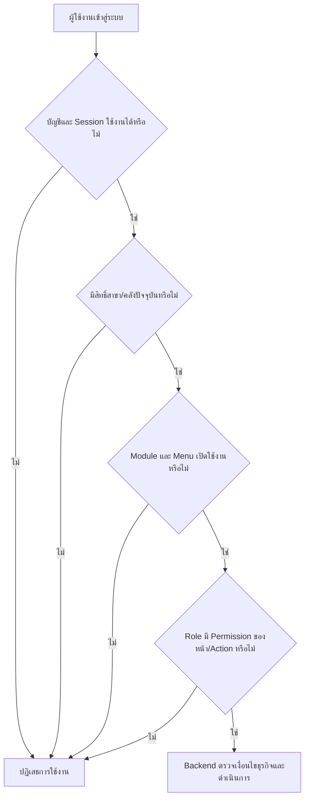
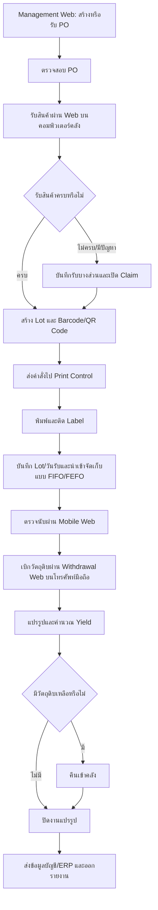
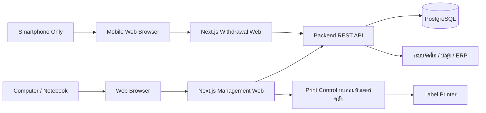
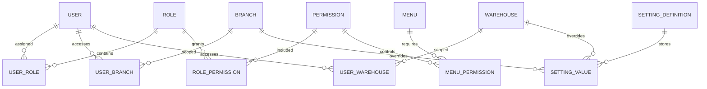

# Hot Pod Man Web Inventory Management System

> เอกสารร่างความต้องการระบบ (Draft Software Requirements Specification)
>
> สถานะ: ร่างเพื่อใช้เก็บ Requirement และยืนยันขอบเขตกับผู้เกี่ยวข้อง

## 1. ภาพรวมโครงการ

โครงการนี้มีเป้าหมายเพื่อพัฒนา Web Application สำหรับบริหารข้อมูล จัดซื้อ และคลังสินค้าของธุรกิจร้านอาหาร Hot Pod Man ให้สามารถติดตามวัตถุดิบและสินค้าได้ตั้งแต่การเปิดใบสั่งซื้อ การรับสินค้าเข้าคลัง การจัดเก็บ การย้ายสินค้า การเบิกไปแปรรูป การคืนวัตถุดิบคงเหลือ การตรวจนับสต็อก ตลอดจนการส่งข้อมูลให้ระบบบัญชีหรือ ERP

ระบบแบ่งหน้าการใช้งานหลักเป็น 2 ส่วน ได้แก่

1. **Management Web** สำหรับจัดการข้อมูลทั้งหมด Dashboard รายงาน และระบบรับเข้าสินค้า
2. **Withdrawal Web (Mobile UI Only)** สำหรับค้นหา สแกน และเบิกสินค้าออกจากคลังผ่านโทรศัพท์มือถือเท่านั้น

ผู้ใช้งานเข้าถึงระบบผ่าน Web Browser โดย Management Web รองรับหน้าจอสำหรับงานบริหารจัดการ ส่วน Withdrawal Web ออกแบบเป็น Mobile UI และรองรับเฉพาะ Web Browser บนโทรศัพท์มือถือ งานรับเข้าและพิมพ์ Label ให้ใช้งานบนคอมพิวเตอร์คลังที่เชื่อมต่อโปรแกรม Print Control และเครื่องพิมพ์ Label

ระบบต้องรองรับการตรวจสอบย้อนหลัง (Traceability) เพื่อให้ทราบว่าสินค้าแต่ละรายการมาจากใบสั่งซื้อใด ซื้อจาก Supplier รายใด รับเข้าเมื่อใด อยู่ที่ตำแหน่งใด ถูกเบิกไปใช้หรือแปรรูปเมื่อใด และมีปริมาณคงเหลือเท่าใด

> **หมายเหตุเรื่องขอบเขต:** ขอบเขตที่ยืนยันในรอบนี้คือเว็บจัดการข้อมูล Dashboard รายงาน รับสินค้า และเว็บเบิกสินค้า แม้ภาพอ้างอิงจะใช้คำว่า POS และแสดงโมดูลขายหน้าร้าน แต่ยังไม่มีรายละเอียดเพียงพอสำหรับฟังก์ชันรับออเดอร์ โต๊ะอาหาร ชำระเงิน โปรโมชัน และใบกำกับภาษี จึงยังแยกฟังก์ชันขายหน้าร้านไว้เป็นประเด็นรอยืนยัน

## 2. วัตถุประสงค์

1. ให้ผู้ใช้งานจัดการข้อมูลและเข้าถึง Dashboard/รายงานผ่าน Web Browser
2. จัดการและติดตาม Purchase Order (PO)
3. รับสินค้าเข้าคลังผ่าน Management Web บนคอมพิวเตอร์คลัง
4. สร้าง Lot และ Barcode/QR Code สำหรับติดตามสินค้า
5. พิมพ์ Label ผ่าน Print Control และเครื่องพิมพ์ที่ติดตั้งในคลัง
6. นำสินค้าเข้าตำแหน่งจัดเก็บตาม Location และหลัก FIFO/FEFO ที่กำหนด
7. ควบคุมการย้ายสินค้าให้ข้อมูลในระบบตรงกับตำแหน่งจริง
8. เบิกสินค้าออกจากคลังผ่าน Withdrawal Web บนโทรศัพท์มือถือ ตามสิทธิ์และวัตถุประสงค์
9. รองรับการแปรรูปหรือหั่นวัตถุดิบ
10. คำนวณ Yield ของวัตถุดิบหลังแปรรูป
11. นำวัตถุดิบที่เหลือกลับเข้าสต็อก
12. ตรวจนับและปรับปรุงยอดสต็อกอย่างมีหลักฐาน
13. ติดตามราคาซื้อและปริมาณการใช้
14. ส่งข้อมูลไปยังระบบบัญชีหรือ ERP
15. แสดงรายงานแยกตามสาขา
16. รองรับผู้ใช้งานหลายภาษา ได้แก่ ไทย ลาว จีน และพม่า
17. ให้ผู้ดูแลตั้งค่าระบบและเปิด–ปิด Menu/Action ได้อย่างละเอียดโดยไม่ต้อง Deploy ใหม่

## 3. ขอบเขตระบบ

### 3.1 อยู่ในขอบเขตของเอกสารฉบับนี้

- Management Web สำหรับข้อมูล Master, Dashboard, Report และรับสินค้า
- Withdrawal Web แบบ Mobile UI Only สำหรับเบิกสินค้าออกจากคลังผ่านโทรศัพท์มือถือ
- Management Web สำหรับคอมพิวเตอร์ โน้ตบุ๊ก และขนาดหน้าจอที่ตกลงกัน
- ข้อมูลสินค้า วัตถุดิบ หน่วยนับ และหน่วยแปลง
- ข้อมูล Supplier และประวัติราคาซื้อ
- Purchase Order
- การรับสินค้าแบบเต็มจำนวนและบางส่วน
- การบันทึกปัญหาการรับสินค้าและการเคลม Supplier
- การอ่านข้อมูลจากบิลรับสินค้าด้วย OCR
- การสร้าง Lot และ Barcode/QR Code
- การพิมพ์สติกเกอร์สำหรับสินค้าที่มีน้ำหนัก
- คลัง ตำแหน่งจัดเก็บ และการย้ายสินค้า
- การตรวจนับสต็อกผ่าน Mobile Web Browser บนโทรศัพท์มือถือ
- การเบิกวัตถุดิบผ่าน Withdrawal Web
- การคืนวัตถุดิบเข้าคลัง
- การแปรรูปวัตถุดิบและการคำนวณ Yield
- การตรวจสอบย้อนหลังของสินค้าแต่ละ Lot
- รายงานจัดซื้อ สต็อก การใช้ ราคา และการเคลม
- การส่งข้อมูลให้ระบบบัญชีหรือ ERP
- การกำหนดสิทธิ์ผู้ใช้งานและบันทึก Audit Log
- ระบบตั้งค่าแบบ Global/สาขา/คลัง พร้อม Effective Value และประวัติการแก้ไข
- ระบบเปิด–ปิด Menu, Submenu, Route และ Action ราย Permission

### 3.2 รอยืนยันว่าอยู่ในขอบเขตหรือไม่

- POS หน้าร้าน: เปิดโต๊ะ รับออเดอร์ แยกบิล รวมบิล และย้ายโต๊ะ
- การชำระเงิน: เงินสด บัตรเครดิต QR Payment และช่องทางอื่น
- โปรโมชัน คูปอง สมาชิก และสะสมแต้ม
- ใบเสร็จ ใบกำกับภาษี และการคืนเงิน
- การเชื่อมยอดขายกับสูตรอาหารเพื่อตัดวัตถุดิบอัตโนมัติ
- ครัว/KDS และการพิมพ์ใบสั่งอาหาร
- การทำงานแบบ Offline เมื่ออินเทอร์เน็ตขัดข้อง

## 4. คำศัพท์สำคัญ

| คำศัพท์ | ความหมาย |
|---|---|
| PO | ใบสั่งซื้อสินค้า (Purchase Order) |
| Supplier | ผู้จำหน่ายสินค้าหรือวัตถุดิบ |
| Lot | ชุดสินค้าที่รับเข้าหรือผลิตในครั้งเดียวกันและติดตามย้อนหลังร่วมกัน |
| Location | ตำแหน่งจัดเก็บจริง เช่น สาขา คลัง ห้องเย็น ชั้น และช่อง |
| Yield | อัตราส่วนปริมาณที่ใช้งานได้หลังแปรรูปเทียบกับปริมาณก่อนแปรรูป |
| Claim | รายการเรียกร้องหรือแจ้งปัญหากับ Supplier |
| OCR | การอ่านตัวอักษรและจำนวนเงินจากภาพหรือเอกสารโดยอัตโนมัติ |
| FIFO | การเลือกใช้สินค้าที่รับเข้าก่อนเป็นลำดับแรก |
| FEFO | การเลือกใช้สินค้าที่หมดอายุก่อนเป็นลำดับแรก |
| Stock Adjustment | การปรับยอดสต็อกให้ตรงกับผลตรวจนับจริง |

## 5. ผู้ใช้งานและสิทธิ์

### 5.1 Purchasing Officer — เจ้าหน้าที่จัดซื้อ

- สร้าง PO ใหม่ หรือรับ PO จากระบบจัดซื้อเดิม
- ตรวจสอบรายการและสถานะของ PO
- ติดตามสินค้าที่ยังส่งไม่ครบ
- ตรวจสอบและยืนยันข้อมูลที่อ่านจากบิลด้วย OCR
- เปิดรายการเคลมและเลือกเหตุผลตามหมวดที่กำหนด เช่น สินค้าเสียหาย หรือส่งไม่ครบ
- บันทึกผลการเคลมและเรียกรายงานการเคลม
- ตรวจสอบประวัติราคาสินค้าและเปอร์เซ็นต์การเปลี่ยนแปลงราคา
- เปรียบเทียบราคา Supplier ตามหมวดสินค้า เช่น ผัก หรือของสด

### 5.2 Receiving Officer — เจ้าหน้าที่รับสินค้า

- ค้นหาและเปิด PO ที่รอรับ
- รับสินค้าแบบเต็มจำนวนหรือบางส่วน
- ระบุสินค้าดี สินค้าเคลม และหมายเหตุการรับเข้า
- ระบุวันผลิต วันหมดอายุ จำนวน น้ำหนัก และหน่วยนับ
- สร้าง Lot และ Barcode/QR Code
- พิมพ์ฉลากหรือสติกเกอร์สินค้า
- ระบุตำแหน่งจัดเก็บเริ่มต้น

### 5.3 Warehouse Officer — พนักงานคลังสินค้า

- ตรวจสอบ นำเข้าจัดเก็บ และย้ายสินค้า
- สแกน Barcode/QR Code ก่อนทำรายการ
- ตรวจนับสต็อกผ่าน Mobile Web Browser บนโทรศัพท์มือถือ
- เบิกและคืนสินค้าได้ตามสิทธิ์
- แจ้งสินค้าหมดอายุ เสียหาย หรือสูญเสีย

### 5.4 Processing Officer — พนักงานแปรรูป

- สแกน Barcode/QR Code เพื่อเบิกวัตถุดิบ
- บันทึกน้ำหนักหรือจำนวนก่อนแปรรูป
- บันทึกสินค้าที่ได้ ของเสีย และวัตถุดิบคงเหลือ
- คืนวัตถุดิบที่เหลือกลับเข้าคลังภายในเวลาที่กำหนด

### 5.5 Branch Manager — ผู้จัดการสาขา

- อนุมัติการเบิก การย้าย การปรับยอด และการทิ้งสินค้าตามวงเงินหรือเงื่อนไข
- ดูรายงานของสาขาที่รับผิดชอบ
- ตรวจสอบรายการผิดปกติและ Audit Log

### 5.6 System Administrator — ผู้ดูแลระบบ

- จัดการผู้ใช้งาน บทบาท และสิทธิ์
- จัดการข้อมูลสาขา คลัง Location หน่วยนับ และค่าพื้นฐาน
- กำหนดหมวดเหตุผลการเคลมและการปรับสต็อก
- ตั้งค่าภาษา การเชื่อมต่อ และเลขที่เอกสาร
- ดูประวัติการทำรายการของทุกสาขาตามสิทธิ์

### 5.7 รูปแบบการกำหนดสิทธิ์

ระบบใช้แนวทาง Role-Based Access Control (RBAC) โดยอ้างอิงรูปแบบจากโครงการ Warehouse และเพิ่มการควบคุม Menu/Action แบบ Dynamic ดังนี้

1. ผู้ใช้งานหนึ่งคนสามารถมีได้หลายบทบาท
2. บทบาทหนึ่งรายการสามารถมีได้หลาย Permission
3. Permission ใช้รหัสรูปแบบ `module.action` เช่น `receiving.confirm` หรือ `report.export`
4. ผู้ใช้งานต้องถูกกำหนดสาขาและคลังที่มีสิทธิ์เข้าถึงแยกจาก Permission
5. เมนูแต่ละรายการต้องกำหนด Permission ที่ใช้สำหรับเข้าหน้าได้
6. Action แต่ละรายการ เช่น เพิ่ม แก้ไข อนุมัติ ยกเลิก พิมพ์ซ้ำ หรือส่งออก ต้องมี Permission แยกกัน
7. Frontend ใช้ Permission เพื่อแสดง/ซ่อนเมนูและปุ่ม แต่ Backend API ต้องตรวจ Permission ซ้ำทุกครั้ง
8. หากไม่มี Permission ที่ตรงกัน ระบบต้องปฏิเสธโดยอัตโนมัติ (Default Deny)
9. Role และ Permission ที่ถูกปิดใช้งานต้องไม่มีผลกับ Session หรือคำขอใหม่
10. การเปลี่ยนสิทธิ์ต้องทำให้ Permission Cache หรือ Session ที่เกี่ยวข้องถูก Refresh ภายในเวลาที่กำหนด

ลำดับการตรวจสิทธิ์ของคำขอหนึ่งรายการ:

## 6. กระบวนการทำงานหลัก

### 6.1 โมดูล Web Application

#### Management Web

- Dashboard แสดงภาพรวม PO การรับสินค้า สต็อกคงเหลือ สินค้าใกล้หมดอายุ การเบิกใช้ และรายการผิดปกติ
- จัดการข้อมูล Master เช่น สินค้า Supplier สาขา คลัง Location หน่วยนับ ผู้ใช้งาน และสิทธิ์
- จัดการ PO และรับสินค้าเข้า
- สร้าง Lot/Batch และ Barcode/QR Code
- สั่งพิมพ์ Label ผ่าน Print Control
- จัดการคลัง การโอนย้าย การคืน และการปรับยอด
- ดูและส่งออกรายงาน
- ตั้งค่าระบบและตรวจสอบ Audit Log

#### Withdrawal Web — Mobile UI Only

- ใช้งานผ่าน Mobile Web Browser บนโทรศัพท์มือถือเท่านั้น
- ไม่รวมการออกแบบหน้าจอสำหรับแท็บเล็ต โน้ตบุ๊ก หรือคอมพิวเตอร์
- ค้นหาหรือสแกน Barcode/QR Code ของสินค้า
- แสดง Lot, Location, วันหมดอายุ และยอดที่เบิกได้
- เลือกจำนวนหรือน้ำหนัก จุดประสงค์ และหน่วยงานผู้เบิก
- ส่งคำขอเบิกหรือยืนยันการเบิกตามสิทธิ์
- แสดงผลสำเร็จและเลขที่รายการเบิกเพื่อป้องกันการทำรายการซ้ำ

### 6.2 สถาปัตยกรรมระบบ

| ชั้นระบบ | เทคโนโลยี/หน้าที่ |
|---|---|
| Frontend | Next.js สำหรับ Management Web และ Withdrawal Web |
| Backend/API | NestJS เป็นตัวเลือกหลักตามข้อมูลที่ได้รับ; คำว่า “Adunis” ตีความเบื้องต้นว่า AdonisJS และต้องยืนยันว่าจะใช้แทน NestJS หรือมีหน้าที่แยกกัน |
| Database | PostgreSQL เป็นฐานข้อมูลกลางสำหรับข้อมูล Master และธุรกรรม |
| Printing | โปรแกรม Print Control บนคอมพิวเตอร์คลัง รับคำสั่งจาก Web Application และส่งไปยัง Label Printer |
| Management Client | Web Browser บนคอมพิวเตอร์และโน้ตบุ๊ก รวมถึงขนาดหน้าจออื่นที่ตกลงกัน |
| Withdrawal Client | Mobile Web Browser บนโทรศัพท์มือถือเท่านั้น (Mobile UI Only) |

ข้อกำหนดสถาปัตยกรรมเบื้องต้น:

1. Frontend ต้องเรียกข้อมูลผ่าน Backend API และไม่เชื่อมต่อ PostgreSQL โดยตรง
2. Backend ต้องเป็นผู้ควบคุมกฎธุรกิจ สิทธิ์ และ Transaction ของสต็อก
3. PostgreSQL ต้องเป็นแหล่งข้อมูลกลางชุดเดียวของทุกสาขา
4. Print Control ต้องยืนยันผลการพิมพ์กลับมายังระบบ และระบบต้องบันทึกกรณีพิมพ์ไม่สำเร็จ
5. API ต้องรองรับ Idempotency สำหรับรายการรับเข้า เบิก คืน และการเชื่อมต่อระบบภายนอก เพื่อป้องกันรายการซ้ำ

### 6.3 โครงสร้าง PostgreSQL Schema เบื้องต้น

แนะนำให้แยก Schema ตาม Domain เพื่อให้โครงสร้างใกล้เคียงแนวทางของระบบ Warehouse และลดการปะปนของตารางแต่ละงาน

| Schema | ข้อมูลหลัก |
|---|---|
| `security` | Session, Authentication, Access Log และ Security Event |
| `master_data` | บริษัท สาขา คลัง Location สินค้า Supplier ผู้ใช้ Role Permission Menu และ System Setting |
| `purchasing` | PO รายการสั่งซื้อ ประวัติราคา และ Supplier Claim |
| `receiving` | เอกสารรับเข้า รายการรับเข้า OCR Attachment Lot และ Print Job |
| `inventory` | Stock Ledger ยอดคงเหลือ การย้าย การตรวจนับ การปรับยอด FIFO/FEFO |
| `withdrawal` | คำขอเบิก การอนุมัติ การจ่ายสินค้า การรับสินค้า และการคืน |
| `processing` | ใบงานแปรรูป วัตถุดิบต้นทาง ผลผลิต ของเสีย และ Yield |
| `notification` | Notification Template, Event, Recipient และ Delivery Status |
| `integration` | ERP Mapping, Outbox, Sync Job, Request/Response และ Retry Log |
| `reporting` | View, Materialized View หรือข้อมูลสรุปสำหรับ Dashboard และ Report |

โครงสร้าง Logical สำหรับระบบสิทธิ์และการตั้งค่า:

ตาราง Logical ขั้นต่ำของระบบสิทธิ์:

| ตาราง | ฟิลด์สำคัญ |
|---|---|
| `users` | รหัสผู้ใช้ สถานะ ภาษา สาขาหลัก และข้อมูลเข้าสู่ระบบ |
| `roles` | `role_code`, ชื่อ, รายละเอียด, ลำดับ, `is_active`, `is_system_role` |
| `permissions` | `permission_code`, `module_key`, `action_key`, ชื่อ, รายละเอียด, `is_active` |
| `user_roles` | ผู้ใช้ บทบาท วันที่เริ่ม/สิ้นสุด และสถานะ |
| `role_permissions` | บทบาท Permission และสถานะ |
| `user_branches` | ผู้ใช้ สาขาที่เข้าถึงได้ และสาขาหลัก |
| `user_warehouses` | ผู้ใช้ คลังที่เข้าถึงได้ |
| `menus` | App, Section, Parent, Menu Code, Path, Icon, Sort Order, `is_enabled`, `show_in_navigation` |
| `menu_permissions` | Menu, Permission, Access Mode แบบ ANY/ALL |
| `setting_definitions` | Setting Key, Data Type, Default, Validation, Scope และข้อมูลอธิบาย |
| `setting_values` | Setting Key, Scope Type, Scope ID, Value, Effective Date และ Version |
| `audit_logs` | ผู้ดำเนินการ Action, Target, Before/After, สาขา, IP, Device และวันเวลา |

## 7. ความต้องการเชิงฟังก์ชัน

### FR-01 ข้อมูลสินค้าและวัตถุดิบ

1. ระบบต้องจัดเก็บรหัส ชื่อ หมวด ประเภท และสถานะของสินค้า
2. ระบบต้องรองรับสินค้าที่นับเป็นชิ้นและสินค้าที่วัดด้วยน้ำหนัก
3. ระบบต้องกำหนดหน่วยซื้อ หน่วยสต็อก และอัตราแปลงหน่วยได้
4. ระบบต้องกำหนดอายุสินค้า เงื่อนไขการจัดเก็บ และจุดสั่งซื้อขั้นต่ำได้
5. ระบบต้องกำหนดได้ว่าสินค้าใดต้องติดตาม Lot วันผลิต หรือวันหมดอายุ
6. ระบบต้องรองรับ Barcode ของ Supplier และ Barcode/QR Code ที่ระบบสร้างเอง

### FR-02 Purchase Order

1. ระบบต้องสร้าง PO ได้ หรือรับข้อมูล PO จากระบบจัดซื้อเดิมได้
2. PO ต้องมีเลขที่เอกสาร Supplier สาขาปลายทาง วันที่สั่ง วันที่คาดว่าจะรับ และรายการสินค้า
3. รายการ PO ต้องมีจำนวน หน่วย ราคา ส่วนลด ภาษี และยอดรวมตามข้อมูลที่ตกลงใช้
4. ระบบต้องแสดงสถานะอย่างน้อย ได้แก่ ร่าง รออนุมัติ อนุมัติแล้ว รับบางส่วน รับครบ ยกเลิก และปิดเอกสาร
5. ระบบต้องแสดงยอดสั่ง ยอดรับ และยอดค้างรับแยกรายการ
6. การแก้ไขหรือยกเลิก PO หลังอนุมัติต้องเป็นไปตามสิทธิ์และมีประวัติการเปลี่ยนแปลง

### FR-03 การรับสินค้า

1. เจ้าหน้าที่ต้องเลือก PO ก่อนรับสินค้า และรับตามลำดับหรือกฎที่ธุรกิจกำหนด
2. ระบบต้องเชื่อมรายการรับเข้ากับรายการ PO เดิม
3. ระบบต้องรองรับการรับเต็มจำนวน รับบางส่วน รับเกิน และปฏิเสธรับ โดยการรับเกินต้องผ่านเงื่อนไขอนุมัติ
4. เจ้าหน้าที่ต้องจำแนกสินค้าดีและสินค้าเคลมได้
5. กรณีเคลม ต้องเลือกเหตุผลและบันทึกหมายเหตุตามรูปแบบที่กำหนด
6. ระบบต้องรองรับวันผลิต วันหมดอายุ Lot ของ Supplier จำนวน น้ำหนัก และหน่วยนับ
7. ระบบต้องช่วยกำหนดวันหมดอายุอัตโนมัติจากอายุสินค้าที่ตั้งไว้ และอนุญาตให้ผู้มีสิทธิ์แก้ไขได้
8. เมื่อเลือก Supplier ระบบต้องแสดงราคาซื้อล่าสุดของสินค้านั้นเพื่อประกอบการตรวจสอบ
9. ระบบต้องบันทึกผู้รับสินค้า วันเวลา อุปกรณ์ และสาขาที่ทำรายการ

### FR-04 การอัปโหลดบิลและ OCR

1. ระบบต้องแนบภาพหรือไฟล์บิลรับสินค้าจาก Supplier ได้
2. ระบบควรอ่านเลขที่เอกสาร วันที่ Supplier ยอดเงิน และรายการที่ตรวจจับได้โดยอัตโนมัติ
3. ระบบต้องรองรับทั้งเอกสารพิมพ์และเอกสารที่มีลายมือ โดยผลลัพธ์ขึ้นอยู่กับคุณภาพเอกสาร
4. ผู้ใช้งานต้องตรวจสอบและยืนยันผล OCR ก่อนบันทึกเป็นข้อมูลจริง
5. ระบบต้องแสดงค่าที่ OCR อ่านไม่แน่ใจเพื่อให้ผู้ใช้งานแก้ไข
6. ระบบต้องเก็บไฟล์ต้นฉบับ ผล OCR และประวัติการแก้ไขไว้ตรวจสอบย้อนหลัง

### FR-05 Lot, Barcode/QR Code และฉลาก

1. ระบบต้องสร้าง Lot เมื่อรับสินค้า โดยหนึ่งรายการรับสามารถแยกเป็นหลาย Lot ได้
2. Lot ต้องเชื่อมโยงกับ PO, Supplier, เอกสารรับเข้า, สาขา, วันรับ, วันผลิต และวันหมดอายุ
3. Barcode/QR Code ต้องไม่ซ้ำและสามารถใช้ค้นหา Lot ได้
4. ระบบต้องพิมพ์ฉลากที่แสดงข้อมูลขั้นต่ำ ได้แก่ ชื่อสินค้า Lot น้ำหนัก/จำนวน วันรับ และวันหมดอายุ
5. สินค้าที่มีน้ำหนักต้องพิมพ์สติกเกอร์แปะสินค้าได้
6. การพิมพ์ฉลากซ้ำต้องมีการบันทึกผู้สั่งพิมพ์ วันเวลา และเหตุผล

### FR-06 คลังและ Location

1. ระบบต้องกำหนดโครงสร้าง Location เช่น สาขา คลัง โซน ห้องเย็น ชั้น และช่องได้
2. การนำเข้าจัดเก็บต้องระบุ Lot ปริมาณ และ Location ปลายทาง
3. การย้ายสินค้าต้องสแกนหรือเลือกรายการจาก Location ต้นทางและยืนยัน Location ปลายทาง
4. ยอดสินค้าในระบบต้องเปลี่ยนตามการเคลื่อนย้ายจริงและห้ามติดลบ เว้นแต่ผู้มีสิทธิ์อนุมัติ
5. ระบบต้องแสดงยอดคงเหลือแยกตามสาขา Location Lot และสถานะสินค้า
6. ระบบต้องรองรับกฎหยิบสินค้าแบบ FIFO และ FEFO โดยกำหนดกฎที่ใช้ตามประเภทสินค้าได้
7. ระบบต้องแจ้งเตือนสินค้าใกล้หมดอายุ สินค้าหมดอายุ และสต็อกต่ำกว่าเกณฑ์

### FR-07 การตรวจนับและปรับปรุงสต็อก

1. ระบบต้องสร้างรอบตรวจนับตามสาขา คลัง Location หรือหมวดสินค้าได้
2. ผู้ใช้งานต้องตรวจนับผ่าน Mobile Web Browser บนโทรศัพท์มือถือได้ทั้งแบบชิ้นและแบบน้ำหนัก
3. ระบบต้องติดตามผลตรวจนับเทียบกับยอดในระบบ
4. ระบบต้องแสดงผลต่างและมูลค่าผลต่างก่อนปรับยอด
5. การปรับยอดต้องระบุเหตุผล หลักฐาน ผู้ดำเนินการ และผู้อนุมัติตามสิทธิ์
6. ระบบต้องเก็บยอดก่อนปรับ ยอดหลังปรับ และประวัติการอนุมัติ

### FR-08 การเบิกสินค้า

1. ผู้ใช้งานต้องสแกน Barcode/QR Code เพื่อเลือก Lot ที่ต้องการเบิกได้
2. ระบบต้องตรวจสอบสิทธิ์ก่อนอนุญาตให้เบิก
3. ระบบต้องบันทึกผู้เบิก จุดประสงค์ สาขา/หน่วยงาน จำนวนหรือน้ำหนัก และวันเวลา
4. ระบบต้องตัดสต็อกจาก Lot และ Location ที่เบิกจริง
5. ระบบต้องรองรับขั้นตอนขอเบิก อนุมัติ จ่ายสินค้า รับสินค้า และยกเลิก ตามกฎธุรกิจ
6. ระบบต้องป้องกันการเบิกเกินยอดคงเหลือ

### FR-09 การแปรรูปและ Yield

1. ระบบต้องสร้างใบงานแปรรูปโดยอ้างอิงวัตถุดิบ Lot ต้นทาง
2. ระบบต้องบันทึกน้ำหนักหรือจำนวนก่อนแปรรูป
3. ระบบต้องบันทึกผลผลิตที่ใช้งานได้ ของเสีย และวัตถุดิบที่เหลือ
4. ระบบต้องคำนวณ Yield ด้วยสูตรต่อไปนี้

   `Yield (%) = ปริมาณผลผลิตที่ใช้งานได้ ÷ ปริมาณวัตถุดิบก่อนแปรรูป × 100`

5. ระบบต้องสร้าง Lot ใหม่สำหรับผลผลิตหลังแปรรูปเมื่อจำเป็น และรักษาความเชื่อมโยงกับ Lot ต้นทาง
6. ระบบต้องเปรียบเทียบ Yield จริงกับค่าเป้าหมายและแสดงรายการผิดปกติ
7. ระบบต้องบันทึกผู้ปฏิบัติงาน วันเวลา และสาขาที่แปรรูป

### FR-10 การคืนสินค้าเข้าคลัง

1. ระบบต้องรองรับการคืนแบบชิ้นและแบบน้ำหนัก
2. การคืนแบบน้ำหนักต้องอัปเดตน้ำหนักล่าสุดของ Barcode/QR Code เดิมที่เคยเบิก
3. ระบบต้องคืนสินค้าเข้า Lot และ Location ที่ตรวจสอบได้
4. การคืนต้องดำเนินการภายใน 24 ชั่วโมงหลังเบิก เว้นแต่มีการอนุมัติข้อยกเว้น
5. ระบบต้องระบุสภาพสินค้าและอนุญาตให้คืนเฉพาะสินค้าที่ยังใช้งานได้ตามกฎธุรกิจ
6. ระบบต้องบันทึกผู้คืน ผู้รับคืน วันเวลา ปริมาณก่อนเบิก ปริมาณใช้ และปริมาณคืน

### FR-11 การเคลม Supplier

1. ระบบต้องเปิด Claim จากรายการรับสินค้าได้
2. เหตุผล Claim ต้องจัดการเป็นหมวด เช่น เสียหายจาก Supplier ส่งไม่ครบ คุณภาพไม่ผ่าน หรือราคาไม่ตรง
3. ระบบต้องแนบภาพ เอกสาร และหมายเหตุได้
4. ระบบต้องติดตามสถานะ ได้แก่ เปิดรายการ ส่งให้ Supplier รอผล อนุมัติ ชดเชย/เปลี่ยนสินค้า ปฏิเสธ และปิดรายการ
5. ระบบต้องบันทึกผลการเคลม จำนวน มูลค่า และวันที่ปิดรายการ
6. ระบบต้องออกรายงาน Claim แยกตาม Supplier สินค้า เหตุผล สาขา และช่วงเวลา

### FR-12 การติดตามราคาและ Supplier

1. ระบบต้องเก็บประวัติราคาซื้อแยกตามสินค้า Supplier สาขา และวันที่มีผล
2. ระบบต้องคำนวณจำนวนเงินและเปอร์เซ็นต์ที่ราคาเพิ่มขึ้นหรือลดลงจากครั้งก่อน
3. ระบบต้องเปรียบเทียบราคา Supplier ภายในหมวดสินค้าเดียวกันได้
4. ระบบต้องแสดงราคาล่าสุด ราคาต่ำสุด ราคาสูงสุด และแนวโน้มราคาในช่วงเวลาที่เลือก
5. ระบบต้องแยกราคาออกจากปัจจัยด้านคุณภาพ ระยะเวลาส่ง และอัตรา Claim เพื่อใช้ประกอบการตัดสินใจ

### FR-13 การตรวจสอบย้อนหลัง

ระบบต้องสามารถค้นหาจากรหัสสินค้า Lot Barcode/QR Code PO หรือเอกสารรับเข้า แล้วแสดงข้อมูลอย่างน้อยดังนี้

- Supplier และ PO ต้นทาง
- วันเวลาและผู้รับสินค้า
- จำนวนหรือน้ำหนักที่รับ
- Lot วันผลิต และวันหมดอายุ
- Location ปัจจุบันและประวัติการย้าย
- ประวัติการตรวจนับและปรับยอด
- ประวัติการเบิก คืน และแปรรูป
- Lot ผลผลิตปลายทางและ Yield
- Claim หรือเหตุผิดปกติที่เกี่ยวข้อง
- ยอดคงเหลือปัจจุบัน

### FR-14 รายงาน

ระบบต้องมีรายงานอย่างน้อยดังนี้

1. รายงาน PO และยอดค้างรับ
2. รายงานรับสินค้าแยกตาม Supplier สินค้า สาขา และช่วงเวลา
3. รายงานสินค้าคงเหลือแยกตามสาขา คลัง Location และ Lot
4. รายงานสินค้าใกล้หมดอายุและหมดอายุ
5. รายงานการเคลื่อนไหวของสต็อก (Stock Card)
6. รายงานผลตรวจนับและการปรับยอด
7. รายงานการเบิก ปริมาณการใช้ และการคืน
8. รายงาน Yield และของเสียจากการแปรรูป
9. รายงานประวัติราคาและเปอร์เซ็นต์การเปลี่ยนแปลง
10. รายงานเปรียบเทียบ Supplier
11. รายงาน Claim และผลการเคลม
12. รายงาน Audit Log

รายงานต้องกรองตามสาขา ช่วงเวลา สินค้า หมวด Supplier และสถานะที่เกี่ยวข้องได้ รวมทั้งส่งออกเป็น Excel/CSV หรือ PDF ตามรูปแบบที่ตกลงกัน

### FR-15 การเชื่อมต่อบัญชีหรือ ERP

1. ระบบต้องเตรียมข้อมูลรายการรับสินค้า มูลค่าสต็อก การปรับยอด การเบิกใช้ ของเสีย และข้อมูลที่เกี่ยวข้องเพื่อส่งไปยังระบบบัญชีหรือ ERP
2. ต้องกำหนด Mapping รหัสสินค้า Supplier สาขา ภาษี บัญชี และหน่วยนับระหว่างระบบได้
3. ระบบต้องแสดงสถานะการส่งข้อมูล ได้แก่ รอส่ง สำเร็จ และไม่สำเร็จ
4. กรณีส่งไม่สำเร็จ ระบบต้องแสดงสาเหตุและให้ผู้มีสิทธิ์ส่งซ้ำได้โดยไม่สร้างรายการซ้ำ
5. ระบบต้องเก็บ Request, Response, วันเวลา และผู้สั่งส่งเพื่อการตรวจสอบ
6. รูปแบบการเชื่อมต่อ เช่น API, ไฟล์ CSV/Excel หรือวิธีอื่น ต้องยืนยันตามระบบปลายทาง

### FR-16 ภาษาและสาขา

1. ระบบต้องรองรับหน้าจอภาษาไทย ลาว จีน และพม่า
2. ผู้ใช้งานต้องเลือกภาษาส่วนตัวได้โดยไม่กระทบข้อมูลธุรกรรม
3. ชื่อสินค้าและข้อมูล Master ที่ต้องแปลควรรองรับหลายภาษา
4. สิทธิ์การดูและทำรายการต้องจำกัดตามสาขาหรือกลุ่มสาขาได้
5. ผู้มีสิทธิ์ส่วนกลางต้องดูรายงานรวมทุกสาขาและแยกตามสาขาได้

### FR-17 Dashboard

1. Management Web ต้องมี Dashboard แสดงข้อมูลตามสิทธิ์และสาขาของผู้ใช้งาน
2. Dashboard ต้องแสดงตัวชี้วัดอย่างน้อย ได้แก่ PO ค้างรับ รายการรับเข้าวันนี้ มูลค่าสต็อก สินค้าสต็อกต่ำ สินค้าใกล้หมดอายุ และรายการเบิก
3. ผู้ใช้งานต้องเลือกสาขา ช่วงเวลา คลัง และหมวดสินค้าได้
4. ผู้ใช้งานต้องกดจากตัวเลขสรุปเพื่อเปิดดูรายการรายละเอียดที่เกี่ยวข้องได้
5. ระบบต้องแสดงวันเวลาอัปเดตล่าสุดและคำอธิบายวิธีคำนวณของตัวชี้วัด

### FR-18 Web Application และ Print Control

1. Management Web และ Withdrawal Web ต้องเข้าใช้งานผ่าน URL และ Web Browser ที่รองรับ
2. Withdrawal Web ต้องเป็น Mobile UI Only และรองรับเฉพาะหน้าจอโทรศัพท์มือถือ
3. การออกแบบ Withdrawal Web สำหรับแท็บเล็ต โน้ตบุ๊ก และคอมพิวเตอร์ไม่อยู่ในขอบเขต
4. Withdrawal Web ต้องรองรับการเปิดกล้องของโทรศัพท์มือถือเพื่อสแกน Barcode/QR Code เมื่อ Browser และอุปกรณ์อนุญาต
5. งานรับเข้าและพิมพ์ Label ต้องรองรับการใช้งานบนคอมพิวเตอร์คลัง
6. Web Application ต้องส่งคำสั่งพิมพ์ไปยัง Print Control พร้อม Template, Lot, จำนวน, น้ำหนัก และข้อมูลฉลาก
7. Print Control ต้องรายงานสถานะอย่างน้อย ได้แก่ รอพิมพ์ กำลังพิมพ์ สำเร็จ และไม่สำเร็จ
8. การสั่งพิมพ์ซ้ำต้องระบุเหตุผลและถูกบันทึกใน Audit Log
9. หาก Print Control ไม่พร้อมใช้งาน ระบบต้องแจ้งผู้ใช้งานอย่างชัดเจนและไม่เปลี่ยนสถานะเป็นพิมพ์สำเร็จ

### FR-19 ระบบตั้งค่าแบบละเอียด

#### FR-19.1 หลักการของ Setting

1. Management Web ต้องมีเมนู “ตั้งค่าระบบ” แยกตามหมวดและค้นหาด้วยชื่อหรือ Setting Key ได้
2. Setting แต่ละรายการต้องมีรหัสไม่ซ้ำ ชื่อ คำอธิบาย ชนิดข้อมูล ค่าเริ่มต้น ขอบเขต และ Validation Rule
3. Setting ต้องรองรับชนิดข้อมูลอย่างน้อย Boolean, Number, Decimal, Text, Select, Multi-select, Date, Time, JSON และ Secret
4. Setting ต้องกำหนดขอบเขตได้อย่างน้อย Global, บริษัท, สาขา และคลัง
5. สาขาหรือคลังสามารถ Override ค่ากลางได้เฉพาะ Setting ที่อนุญาต
6. หน้าจอต้องแสดงค่าเริ่มต้น ค่าที่ Override และค่าที่มีผลจริง (Effective Value) แยกจากกัน
7. ระบบต้องตรวจสอบรูปแบบ ช่วงค่า และ Dependency ก่อนบันทึก
8. Setting ที่กระทบธุรกรรมต้องแสดงคำเตือนและสรุปผลกระทบก่อนยืนยัน
9. Setting ที่เป็น Secret ต้องเข้ารหัส Mask ค่าเดิม และห้ามส่งค่าจริงกลับไปยัง Frontend หลังบันทึก
10. การแก้ไข Setting ต้องบันทึก Version, Before/After, ผู้แก้ไข, วันเวลา, Scope และเหตุผล
11. Setting ที่สำคัญต้องรองรับวันที่เริ่มมีผลและผู้อนุมัติก่อนใช้งาน
12. ระบบต้องคืนค่า Default หรือยกเลิก Override ได้โดยไม่ลบประวัติ

#### FR-19.2 หมวดการตั้งค่า

| หมวด | ตัวอย่างค่าที่ต้องตั้งได้ |
|---|---|
| องค์กร | ชื่อบริษัท เขตเวลา สกุลเงิน รูปแบบวันที่ ภาษาเริ่มต้น |
| สาขาและคลัง | สถานะสาขา คลังเริ่มต้น Location กักกัน Location ของเสีย และสิทธิ์ข้ามสาขา |
| เอกสาร | Prefix, Running Number, รูปแบบเลขที่เอกสาร และการ Reset เลขเอกสาร |
| PO | ขั้นตอนอนุมัติ วงเงินอนุมัติ อนุโลมรับเกิน PO และเงื่อนไขปิด PO |
| รับสินค้า | บังคับ PO, บังคับ Lot, บังคับวันหมดอายุ, รับบางส่วน, รับเกิน, OCR และหลักฐาน |
| Lot/อายุสินค้า | วิธีสร้าง Lot, อายุเริ่มต้น, จำนวนวันแจ้งเตือน และการกักกันสินค้าหมดอายุ |
| FIFO/FEFO | กฎหยิบเริ่มต้น กฎแยกตามหมวดสินค้า และการอนุญาต Override Lot |
| Label/Printing | Print Control, Printer, Template, ขนาด Label, จำนวนสำเนา และ Retry |
| ตรวจนับ | รูปแบบ Blind Count, ผู้อนุมัติผลต่าง, Threshold จำนวน/มูลค่า และการ Freeze Stock |
| เบิกสินค้า | ขั้นตอน Request/Approve/Issue/Receive, ผู้อนุมัติ, วงเงิน, ปริมาณ และเวลาคืน 24 ชั่วโมง |
| แปรรูป/Yield | สูตรคำนวณ ค่า Yield เป้าหมาย Threshold ของเสีย และผู้อนุมัติกรณีผิดปกติ |
| Claim | หมวดเหตุผล SLA ผู้รับผิดชอบ หลักฐานบังคับ และขั้นตอนปิด Claim |
| Dashboard/Report | KPI เริ่มต้น ช่วงเวลา Default คลัง/สาขา และสิทธิ์ Export |
| Notification | Event, ช่องทาง, Template, ผู้รับ, Severity, Quiet Hours และ Escalation |
| Integration | ERP Endpoint, Mapping, Schedule, Timeout, Retry และสถานะเปิด/ปิด |
| Security | Session Timeout, Password Policy, Login Attempt, Lockout และ Permission Cache TTL |
| ภาษา | ภาษาที่เปิดใช้ คำแปล และภาษาเริ่มต้นของแต่ละสาขา |

#### FR-19.3 ลำดับการหาค่าที่มีผลจริง

ระบบต้องหาค่า Setting ตามลำดับความเฉพาะเจาะจง โดยใช้ค่าระดับล่างสุดที่เปิดใช้งาน:

`Warehouse Override → Branch Override → Company/Global Value → System Default`

หากค่า Override ไม่ผ่าน Validation หรือถูกปิดใช้งาน ระบบต้องถอยกลับไปใช้ค่าระดับบนและบันทึก Warning เพื่อให้ผู้ดูแลตรวจสอบ

### FR-20 ระบบ Menu, Role และ Action Permission

#### FR-20.1 จัดการ Role

1. ระบบต้องเพิ่ม แก้ไข คัดลอก เปิด/ปิด และเรียงลำดับ Role ได้
2. Role ต้องมีรหัส ชื่อไทย/อังกฤษ รายละเอียด สถานะ และประเภท System/Custom
3. ผู้ดูแลต้องเลือก Permission ของ Role ผ่าน Permission Matrix ที่จัดกลุ่มตาม Module ได้
4. Permission Matrix ต้องเลือกทั้งหมด/ยกเลิกทั้งหมดราย Module และค้นหา Permission ได้
5. ผู้ใช้งานหนึ่งคนมีหลาย Role ได้ โดย Effective Permission เป็นผลรวมของ Permission จาก Role ที่ยังใช้งาน
6. ระบบต้องแสดง Effective Permission ของผู้ใช้ พร้อมระบุว่าได้รับจาก Role ใด
7. ผู้ดูแลต้องกำหนดสาขาและคลังที่ผู้ใช้เข้าถึงได้แยกจาก Role
8. การปิด Role ต้องไม่ลบประวัติและต้องแสดงจำนวนผู้ใช้ที่ได้รับผลกระทบก่อนยืนยัน
9. System Role เช่น OWNER ต้องป้องกันการเปลี่ยนรหัส ลบ หรือปิดจนไม่เหลือผู้ดูแลระบบ
10. ระบบต้องมีอย่างน้อยหนึ่งบัญชีที่มีสิทธิ์จัดการ Role/Permission อยู่เสมอเพื่อป้องกัน Lockout

#### FR-20.2 เปิด–ปิด Menu

1. ผู้ดูแลต้องเปิด/ปิด Menu และ Submenu แยกกันได้
2. Menu ต้องระบุว่าอยู่ใน Management Web หรือ Withdrawal Web
3. Menu ต้องกำหนด Section, Parent, Path, Icon, Sort Order และคำอธิบายได้
4. Menu ต้องแยกค่า `is_enabled` ออกจาก `show_in_navigation`
5. `is_enabled = false` หมายถึงปิด Route และ Backend Capability ที่เกี่ยวข้องตาม Mapping
6. `show_in_navigation = false` หมายถึงไม่แสดงในเมนู แต่ Route อาจยังเข้าได้หาก Menu เปิดและผู้ใช้มี Permission
7. Menu ต้องกำหนด Required Permission ได้หนึ่งรายการหรือหลายรายการ
8. กรณีหลาย Permission ต้องกำหนด Access Mode เป็น ANY หรือ ALL ได้
9. หาก Parent ไม่มี Child ที่ผู้ใช้เข้าถึงได้ ระบบต้องซ่อน Parent โดยอัตโนมัติ
10. การพิมพ์ URL โดยตรงต้องไม่ข้ามการตรวจ Menu, Permission, Branch และ Warehouse Scope
11. เมื่อปิด Menu ที่มีงานค้าง ระบบต้องเตือนจำนวนงานค้างและผลกระทบก่อนยืนยัน
12. การเปลี่ยน Menu ต้องมีผลกับ Navigation และ Route Guard โดยไม่ต้อง Deploy ระบบใหม่

#### FR-20.3 เปิด–ปิด Action

1. Action ทุกตัวที่เปลี่ยนข้อมูลหรือเปิดเผยข้อมูลสำคัญต้องมี Permission Code แยก
2. ผู้ดูแลต้องเปิด/ปิด Permission ได้ทั้งระบบ และเลือกให้แต่ละ Role ได้
3. Action ที่ผู้ใช้ไม่มีสิทธิ์ต้องถูกซ่อนหรือ Disable ตาม UX Rule ที่กำหนด
4. หากแสดงเป็น Disabled ระบบต้องอธิบายว่าขาด Permission ใด โดยไม่เปิดเผยข้อมูลอ่อนไหว
5. Backend API ต้องตรวจ Permission เดียวกับ Action ฝั่ง UI ทุกครั้ง
6. การปิด Action ทั้งระบบต้องทำให้ API ปฏิเสธ Action นั้น แม้ผู้ใช้ยังมี Permission อยู่ใน Role
7. Action สำคัญ เช่น Approve, Adjust, Cancel, Reprint, Export และ Retry Integration ต้องขอเหตุผลก่อนดำเนินการ
8. Transaction ที่ยืนยันแล้วต้องใช้ Cancel/Reverse Permission แทน Delete Permission
9. ระบบต้องแยกสิทธิ์ View, Manage และ Approve เพื่อรองรับหลัก Maker–Checker
10. ผู้สร้างรายการต้องไม่สามารถอนุมัติรายการของตนเองเมื่อ Setting Maker–Checker เปิดใช้งาน

#### FR-20.4 Permission Code ขั้นต่ำ

| Module | Permission Code ตัวอย่าง | Action ที่ควบคุม |
|---|---|---|
| Dashboard | `dashboard.view` | ดู Dashboard |
| Product | `product.view`, `product.manage` | ดู/จัดการสินค้าและวัตถุดิบ |
| Supplier | `supplier.view`, `supplier.manage` | ดู/จัดการ Supplier |
| Purchase Order | `purchase_order.view`, `purchase_order.create`, `purchase_order.update`, `purchase_order.approve`, `purchase_order.cancel` | ดู สร้าง แก้ไข อนุมัติ ยกเลิก PO |
| Receiving | `receiving.view`, `receiving.create`, `receiving.update`, `receiving.confirm`, `receiving.cancel` | ดู รับเข้า แก้ไข ยืนยัน และยกเลิกรับเข้า |
| OCR | `receiving.ocr_upload`, `receiving.ocr_confirm` | อัปโหลดและยืนยันผล OCR |
| Claim | `claim.view`, `claim.create`, `claim.update`, `claim.close` | ดู เปิด แก้ไข และปิด Claim |
| Lot | `lot.view`, `lot.create`, `lot.update` | ดู สร้าง และแก้ไข Lot |
| Label | `label.print`, `label.reprint`, `label.template_manage` | พิมพ์ พิมพ์ซ้ำ และจัดการ Template |
| Inventory | `inventory.view`, `inventory.transfer`, `inventory.adjust`, `inventory.count` | ดู โอนย้าย ปรับยอด และตรวจนับ |
| Withdrawal | `withdrawal.view`, `withdrawal.request`, `withdrawal.approve`, `withdrawal.issue`, `withdrawal.receive`, `withdrawal.cancel` | ดู ขอเบิก อนุมัติ จ่าย รับ และยกเลิก |
| Return | `withdrawal.return`, `withdrawal.return_approve` | คืนสินค้าและอนุมัติคืน |
| Processing | `processing.view`, `processing.create`, `processing.confirm`, `processing.close` | ดู สร้าง ยืนยัน และปิดงานแปรรูป |
| Report | `report.view`, `report.export` | ดูและส่งออกรายงาน |
| Integration | `integration.view`, `integration.sync`, `integration.retry` | ดู ส่งข้อมูล และส่งซ้ำ |
| User | `user.view`, `user.manage` | ดูและจัดการผู้ใช้ |
| Role | `role.view`, `role.manage` | ดูและจัดการ Role/Permission |
| Menu | `menu.view`, `menu.manage` | ดูและเปิด–ปิด Menu |
| Setting | `settings.view`, `settings.manage`, `settings.approve` | ดู แก้ไข และอนุมัติ Setting |
| Audit | `audit.view`, `audit.export` | ดูและส่งออก Audit Log |

รายการ Permission จริงต้องจัดทำเป็น Permission Catalog และต้องเพิ่ม Test ทุกครั้งที่มีการเพิ่ม Menu, Page, Action หรือ API ใหม่

### FR-21 Audit Log สำหรับ Setting และ Permission

1. ระบบต้องบันทึก Audit Log เมื่อสร้าง แก้ไข เปิด/ปิด หรือยกเลิก User, Role, Permission, Menu และ Setting
2. Audit Log ต้องมีผู้ดำเนินการ วันเวลา สาขา Session, IP Address, User Agent, Action, Target และเหตุผล
3. ระบบต้องเก็บค่า Before/After ในรูปแบบที่ตรวจสอบความเปลี่ยนแปลงได้
4. ค่า Secret ต้องไม่ถูกเก็บเป็นข้อความจริงใน Audit Log
5. ผู้มีสิทธิ์ต้องค้นหาตามผู้ใช้ Module, Action, Target, สาขา และช่วงเวลาได้
6. Audit Log ต้องแก้ไขหรือลบไม่ได้ผ่านหน้าจอใช้งานทั่วไป
7. ระบบต้องส่งออก Audit Log ได้เฉพาะผู้ที่มี `audit.export`
8. เหตุการณ์ความปลอดภัย เช่น Login Failed, Permission Denied, Lockout และการพยายามเข้า URL ที่ไม่มีสิทธิ์ต้องถูกบันทึก
9. ระบบต้องกำหนดระยะเวลาเก็บ Audit Log และขั้นตอน Archive ได้

## 8. กฎทางธุรกิจเบื้องต้น

1. ทุกการรับเข้าต้องอ้างอิง PO เว้นแต่ประเภทรายการที่ผู้ดูแลระบบอนุญาตเป็นกรณีพิเศษ
2. สินค้าที่กำหนดให้ติดตาม Lot ต้องไม่มีการเคลื่อนไหวโดยไม่มี Lot
3. การย้าย เบิก คืน และปรับยอดต้องอ้างอิง Location จริง
4. สินค้าหมดอายุห้ามเบิกใช้งาน และต้องแยกสถานะหรือพื้นที่กักกัน
5. การรับเกิน PO การปรับยอด และการยกเลิกรายการสำคัญต้องผ่านสิทธิ์อนุมัติ
6. ห้ามลบธุรกรรมที่บันทึกสมบูรณ์แล้ว ให้ใช้การยกเลิกหรือรายการกลับรายการพร้อมเหตุผล
7. การคืนวัตถุดิบต้องทำภายใน 24 ชั่วโมงหลังเบิก เว้นแต่มีข้อยกเว้นที่อนุมัติและตรวจสอบย้อนหลังได้
8. จำนวนหรือน้ำหนักต้องไม่เป็นค่าติดลบ และต้องใช้จำนวนตำแหน่งทศนิยมตามชนิดสินค้า
9. การเปลี่ยนสถานะ Claim ต้องระบุผู้ดำเนินการและวันเวลา
10. การแก้ไขข้อมูลสำคัญต้องถูกบันทึกใน Audit Log
11. การซ่อนปุ่มหรือเมนูบน Frontend ไม่ถือเป็นการควบคุมสิทธิ์ หาก Backend ยังไม่ได้ตรวจ Permission
12. Permission ที่ไม่รู้จัก ถูกปิดใช้งาน หรือไม่มี Mapping ต้องถูกปฏิเสธแบบ Default Deny
13. ผู้ใช้ต้องมีทั้ง Permission และสิทธิ์สาขา/คลังจึงทำรายการใน Scope นั้นได้
14. เมื่อผู้ใช้มีหลาย Role ให้รวม Permission ที่อนุญาตจาก Role ที่ Active ทั้งหมด
15. การปิด Menu ไม่ควรยกเลิกธุรกรรมที่เสร็จสมบูรณ์แล้ว แต่ต้องกำหนดวิธีจัดการงานค้างก่อนปิด
16. การแก้ไข Setting ต้องไม่เปลี่ยนผลของธุรกรรมย้อนหลัง เว้นแต่มี Requirement และรายการปรับปรุงเฉพาะ
17. OWNER และ System Role ที่กำหนดต้องได้รับการป้องกันไม่ให้ระบบเหลือผู้ดูแลเป็นศูนย์
18. การอนุมัติรายการสำคัญต้องรองรับ Maker–Checker ตาม Setting ของแต่ละ Module

## 9. ความต้องการที่ไม่ใช่ฟังก์ชัน

### 9.1 ความปลอดภัย

- ผู้ใช้งานต้องเข้าสู่ระบบก่อนใช้งาน
- ระบบต้องควบคุมสิทธิ์ตาม Role, Permission, Menu, Action, สาขา และคลัง
- Backend ต้องตรวจ Permission ทุก Endpoint ที่อ่านข้อมูลสำคัญหรือเปลี่ยนแปลงข้อมูล
- Route Guard ต้องปฏิเสธการเข้า Page โดยตรงเมื่อ Menu ปิดหรือผู้ใช้ไม่มีสิทธิ์
- ระบบต้องใช้ Default Deny สำหรับ Page, Action และ API ที่ไม่มี Policy ชัดเจน
- ระบบต้องป้องกัน Cross-branch/Cross-warehouse Access โดยไม่เชื่อ Tenant Scope จากค่าที่ Browser ส่งมาเพียงอย่างเดียว
- ข้อมูลสำคัญต้องถูกส่งผ่านการเชื่อมต่อที่เข้ารหัส
- ระบบต้องบันทึกการเข้าสู่ระบบ การอนุมัติ การยกเลิก และการแก้ไขข้อมูลสำคัญ
- การเปลี่ยน Role, Permission, Menu และ Security Setting ต้องทำให้ Session/Permission Cache ถูก Refresh หรือยกเลิกตามนโยบาย
- ต้องมี Automated Test สำหรับ Permission Matrix, Direct URL, API และ Branch/Warehouse Scope
- Session ต้องหมดอายุเมื่อไม่มีการใช้งานตามเวลาที่กำหนด

### 9.2 ประสิทธิภาพและการใช้งาน

- หน้าค้นหาและหน้าทำรายการทั่วไปควรตอบสนองภายใน 3 วินาทีภายใต้ปริมาณใช้งานปกติ
- การสแกน Barcode/QR Code ต้องแสดงผลรายการได้รวดเร็วและเหมาะกับงานต่อเนื่อง
- Web Application ต้องรองรับ Browser รุ่นปัจจุบันของ Chrome, Edge และ Safari ตาม Browser Support Matrix ที่ตกลงกัน
- Management Web ต้องรองรับขนาดหน้าจอคอมพิวเตอร์และโน้ตบุ๊กตามที่ตกลงกัน
- Withdrawal Web ต้องออกแบบสำหรับหน้าจอโทรศัพท์มือถือเท่านั้น และรองรับการใช้งานด้วยมือเดียวและปุ่มที่กดได้สะดวก
- ระบบต้องแสดงข้อความผิดพลาดที่เข้าใจง่ายและไม่ทำให้เกิดรายการซ้ำ

### 9.3 ความน่าเชื่อถือและการสำรองข้อมูล

- ระบบต้องป้องกันรายการซ้ำเมื่อผู้ใช้งานกดบันทึกหรือส่งข้อมูลซ้ำ
- ต้องมีการสำรองข้อมูลและขั้นตอนกู้คืนตามนโยบายที่ตกลงกัน
- ธุรกรรมสต็อกต้องมีความถูกต้องครบถ้วน แม้เกิดข้อผิดพลาดระหว่างทำรายการ
- ต้องมีระบบติดตามข้อผิดพลาดและแจ้งเตือนผู้ดูแลเมื่อการเชื่อมต่อสำคัญล้มเหลว

## 10. เกณฑ์ยอมรับระบบระดับภาพรวม

1. ผู้ใช้งานสามารถเข้า Management Web ผ่านคอมพิวเตอร์/โน้ตบุ๊ก และเข้า Withdrawal Web ผ่านโทรศัพท์มือถือได้
2. Dashboard แสดงข้อมูลตามสาขาและสิทธิ์ พร้อมเปิดดูรายการรายละเอียดได้
3. สามารถสร้างหรือรับ PO และรับสินค้าแบบเต็มจำนวน/บางส่วนได้
4. สามารถแยกสินค้าดีและสินค้าเคลม พร้อมติดตามยอดค้างรับได้
5. สามารถสร้าง Lot และ Barcode/QR Code แล้วสแกนกลับมาพบข้อมูลต้นทางได้
6. สามารถส่งคำสั่งจาก Web Application ผ่าน Print Control ไปยัง Label Printer และตรวจสอบผลการพิมพ์ได้
7. สามารถจัดเก็บและตัดสต็อกตามกฎ FIFO/FEFO ที่กำหนดได้
8. สามารถติดตามสินค้าในแต่ละ Location และดูประวัติการย้ายได้
9. สามารถตรวจนับแบบชิ้นและแบบน้ำหนักผ่าน Mobile Web Browser บนโทรศัพท์มือถือ พร้อมปรับยอดตามสิทธิ์ได้
10. สามารถเบิกสินค้าผ่าน Withdrawal Web แบบ Mobile UI Only โดยสแกน Barcode/QR Code ด้วยโทรศัพท์มือถือและตรวจสอบสิทธิ์ก่อนตัดสต็อกได้
11. สามารถเบิก แปรรูป คำนวณ Yield และคืนวัตถุดิบเข้าสต็อกได้
12. สามารถตรวจสอบย้อนกลับจาก Lot ไปถึง PO และ Supplier รวมถึงติดตามไปยังผลผลิตหลังแปรรูปได้
13. สามารถดูประวัติราคา เปอร์เซ็นต์การเปลี่ยนแปลง และเปรียบเทียบ Supplier ได้
14. สามารถออกรายงานแยกตามสาขาและส่งออกข้อมูลได้
15. สามารถส่งข้อมูลไปยังระบบบัญชีหรือ ERP และตรวจสอบผลการส่งได้
16. ผู้ใช้งานแต่ละบทบาทต้องเห็นและทำรายการได้เฉพาะตามสิทธิ์
17. หน้าจอหลักต้องแสดงผลในภาษาไทย ลาว จีน และพม่าได้ตามขอบเขตคำแปลที่ได้รับอนุมัติ
18. ผู้ดูแลสามารถสร้าง Role และเลือก Permission ราย Module/Action ผ่าน Permission Matrix ได้
19. ผู้ดูแลสามารถเปิด–ปิด Menu/Submenu และกำหนดการแสดงใน Navigation แยกจากการเปิด Route ได้
20. เมื่อปิด Menu ระบบต้องซ่อนจาก Navigation และปฏิเสธ Direct URL ตามสถานะที่ตั้งไว้
21. เมื่อปิด Action ระบบต้องซ่อน/Disable ปุ่มและ Backend API ต้องปฏิเสธคำขอเดียวกัน
22. ผู้ใช้ที่ไม่มีสิทธิ์สาขาหรือคลังต้องไม่เห็นและไม่สามารถเรียกข้อมูลของ Scope นั้นผ่าน API ได้
23. ผู้ดูแลสามารถดู Effective Permission ของผู้ใช้และที่มาจากแต่ละ Role ได้
24. ระบบต้องป้องกันไม่ให้ปิดหรือลบ OWNER คนสุดท้ายจนไม่สามารถบริหารสิทธิ์ได้
25. ผู้ดูแลสามารถกำหนด Setting ระดับ Global และ Override ระดับสาขา/คลัง พร้อมดู Effective Value ได้
26. การเปลี่ยน Setting, Menu, Role และ Permission ต้องปรากฏใน Audit Log พร้อม Before/After
27. การเปลี่ยน Permission ต้องมีผลกับ Session ตามเวลาหรือวิธี Refresh ที่กำหนด โดยไม่ต้อง Deploy ระบบใหม่

## 11. ข้อมูลที่ต้องยืนยันเพิ่มเติม

### 11.1 ขอบเขต POS หน้าร้าน

- ต้องการฟังก์ชันขายหน้าร้านและจัดการโต๊ะในโครงการเดียวกันหรือไม่
- ต้องรองรับช่องทางชำระเงินและเอกสารภาษีประเภทใดบ้าง
- ยอดขายต้องตัดวัตถุดิบจากสูตรอาหารแบบ Real-time หรือสรุปเป็นรอบ

### 11.2 ระบบเดิมและการเชื่อมต่อ

- ระบบจัดซื้อเดิมคือระบบใด และมี API หรือรูปแบบไฟล์สำหรับรับ PO หรือไม่
- ระบบบัญชี/ERP ปลายทางคือระบบใด
- ต้องส่งข้อมูลใด เมื่อใด และใครเป็นผู้อนุมัติก่อนส่ง
- ต้องนำเข้าข้อมูลเดิม เช่น สินค้า Supplier PO หรือยอดยกมาหรือไม่
- คำว่า “Adunis” หมายถึง AdonisJS หรือเทคโนโลยีอื่น
- หากหมายถึง AdonisJS ต้องยืนยันว่าจะใช้ AdonisJS แทน NestJS หรือแยกเป็นบริการใด เพราะทั้งสองตัวเป็น Backend Framework

### 11.3 ขั้นตอนปฏิบัติงาน

- คำว่า “รับตามลำดับ PO” หมายถึงเรียงตามวันที่ เลขที่ PO หรือกำหนดคิวรับสินค้าแบบใด
- การรับเกิน PO อนุญาตหรือไม่ และอนุโลมได้กี่เปอร์เซ็นต์
- ใครมีสิทธิ์อนุมัติ Claim ปรับยอด ย้ายข้ามสาขา และทิ้งสินค้า
- สูตร Yield และค่าเป้าหมายกำหนดแยกตามสินค้า สาขา หรือวิธีแปรรูปหรือไม่
- การคืนภายใน 24 ชั่วโมงนับจากเวลาเบิกหรือภายในวันทำการ และมีข้อยกเว้นใดบ้าง

### 11.4 อุปกรณ์และโครงสร้างพื้นฐาน

- รุ่นเครื่องชั่ง เครื่องพิมพ์สติกเกอร์ เครื่องสแกน Barcode/QR Code และโทรศัพท์มือถือที่จะใช้งาน
- เครื่องชั่งต้องส่งน้ำหนักเข้าสู่ระบบโดยตรงหรือให้ผู้ใช้งานกรอกเอง
- ต้องรองรับการทำงาน Offline หรือไม่
- จำนวนสาขา คลัง ผู้ใช้งาน และธุรกรรมต่อวันโดยประมาณ
- ระบบปฏิบัติการของคอมพิวเตอร์คลังที่ติดตั้ง Print Control
- Print Control มี API/Protocol สำหรับรับคำสั่งและรายงานผลการพิมพ์แบบใด
- ต้องรองรับ Browser และรุ่นขั้นต่ำใดบ้าง
- Withdrawal Web ต้องรองรับระบบปฏิบัติการและ Mobile Browser รุ่นใดบ้าง เช่น iOS Safari หรือ Android Chrome

### 11.5 OCR และเอกสาร

- รูปแบบบิลจาก Supplier ที่ใช้งานจริงและจำนวน Supplier
- ฟิลด์ที่ต้องอ่านด้วย OCR และค่าความแม่นยำที่ยอมรับได้
- ต้องเก็บไฟล์เอกสารนานเท่าใด
- ต้องมีขั้นตอนผู้ตรวจสอบคนที่สองก่อนยืนยันยอดหรือไม่

### 11.6 Setting และ Permission

- Management Web ต้องรองรับหน้าจอขนาด Tablet เพิ่มเติมหรือไม่
- การไม่มี Permission ควรซ่อน Action หรือแสดง Disabled พร้อมคำอธิบายในแต่ละกรณี
- Menu ที่ `show_in_navigation = false` แต่ `is_enabled = true` อนุญาตให้เข้าผ่าน Deep Link หรือไม่
- Menu ที่มีหลาย Permission ต้องใช้ ANY หรือ ALL เป็นค่าเริ่มต้น
- ต้องมี User-specific Permission Override นอกเหนือจาก Role หรือใช้ Role เท่านั้น
- ต้องรองรับ Role Template กลางและคัดลอกไปแต่ละสาขาหรือไม่
- การเปลี่ยนสิทธิ์ต้องมีผลทันที บังคับ Logout หรือมีผลเมื่อ Session Refresh
- Setting ใดต้องมี Approval ก่อนเริ่มใช้งาน และต้องมี Maker–Checker หรือไม่
- ระยะเวลาจัดเก็บ Audit Log และ Security Log กี่ปี
- ต้องแยกผู้ดูแล Menu/Permission ออกจากผู้ดูแล Setting ทั่วไปหรือไม่

## 12. สมมติฐานของเอกสารฉบับร่าง

- ระบบเป็น Web Application และไม่ต้องติดตั้งแอปพลิเคชันหลักบนอุปกรณ์ผู้ใช้งาน
- ใช้ Next.js สำหรับ Frontend ของ Management Web และ Withdrawal Web
- ใช้ Backend API และ PostgreSQL เป็นฐานข้อมูลกลาง โดย Backend Framework หลักยังรอยืนยันระหว่าง NestJS กับ AdonisJS
- ใช้ Web บนคอมพิวเตอร์คลังสำหรับ PO การรับเข้า การคืนสินค้า งานรายงาน และการพิมพ์ Label
- Withdrawal Web เป็น Mobile UI Only และใช้งานผ่าน Web Browser บนโทรศัพท์มือถือเท่านั้น
- คอมพิวเตอร์คลังต้องติดตั้ง Print Control เพื่อเชื่อม Web Application กับ Label Printer
- สินค้าหนึ่งรายการอาจมีหลายหน่วย เช่น กิโลกรัม แพ็ก และชิ้น
- ทุกสาขาใช้ฐานข้อมูลกลางและแยกการเข้าถึงด้วยสิทธิ์
- ระบบใช้ RBAC แบบ User → Role → Permission ร่วมกับ Branch/Warehouse Scope และ Dynamic Menu/Action Policy
- OCR เป็นเครื่องมือช่วยกรอกข้อมูล ผู้ใช้งานยังต้องตรวจสอบก่อนยืนยัน
- รายละเอียดฟังก์ชัน POS หน้าร้านและรูปแบบการเชื่อม ERP จะเพิ่มหลังได้รับข้อมูลยืนยัน

---

เอกสารนี้จัดทำจากข้อมูลเบื้องต้นเพื่อใช้เป็นฐานสำหรับ Workshop เก็บ Requirement ไม่ถือเป็นขอบเขตส่งมอบสุดท้ายจนกว่าจะได้รับการตรวจสอบและอนุมัติจากผู้เกี่ยวข้อง
