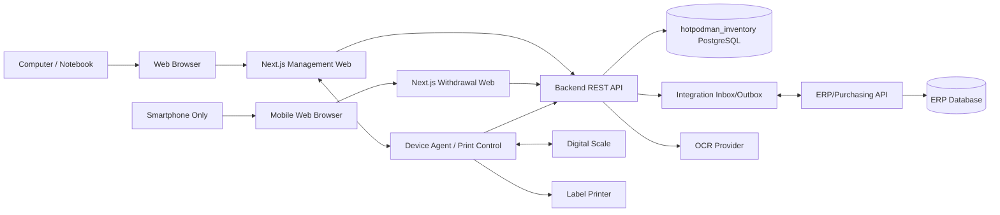
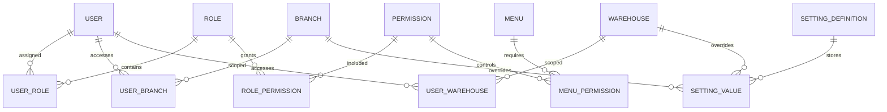
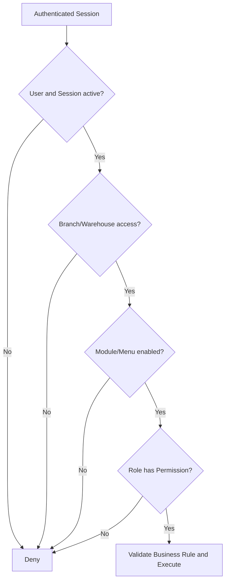

# Hot Pod Man — Technical Specification

> เอกสารข้อมูลเทคนิคสำหรับใช้วิเคราะห์ ออกแบบ และตกลงแนวทางกับทีม Development
>
> เอกสาร Requirement สำหรับผู้บริหาร: [requirements.md](./requirements.md)

## 1. Technical Scope

ระบบแบ่งเป็น 2 Web Application ที่ใช้ Backend และฐานข้อมูลกลางร่วมกัน

1. **Management Web** สำหรับ Master Data, Dashboard, Report, PO, รับสินค้า, คลัง, การตั้งค่า และงานบริหาร
2. **Withdrawal Web (Mobile UI Only)** สำหรับตรวจนับ สแกน และเบิกสินค้าผ่าน Mobile Web Browser บนโทรศัพท์มือถือเท่านั้น

งานรับเข้าและพิมพ์ Label ทำบนคอมพิวเตอร์คลังที่ติดตั้ง Print Control เพื่อเชื่อมต่อกับ Label Printer โดยทีมโครงการเป็นผู้กำหนด จัดหา ติดตั้ง และรับรอง Hardware ที่รองรับทั้งหมด

## 2. Technology Stack

| Layer | Technology/Responsibility |
|---|---|
| Frontend | Next.js สำหรับ Management Web และ Withdrawal Web |
| Backend API | NestJS เป็น Backend หลักของระบบ; AdonisJS ไม่รวมใน Technical Baseline เว้นแต่มี Change Request |
| Database | PostgreSQL Database ชื่อ `hotpodman_inventory` แยกจาก ERP |
| Data Access | TypeORM สำหรับ Transaction/Migration และใช้ Raw SQL/Materialized View สำหรับ Reporting; ห้าม Frontend เชื่อม Database โดยตรง |
| Scale Hardware | เครื่องชั่งและ Scale Connector ที่ทีมโครงการกำหนด/พัฒนา พร้อม Stable Weight, Tare, Gross และ Net Weight |
| Device Agent | Local Service บนคอมพิวเตอร์คลังสำหรับเชื่อมเครื่องชั่งและควบคุมงานพิมพ์ |
| Printing | Print Control, Thermal-transfer Label Printer และวัสดุฉลากที่ทีมโครงการกำหนด/พัฒนา |
| Client | Management: Computer/Notebook Browser; Withdrawal: Mobile Browser บน Smartphone เท่านั้น |
| External Integration | ระบบจัดซื้อเดิม ระบบบัญชี/ERP และ OCR ผ่าน Adapter/API |

หลักการทางเทคนิค:

- Frontend ต้องเรียกข้อมูลผ่าน Backend API และห้ามเชื่อม PostgreSQL โดยตรง
- Backend เป็นผู้ควบคุม Business Rule, Permission, Scope และ Transaction
- ระบบ Hot Pod Man เป็นเจ้าของ Operational Stock Ledger ส่วน ERP เป็นเจ้าของ PO ที่อนุมัติและข้อมูลบัญชี
- ห้าม Application หรือทีม Hot Pod Man เขียนตรงลง Business Table ของ ERP
- API ที่สร้างหรือเปลี่ยนธุรกรรมต้องรองรับ Idempotency
- Transaction สต็อกต้องทำแบบ Atomic และตรวจสอบย้อนหลังได้
- ห้ามเชื่อ Branch/Warehouse/User Scope จากค่าที่ Browser ส่งมาเพียงอย่างเดียว

## 3. System Architecture

### 3.1 Management Web

- รองรับหน้าจอคอมพิวเตอร์และโน้ตบุ๊กตาม Browser Support Matrix
- เป็นพื้นที่ทำงานของ Dashboard, Report, Master Data, PO, Receiving, Inventory และ Settings
- งานรับเข้าและพิมพ์ Label ต้องตรวจสถานะ Print Control ก่อนส่งคำสั่ง

### 3.2 Withdrawal Web

- Mobile UI Only
- รองรับเฉพาะ Mobile Web Browser บนโทรศัพท์มือถือ
- ไม่รวม Layout สำหรับ Tablet, Notebook หรือ Desktop
- ต้องรองรับการเปิดกล้องเพื่อสแกน Barcode/QR Code เมื่ออุปกรณ์และ Browser อนุญาต
- UI ต้องเหมาะกับการใช้งานมือเดียวและลดจำนวนขั้นตอนระหว่างสแกนกับยืนยันรายการ

### 3.3 Source of Truth

| Domain | Source of Truth | หมายเหตุ |
|---|---|---|
| Approved PO และ PO Line | ERP/ระบบจัดซื้อ | Hot Pod Man เก็บสำเนาพร้อม `external_id` และ `synced_at` |
| Product/Supplier/Branch/Unit Code | ERP หรือ Master Data ที่ได้รับอนุมัติ | เก็บ Mapping และ Version ใน Hot Pod Man |
| Receiving, Lot, Package และ Location | Hot Pod Man | ERP ไม่แก้ไขข้อมูลปฏิบัติการโดยตรง |
| Stock Ledger, Count, Withdrawal, Return และ Yield | Hot Pod Man | เป็น Operational Inventory Source of Truth |
| Accounting Posting และ Financial Document | ERP/ระบบบัญชี | รับข้อมูลที่ยืนยันแล้วจาก Integration Outbox |

### 3.4 Hardware and Device Agent

- ทีมโครงการเป็นผู้เลือกรุ่น จัดหา ติดตั้ง และรับรองเครื่องชั่งกับ Label Printer
- Device Agent ใช้ Windows 11 64-bit เป็น Baseline และทำงานเป็น Local Service
- เครื่องชั่งเชื่อมผ่าน USB Serial หรือ Network ตามรุ่นที่ทีมโครงการรับรอง ไม่ใช้ Bluetooth เป็นช่องทางหลัก
- Device Agent ต้องอ่าน Stable Weight, Gross, Tare, Net, Unit, Device ID และ Timestamp
- ทุก Device ต้องมี Credential แยกกัน ส่ง Heartbeat และบันทึก Raw Device Data สำหรับตรวจสอบย้อนหลัง
- Browser ติดต่อ Device Agent ผ่าน Local Authenticated Channel และ Backend ต้องตรวจ Device/User/Branch ก่อน Commit Transaction
- หาก Device ไม่พร้อม ระบบต้อง Block งานปกติ; Admin Override ใช้ได้เฉพาะผู้มีสิทธิ์พร้อมเหตุผลและ Audit Log

## 4. PostgreSQL Schema

แนะนำให้แยก Schema ตาม Domain ดังนี้

| Schema | Responsibility |
|---|---|
| `security` | Authentication, Session, Access Log และ Security Event |
| `master_data` | Company, Branch, Warehouse, Location, Product, Supplier, User, Role, Permission, Menu และ Setting |
| `purchasing` | PO, PO Line, Price History และ Supplier Claim |
| `receiving` | Receipt, Receipt Line, OCR Attachment, Lot และ Print Job |
| `inventory` | Stock Ledger, Balance, Transfer, Count, Adjustment, Return และ FIFO/FEFO |
| `withdrawal` | Scan Session, Request, Approval, Issue และ Cancel |
| `processing` | Processing Job, Input Lot, Output Lot, Waste, Yield และ Remaining Stock Return |
| `notification` | Event, Template, Recipient และ Delivery Status |
| `integration` | Mapping, Inbox, Outbox, Idempotency Key, Sync Job, Request/Response, Retry และ Dead-letter Log |
| `reporting` | View, Materialized View และ Aggregate สำหรับ Dashboard/Report |

ไม่ควรเก็บ Business Table ทั้งหมดไว้ใน `public` Schema โดยไม่มี Boundary ชัดเจน

- Database Owner แยกจาก Runtime User และ Migration User
- Migration ทุกชุดต้องอยู่ใน Version Control และผ่าน CI ก่อน Deploy
- Runtime User ใช้ Least Privilege และไม่มีสิทธิ์แก้ Schema
- ERP Credential, OCR Key และ Device Secret ต้องเก็บใน Secret Store/Encrypted Setting

## 5. Core Data Model

### 5.1 Traceability

Lot ต้องเชื่อมโยงข้อมูลต่อไปนี้ได้:

- PO และ PO Line
- Supplier
- Receipt และ Receipt Line
- วันที่รับ วันผลิต และวันหมดอายุ
- Branch, Warehouse และ Location
- Stock Movement ทุกประเภท
- Withdrawal, Return และ Processing Job
- Output Lot และ Yield หลังแปรรูป
- Claim และเหตุผิดปกติ

### 5.2 Stock Ledger

- Stock Ledger เป็นแหล่งอ้างอิงธุรกรรมการเพิ่ม/ลดสต็อก
- Stock Balance ต้องสร้างจาก Ledger หรือ Update ภายใน Transaction เดียวกัน
- Movement ต้องมี Reference Type, Reference ID, Lot, Location, Quantity, Unit, Actor และ Timestamp
- ห้ามแก้ไข Ledger ที่ยืนยันแล้วโดยตรง ให้ใช้ Reverse/Adjustment Entry
- ห้ามยอดติดลบ เว้นแต่ Policy อนุญาตและผู้ใช้มี Permission ที่เกี่ยวข้อง

### 5.3 Permission and Setting Model

| Entity | Required Fields |
|---|---|
| `users` | User Code, Status, Language, Primary Branch และ Login Identity |
| `roles` | `role_code`, Name, Description, Sort Order, `is_active`, `is_system_role` |
| `permissions` | `permission_code`, `module_key`, `action_key`, Name, Description, `is_active` |
| `user_roles` | User, Role, Effective Date, Expiry Date และ Status |
| `role_permissions` | Role, Permission และ Status |
| `user_branches` | User, Branch และ Primary Flag |
| `user_warehouses` | User และ Warehouse |
| `menus` | App, Section, Parent, Menu Code, Path, Icon, Sort Order, `is_enabled`, `show_in_navigation` |
| `menu_permissions` | Menu, Permission และ Access Mode แบบ ANY/ALL |
| `setting_definitions` | Setting Key, Type, Default, Validation, Scope และ Secret Flag |
| `setting_values` | Setting Key, Scope Type, Scope ID, Value, Effective Date และ Version |
| `audit_logs` | Actor, Action, Target, Before/After, Branch, IP, Device และ Timestamp |

## 6. System Settings

### 6.1 Setting Contract

Setting แต่ละรายการต้องมี:

- Unique Setting Key
- Display Name และ Description
- Data Type: Boolean, Number, Decimal, Text, Select, Multi-select, Date, Time, JSON หรือ Secret
- System Default
- Allowed Scope
- Validation Rule และ Dependency
- Effective Date และ Version
- Approval Requirement
- Active Status

### 6.2 Setting Resolution

ค่าที่มีผลจริงใช้ลำดับต่อไปนี้:

`Warehouse Override → Branch Override → Company/Global Value → System Default`

หาก Override ไม่ผ่าน Validation หรือไม่ Active ให้ Fallback ไปค่าระดับบนและบันทึก Warning

### 6.3 Setting Categories

| Category | Examples |
|---|---|
| Organization | Timezone, Currency, Date Format, Default Language |
| Branch/Warehouse | Default Warehouse, Quarantine/Waste Location, Cross-branch Policy |
| Document | Prefix, Running Number, Reset Rule |
| PO | Approval Flow, Approval Limit, Over-receipt Tolerance, Close Rule |
| Receiving | PO Required, Lot/Expiry Required, Partial/Over Receipt, OCR Evidence |
| Lot/Expiry | Lot Generation, Shelf Life, Expiry Alert, Quarantine Rule |
| FIFO/FEFO | Default Picking Rule, Category Override, Manual Lot Override |
| Label | Print Control, Printer, Template, Label Size, Copy Count, Retry |
| Stock Count | Blind Count, Difference Threshold, Freeze Stock, Approval |
| Withdrawal | Request/Approve/Issue/Receive Flow, Limit, Approver, Return Time |
| Processing/Yield | Formula, Target Yield, Waste Threshold, Exception Approval |
| Claim | Reason, SLA, Evidence, Owner, Close Flow |
| Dashboard/Report | Default KPI, Period, Branch/Warehouse, Export Policy |
| Notification | Event, Channel, Template, Recipient, Severity, Quiet Hours |
| Integration | Endpoint, Mapping, Schedule, Timeout, Retry, Enable/Disable |
| Security | Session Timeout, Password Policy, Login Attempt, Lockout, Cache TTL |
| Language | Enabled Languages, Default Language, Translation Data |

### 6.4 Setting Security

- Secret ต้อง Encrypt at Rest และ Mask เมื่อแสดงผล
- API ห้ามส่งค่า Secret เดิมกลับ Frontend
- Setting ที่กระทบธุรกรรมต้องแสดง Impact ก่อนยืนยัน
- ต้องเก็บ Before/After, Version, Actor, Scope, Reason และ Timestamp
- ต้องรองรับ Reset to Default และ Remove Override โดยไม่ลบ History

### 6.5 Baseline Setting Values

| Setting Key | ค่าเริ่มต้น |
|---|---|
| `receiving.po_selection_rule` | `OLDEST_EXPECTED_DELIVERY_FIRST` |
| `receiving.over_receipt_tolerance_percent` | `0` |
| `receiving.price_variance_tolerance_percent` | `2` |
| `receiving.manual_weight_enabled` | `false` |
| `inventory.negative_stock_enabled` | `false` |
| `inventory.default_picking_rule` | `FEFO` สำหรับสินค้ามีวันหมดอายุ; `FIFO` สำหรับสินค้าอื่น |
| `return.default_expiry_hours` | `24` และห้ามเกินวันหมดอายุเดิม |
| `yield.alert_enabled_without_standard` | `false` |
| `ui.unauthorized_action_mode` | `HIDE` |
| `security.maker_checker_critical_actions` | `true` |
| `audit.retention_years` | `5` |

ค่า Default ต้อง Seed ผ่าน Migration และเปลี่ยนได้ผ่าน Versioned Setting โดยไม่แก้ Source Code

## 7. RBAC, Menu and Action Control

### 7.1 Permission Model

- Permission Code ใช้รูปแบบ `module.action`
- User หนึ่งคนมีหลาย Role ได้
- Effective Permission เป็น Union ของ Permission จาก Active Role
- Permission ต้องทำงานร่วมกับ Branch/Warehouse Scope
- Frontend ใช้ Permission เพื่อแสดง UI แต่ Backend ต้องตรวจซ้ำทุก Request
- Policy ที่ไม่รู้จักต้องเป็น Default Deny
- การเปลี่ยน Permission ต้อง Refresh/Invalidate Session หรือ Permission Cache ตาม Policy

ลำดับการตรวจสิทธิ์:

### 7.2 Role Management

System Role ขั้นต่ำ:

- `OWNER`
- `ADMIN`
- `PURCHASING`
- `RECEIVING`
- `WAREHOUSE`
- `PROCESSING`
- `BRANCH_MANAGER`
- `MANAGEMENT`

- Create, Edit, Clone, Activate/Deactivate และ Sort Role
- System Role และ Custom Role
- Permission Matrix จัดกลุ่มตาม Module
- Select All/Clear All ราย Module
- แสดง Effective Permission ของ User และ Role ต้นทาง
- กำหนด Branch/Warehouse Access แยกจาก Role
- ป้องกันการปิด OWNER คนสุดท้ายหรือทำให้ไม่มีผู้ใช้ที่จัดการ Permission ได้

### 7.3 Menu Control

- เปิด/ปิด Menu และ Submenu แยกกัน
- ระบุ App: Management หรือ Withdrawal
- กำหนด Section, Parent, Path, Icon, Sort Order และ Description
- `is_enabled` ใช้ปิด Route/Capability
- `show_in_navigation` ใช้ซ่อน Navigation แต่ Route อาจยังเปิดตาม Policy
- รองรับ Required Permission หลายรายการและ Access Mode แบบ ANY/ALL
- Parent ที่ไม่มี Child ที่เข้าถึงได้ต้องถูกซ่อน
- Direct URL ต้องผ่าน Menu, Permission และ Scope Guard
- การเปลี่ยน Menu ต้องมีผลโดยไม่ Deploy ใหม่

### 7.4 Action Control

- View, Create, Update, Confirm, Approve, Cancel, Reverse, Export, Reprint และ Retry ต้องแยก Permission
- ปิด Action ทั้งระบบแล้ว Backend ต้องปฏิเสธ แม้ Role ยังมี Permission
- UI ที่ไม่มีสิทธิ์ให้ Hide เป็นค่าเริ่มต้น; แสดง Disabled เฉพาะกรณีต้องอธิบาย Dependency หรือสถานะของรายการ
- Confirmed Transaction ใช้ Cancel/Reverse แทน Delete
- Action สำคัญต้องรับ Reason และเขียน Audit Log
- รองรับ Maker–Checker และห้ามผู้สร้างอนุมัติรายการตนเองเมื่อ Policy เปิดใช้

### 7.5 Minimum Permission Catalog

| Module | Permission Codes |
|---|---|
| Dashboard | `dashboard.view` |
| Product | `product.view`, `product.manage` |
| Supplier | `supplier.view`, `supplier.manage` |
| Purchase Order | `purchase_order.view`, `purchase_order.create`, `purchase_order.update`, `purchase_order.approve`, `purchase_order.cancel` |
| Receiving | `receiving.view`, `receiving.create`, `receiving.update`, `receiving.confirm`, `receiving.cancel` |
| OCR | `receiving.ocr_upload`, `receiving.ocr_confirm` |
| Claim | `claim.view`, `claim.create`, `claim.update`, `claim.close` |
| Lot | `lot.view`, `lot.create`, `lot.update` |
| Label | `label.print`, `label.reprint`, `label.template_manage` |
| Inventory | `inventory.view`, `inventory.transfer`, `inventory.adjust`, `inventory.count` |
| Withdrawal | `withdrawal.view`, `withdrawal.count`, `withdrawal.scan`, `withdrawal.issue`, `withdrawal.approve`, `withdrawal.cancel` |
| Return | `inventory.return`, `inventory.return_approve` |
| Processing | `processing.view`, `processing.create`, `processing.confirm`, `processing.close` |
| Report | `report.view`, `report.export` |
| Integration | `integration.view`, `integration.sync`, `integration.retry` |
| User | `user.view`, `user.manage` |
| Role | `role.view`, `role.manage` |
| Menu | `menu.view`, `menu.manage` |
| Setting | `settings.view`, `settings.manage`, `settings.approve` |
| Audit | `audit.view`, `audit.export` |

Permission Catalog ต้องได้รับการอัปเดตและทดสอบทุกครั้งที่เพิ่ม Menu, Page, Action หรือ API

## 8. Domain Technical Requirements

### 8.1 Purchase Order and Receiving

- PO ต้องมี Status Transition ที่ Backend ตรวจสอบ
- ระบบแนะนำ PO ที่ยังเปิดและมี Expected Delivery Date เก่าที่สุดก่อน ผู้มีสิทธิ์เลือก PO อื่นได้โดยระบุเหตุผล
- Receipt ต้องอ้างอิง PO เว้นแต่ Setting อนุญาตเป็นกรณีพิเศษ
- รองรับ Full, Partial, Over และ Rejected Receipt
- Over Receipt ค่าเริ่มต้น `0%`; หากเกินต้องตรวจ Tolerance และ Approval
- Price Variance ค่าเริ่มต้น `±2%`; หากเกินต้องให้ผู้มีสิทธิ์ฝ่ายจัดซื้ออนุมัติ
- Receipt Confirmation ต้องสร้าง Lot/Stock Movement ภายใน Transaction เดียวกัน
- OCR Result ต้องแยก Raw Extraction, Confidence และ Confirmed Value
- OCR Baseline อ่านเอกสารพิมพ์เท่านั้น; เอกสารเขียนมือเก็บเป็นหลักฐานและให้ผู้ใช้กรอกข้อมูลเอง
- ผู้ใช้ต้องยืนยัน OCR ก่อนสร้างข้อมูลธุรกรรม

### 8.2 Lot, FIFO and FEFO

- Lot ID และ Barcode/QR Code ต้องไม่ซ้ำ
- หนึ่ง Receipt Line แยกหลาย Lot ได้
- Picking Engine ต้องรองรับ FIFO และ FEFO ตาม Product/Category Setting
- Manual Lot Override ต้องใช้ Permission และ Reason
- Expired Lot ต้องถูก Block และส่งไป Quarantine ตาม Setting

### 8.3 Stock Count and Adjustment

- Count Session ต้องกำหนด Branch, Warehouse, Location และ Product Scope
- รองรับ Piece และ Weight
- Blind Count เป็น Setting
- Adjustment ต้องเก็บ Before, Counted, Difference, Value และ Reason
- Difference เกิน Threshold ต้องเข้าสู่ Approval Flow

### 8.4 Withdrawal and Return

- Withdrawal Web แสดงเฉพาะตรวจนับ สแกน และเบิก; Approve, Return และ Adjustment ทำผ่าน Management Web
- Backend รองรับ Request → Approve → Issue → Close/Cancel ตาม Setting แม้ Mobile UI จะแสดงเฉพาะ Action ที่ได้รับอนุญาต
- Mobile Scan ต้องตรวจ Lot, Location, Expiry และ Available Quantity
- Issue ต้องทำ Stock Deduction แบบ Atomic
- Return ต้องเชื่อม Withdrawal เดิมและอัปเดตน้ำหนัก/จำนวนล่าสุด
- Return Expiry ค่าเริ่มต้น 24 ชั่วโมงนับจากเวลาคืนและต้องไม่เกิน Expiry เดิม

### 8.5 Processing and Yield

- Processing Job ต้องเก็บ Input Lot, Input Quantity, Output, Waste และ Return
- Output Lot ต้อง Trace กลับ Input Lot ได้
- Yield Formula: `usable output ÷ input × 100`
- หากยังไม่มี Standard Yield ให้คำนวณและรายงาน Actual Yield แต่ไม่แจ้งเตือนเทียบมาตรฐาน
- เมื่อมี Standard/Minimum/Maximum Yield แล้ว ค่าต่ำกว่า Threshold ต้องแจ้งเตือนหรือขออนุมัติตาม Setting

## 9. Label Printing

ทีมโครงการเป็นผู้กำหนดรุ่นเครื่องพิมพ์ ขนาดฉลาก วัสดุฉลาก Driver/Protocol และ Supported OS พร้อมทดสอบการพิมพ์และการสแกนในสภาพแวดล้อมใช้งานจริง ลูกค้าไม่ต้องเป็นผู้เลือกรุ่น Hardware

Hardware Baseline:

- Thermal-transfer Printer ความละเอียดไม่น้อยกว่า 300 dpi
- ฉลากเริ่มต้นขนาด 60 × 40 มิลลิเมตร
- ใช้วัสดุ Synthetic ที่ทนความเย็น ความชื้น และน้ำ พร้อม Resin Ribbon
- รองรับ QR Code และ Code 128
- เชื่อมต่อผ่าน Network เป็นหลักและ USB เป็นทางเลือกสำรอง
- Printer, Label และ Ribbon ต้องผ่านการทดสอบติดทนและสแกนได้ในสภาพใช้งานจริงก่อน Pilot

Flow:

`Management Web → Print Control → Label Printer → Result Callback`

Print Command ต้องมี:

- Command/Idempotency ID
- Printer และ Template
- Product, Lot, Barcode/QR Code
- Quantity/Weight
- Received/Production/Expiry Date
- Copy Count

Print Status ขั้นต่ำ: Queued, Printing, Success, Failed และ Cancelled

- Reprint ต้องใช้ Permission และ Reason
- Web ห้ามแสดง Success จน Print Control ยืนยันผล
- Failed Job ต้อง Retry ได้โดยไม่สร้าง Receipt/Lot ซ้ำ

## 10. Integration

- Integration Transport หลักใช้ REST/JSON ผ่าน HTTPS และ Versioned Contract
- Inbound: Approved PO, PO Line และ Master Data ที่เกี่ยวข้อง
- Outbound: Confirmed Receipt, Stock Adjustment, Return, Waste/Yield Summary และข้อมูลที่ ERP ต้องใช้
- ห้ามใช้ Direct Write ไปยัง ERP Table; หาก ERP ไม่มี API ให้ใช้ Read-only View, Staging Table หรือ File Adapter ที่ทีม ERP อนุมัติ
- รองรับ Mapping Product, Supplier, Branch, Warehouse, Unit, Tax และ Account Code
- ทุกข้อมูลจาก ERP ต้องมี `source_system`, `external_id`, `source_version` และ `synced_at`
- ใช้ Outbox/Job Pattern สำหรับการส่งข้อมูลที่ต้อง Retry
- Status ขั้นต่ำ: Pending, Processing, Success, Failed และ Dead-letter
- เก็บ Request, Response, Correlation ID, Attempt, Error และ Timestamp
- Retry ต้องไม่สร้างรายการซ้ำในระบบปลายทาง
- Inbound และ Outbound ต้องรองรับ Idempotency และ Reconciliation Report
- Secret และ Credential ต้องเก็บใน Secret Store/Encrypted Setting

## 11. Audit and Security

Audit Event ขั้นต่ำ:

- Login Success/Failed, Logout, Lockout
- Permission Denied และ Direct URL/API Access ที่ถูกปฏิเสธ
- User/Role/Permission/Menu/Setting Create/Update/Activate/Deactivate
- Approval, Cancel, Reverse, Adjustment, Reprint, Export และ Integration Retry

Audit Record ต้องมี Actor, Session, Branch, Warehouse, Action, Target, Before/After, Reason, IP, User Agent และ Timestamp

- Secret ต้องไม่ปรากฏใน Log
- Audit Log ต้องแก้ไข/ลบไม่ได้ผ่าน Application ปกติ
- Audit Log เก็บอย่างน้อย 5 ปี โดย Archive ได้แต่ต้องค้นคืนและ Export ได้ตามสิทธิ์
- Backend Endpoint ทุกตัวต้องมี Authentication, Permission และ Scope Policy ที่ชัดเจน
- ต้องป้องกัน Cross-branch และ Cross-warehouse Access
- ต้องมี Rate Limit/Login Lockout ตาม Security Setting

## 12. Non-functional Requirements

- Barcode/QR Scan และการแสดง Package ต้องตอบสนองไม่เกิน 2 วินาทีภายใต้โหลดปกติ
- การบันทึก Stable Weight ต้องตอบสนองไม่เกิน 2 วินาที
- รายงานทั่วไปต้องตอบสนองไม่เกิน 10 วินาทีภายใต้ Filter และปริมาณข้อมูลที่กำหนด
- Availability Baseline ไม่น้อยกว่า 99.5% ตามรอบการวัดที่ตกลงร่วมกัน
- รองรับ Browser ตาม Browser Support Matrix ที่อนุมัติ
- ป้องกัน Double Submit และ Duplicate Transaction
- มี Automated Backup, Restore Test, Disaster Recovery Plan, Monitoring, Error Tracking และ Alert
- Backup Baseline: RPO ไม่เกิน 15 นาที และ RTO ไม่เกิน 4 ชั่วโมง
- Database Migration ต้อง Version Control และมี Rollback/Forward-fix Plan
- Transaction สต็อกต้องรักษาความถูกต้องเมื่อเกิด Error ระหว่างขั้นตอน

## 13. Technical Test and Acceptance

1. Unit Test สำหรับ Business Rule, Setting Resolution และ Permission Evaluation
2. API Integration Test สำหรับทุก Action Permission
3. Test Direct URL และ API เมื่อ Menu/Action ถูกปิด
4. Test Branch/Warehouse Isolation และ Cross-scope Attack
5. Test OWNER Lockout Protection
6. Test Maker–Checker
7. Test Idempotency ของ Receiving, Withdrawal, Print และ Integration
8. Test Stock Ledger/Balance Consistency
9. Test FIFO/FEFO และ Manual Override
10. Test OCR Confirmation ก่อน Commit Transaction
11. Test Print Success/Failure/Retry/Reprint
12. Test Mobile Withdrawal บน iOS Safari และ Android Chrome ตามรุ่นที่ตกลงกัน
13. Test Audit Log Before/After และ Secret Redaction
14. Test Backup/Restore และ Integration Retry
15. Test Scale Stable/Tare/Gross/Net, Disconnect, Reconnect และ Admin Override
16. Test Label Print, Scan, Moisture/Cold Adhesion และ Reprint Audit
17. Contract Test และ Reconciliation ระหว่าง Hot Pod Man กับ ERP
18. Performance Test ตามเกณฑ์ 2/2/10 วินาทีและ Availability/Recovery Baseline

## 14. Technical Baseline Decisions

| หัวข้อ | Baseline |
|---|---|
| Backend | NestJS; ไม่ใช้ AdonisJS ใน Baseline |
| API | REST/JSON, HTTPS และ Base Path `/api/v1` |
| Error Contract | Standard Error Code, HTTP Status, Message, Detail, Correlation ID และ Field Error |
| Authentication | Local Identity + JWT Access/Refresh Token; SSO เป็น Change Request |
| Authorization | Role-based Permission + Branch/Warehouse Scope; ไม่ใช้ User-specific Allow Override |
| Permission Default | Default Deny และ Backend ตรวจทุก Request |
| Menu/Action | Hide เมื่อไม่มีสิทธิ์; Direct URL/API ต้องถูกปฏิเสธ |
| Session/Permission Change | เพิ่ม Permission Version และบังคับ Refresh เมื่อ Role/Permission เปลี่ยน |
| Desktop Browser | Chrome และ Edge สอง Major Version ล่าสุด |
| Mobile Browser | iOS Safari และ Android Chrome สอง Major Version ล่าสุด |
| Device OS | Windows 11 64-bit |
| ERP Integration | REST/JSON ผ่าน Adapter; ไม่มี Direct Write เข้า ERP |
| OCR | เอกสารพิมพ์ + Manual Confirmation; ลายมือเป็นหลักฐานเท่านั้น |
| Audit Retention | อย่างน้อย 5 ปี |
| Backup/Recovery | RPO 15 นาที, RTO 4 ชั่วโมง และ Availability 99.5% |

## 15. External Inputs Required

ทีม Development เริ่มพัฒนาจาก Baseline ได้โดยไม่ต้องรอการตัดสินใจเพิ่มเติม แต่ Integration, Configuration และ Production Sizing ต้องได้รับข้อมูลจริงต่อไปนี้:

- ERP/PO API Documentation, Test Credential และตัวอย่าง Payload
- รายการ Outbound Data และ Mapping Code ที่ ERP ต้องรับ
- Master Data ของบริษัท สาขา คลัง Location สินค้า หน่วย Supplier ผู้ใช้ และบทบาท
- ตัวอย่างบิล/ใบส่งของแบบพิมพ์สำหรับทดสอบ OCR
- Logo และข้อความที่ต้องแสดงบน Label
- UAT User, Approver และผู้มีอำนาจตัดสินใจ
- ปริมาณธุรกรรมและผู้ใช้พร้อมกันโดยประมาณก่อน Production Rollout

รุ่นเครื่องชั่ง เครื่องพิมพ์ Label, Protocol, Driver, ขนาดฉลาก วัสดุฉลาก และ Device Agent เป็นความรับผิดชอบของทีมโครงการ ไม่ใช่ External Input จากลูกค้า
