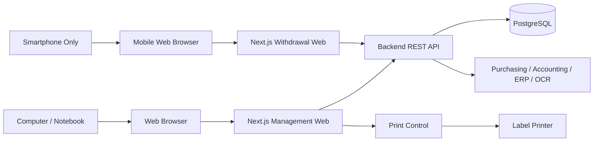
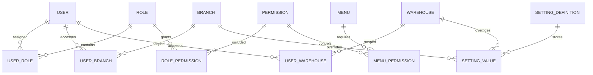
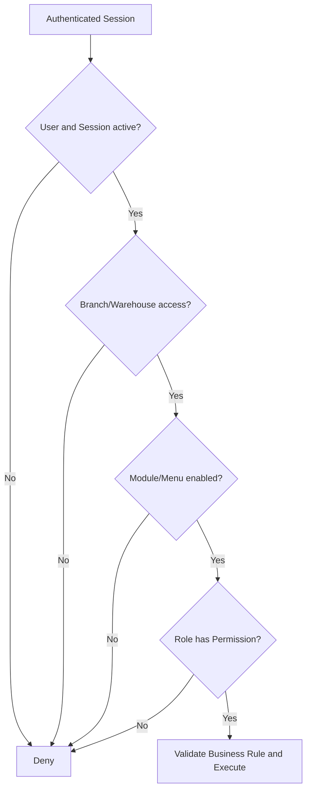

# Hot Pod Man — Technical Specification

> เอกสารข้อมูลเทคนิคสำหรับใช้วิเคราะห์ ออกแบบ และตกลงแนวทางกับทีม Development
>
> เอกสาร Requirement สำหรับผู้บริหาร: [requirements.md](./requirements.md)

## 1. Technical Scope

ระบบแบ่งเป็น 2 Web Application ที่ใช้ Backend และฐานข้อมูลกลางร่วมกัน

1. **Management Web** สำหรับ Master Data, Dashboard, Report, PO, รับสินค้า, คลัง, การตั้งค่า และงานบริหาร
2. **Withdrawal Web (Mobile UI Only)** สำหรับตรวจนับ สแกน และเบิกสินค้าผ่าน Mobile Web Browser บนโทรศัพท์มือถือเท่านั้น

งานรับเข้าและพิมพ์ Label ทำบนคอมพิวเตอร์คลังที่ติดตั้ง Print Control เพื่อเชื่อมต่อกับ Label Printer

## 2. Technology Stack

| Layer | Technology/Responsibility |
|---|---|
| Frontend | Next.js สำหรับ Management Web และ Withdrawal Web |
| Backend API | NestJS เป็นตัวเลือกหลัก; คำว่า “Adunis” ตีความเบื้องต้นว่า AdonisJS และต้องยืนยันว่าจะใช้แทน NestJS หรือแยกเป็น Service ใด |
| Database | PostgreSQL เป็นฐานข้อมูลกลาง |
| Printing | Print Control บนคอมพิวเตอร์คลังและ Label Printer |
| Client | Management: Computer/Notebook Browser; Withdrawal: Mobile Browser บน Smartphone เท่านั้น |
| External Integration | ระบบจัดซื้อเดิม ระบบบัญชี/ERP และ OCR Provider ตามที่ยืนยันภายหลัง |

หลักการทางเทคนิค:

- Frontend ต้องเรียกข้อมูลผ่าน Backend API และห้ามเชื่อม PostgreSQL โดยตรง
- Backend เป็นผู้ควบคุม Business Rule, Permission, Scope และ Transaction
- API ที่สร้างหรือเปลี่ยนธุรกรรมต้องรองรับ Idempotency
- Transaction สต็อกต้องทำแบบ Atomic และตรวจสอบย้อนหลังได้
- ห้ามเชื่อ Branch/Warehouse/User Scope จากค่าที่ Browser ส่งมาเพียงอย่างเดียว

## 3. System Architecture

### 3.1 Management Web

- รองรับหน้าจอคอมพิวเตอร์และโน้ตบุ๊กตาม Browser Support Matrix
- เป็นพื้นที่ทำงานของ Dashboard, Report, Master Data, PO, Receiving, Inventory และ Settings
- งานรับเข้าและพิมพ์ Label ต้องตรวจสถานะ Print Control ก่อนส่งคำสั่ง

### 3.2 Withdrawal Web

- Mobile UI Only
- รองรับเฉพาะ Mobile Web Browser บนโทรศัพท์มือถือ
- ไม่รวม Layout สำหรับ Tablet, Notebook หรือ Desktop
- ต้องรองรับการเปิดกล้องเพื่อสแกน Barcode/QR Code เมื่ออุปกรณ์และ Browser อนุญาต
- UI ต้องเหมาะกับการใช้งานมือเดียวและลดจำนวนขั้นตอนระหว่างสแกนกับยืนยันรายการ

## 4. PostgreSQL Schema

แนะนำให้แยก Schema ตาม Domain ดังนี้

| Schema | Responsibility |
|---|---|
| `security` | Authentication, Session, Access Log และ Security Event |
| `master_data` | Company, Branch, Warehouse, Location, Product, Supplier, User, Role, Permission, Menu และ Setting |
| `purchasing` | PO, PO Line, Price History และ Supplier Claim |
| `receiving` | Receipt, Receipt Line, OCR Attachment, Lot และ Print Job |
| `inventory` | Stock Ledger, Balance, Transfer, Count, Adjustment และ FIFO/FEFO |
| `withdrawal` | Request, Approval, Issue, Receive, Return และ Cancel |
| `processing` | Processing Job, Input Lot, Output Lot, Waste และ Yield |
| `notification` | Event, Template, Recipient และ Delivery Status |
| `integration` | Mapping, Outbox, Sync Job, Request/Response และ Retry Log |
| `reporting` | View, Materialized View และ Aggregate สำหรับ Dashboard/Report |

ไม่ควรเก็บ Business Table ทั้งหมดไว้ใน `public` Schema โดยไม่มี Boundary ชัดเจน

## 5. Core Data Model

### 5.1 Traceability

Lot ต้องเชื่อมโยงข้อมูลต่อไปนี้ได้:

- PO และ PO Line
- Supplier
- Receipt และ Receipt Line
- วันที่รับ วันผลิต และวันหมดอายุ
- Branch, Warehouse และ Location
- Stock Movement ทุกประเภท
- Withdrawal, Return และ Processing Job
- Output Lot และ Yield หลังแปรรูป
- Claim และเหตุผิดปกติ

### 5.2 Stock Ledger

- Stock Ledger เป็นแหล่งอ้างอิงธุรกรรมการเพิ่ม/ลดสต็อก
- Stock Balance ต้องสร้างจาก Ledger หรือ Update ภายใน Transaction เดียวกัน
- Movement ต้องมี Reference Type, Reference ID, Lot, Location, Quantity, Unit, Actor และ Timestamp
- ห้ามแก้ไข Ledger ที่ยืนยันแล้วโดยตรง ให้ใช้ Reverse/Adjustment Entry
- ห้ามยอดติดลบ เว้นแต่ Policy อนุญาตและผู้ใช้มี Permission ที่เกี่ยวข้อง

### 5.3 Permission and Setting Model

| Entity | Required Fields |
|---|---|
| `users` | User Code, Status, Language, Primary Branch และ Login Identity |
| `roles` | `role_code`, Name, Description, Sort Order, `is_active`, `is_system_role` |
| `permissions` | `permission_code`, `module_key`, `action_key`, Name, Description, `is_active` |
| `user_roles` | User, Role, Effective Date, Expiry Date และ Status |
| `role_permissions` | Role, Permission และ Status |
| `user_branches` | User, Branch และ Primary Flag |
| `user_warehouses` | User และ Warehouse |
| `menus` | App, Section, Parent, Menu Code, Path, Icon, Sort Order, `is_enabled`, `show_in_navigation` |
| `menu_permissions` | Menu, Permission และ Access Mode แบบ ANY/ALL |
| `setting_definitions` | Setting Key, Type, Default, Validation, Scope และ Secret Flag |
| `setting_values` | Setting Key, Scope Type, Scope ID, Value, Effective Date และ Version |
| `audit_logs` | Actor, Action, Target, Before/After, Branch, IP, Device และ Timestamp |

## 6. System Settings

### 6.1 Setting Contract

Setting แต่ละรายการต้องมี:

- Unique Setting Key
- Display Name และ Description
- Data Type: Boolean, Number, Decimal, Text, Select, Multi-select, Date, Time, JSON หรือ Secret
- System Default
- Allowed Scope
- Validation Rule และ Dependency
- Effective Date และ Version
- Approval Requirement
- Active Status

### 6.2 Setting Resolution

ค่าที่มีผลจริงใช้ลำดับต่อไปนี้:

`Warehouse Override → Branch Override → Company/Global Value → System Default`

หาก Override ไม่ผ่าน Validation หรือไม่ Active ให้ Fallback ไปค่าระดับบนและบันทึก Warning

### 6.3 Setting Categories

| Category | Examples |
|---|---|
| Organization | Timezone, Currency, Date Format, Default Language |
| Branch/Warehouse | Default Warehouse, Quarantine/Waste Location, Cross-branch Policy |
| Document | Prefix, Running Number, Reset Rule |
| PO | Approval Flow, Approval Limit, Over-receipt Tolerance, Close Rule |
| Receiving | PO Required, Lot/Expiry Required, Partial/Over Receipt, OCR Evidence |
| Lot/Expiry | Lot Generation, Shelf Life, Expiry Alert, Quarantine Rule |
| FIFO/FEFO | Default Picking Rule, Category Override, Manual Lot Override |
| Label | Print Control, Printer, Template, Label Size, Copy Count, Retry |
| Stock Count | Blind Count, Difference Threshold, Freeze Stock, Approval |
| Withdrawal | Request/Approve/Issue/Receive Flow, Limit, Approver, Return Time |
| Processing/Yield | Formula, Target Yield, Waste Threshold, Exception Approval |
| Claim | Reason, SLA, Evidence, Owner, Close Flow |
| Dashboard/Report | Default KPI, Period, Branch/Warehouse, Export Policy |
| Notification | Event, Channel, Template, Recipient, Severity, Quiet Hours |
| Integration | Endpoint, Mapping, Schedule, Timeout, Retry, Enable/Disable |
| Security | Session Timeout, Password Policy, Login Attempt, Lockout, Cache TTL |
| Language | Enabled Languages, Default Language, Translation Data |

### 6.4 Setting Security

- Secret ต้อง Encrypt at Rest และ Mask เมื่อแสดงผล
- API ห้ามส่งค่า Secret เดิมกลับ Frontend
- Setting ที่กระทบธุรกรรมต้องแสดง Impact ก่อนยืนยัน
- ต้องเก็บ Before/After, Version, Actor, Scope, Reason และ Timestamp
- ต้องรองรับ Reset to Default และ Remove Override โดยไม่ลบ History

## 7. RBAC, Menu and Action Control

### 7.1 Permission Model

- Permission Code ใช้รูปแบบ `module.action`
- User หนึ่งคนมีหลาย Role ได้
- Effective Permission เป็น Union ของ Permission จาก Active Role
- Permission ต้องทำงานร่วมกับ Branch/Warehouse Scope
- Frontend ใช้ Permission เพื่อแสดง UI แต่ Backend ต้องตรวจซ้ำทุก Request
- Policy ที่ไม่รู้จักต้องเป็น Default Deny
- การเปลี่ยน Permission ต้อง Refresh/Invalidate Session หรือ Permission Cache ตาม Policy

ลำดับการตรวจสิทธิ์:

### 7.2 Role Management

- Create, Edit, Clone, Activate/Deactivate และ Sort Role
- System Role และ Custom Role
- Permission Matrix จัดกลุ่มตาม Module
- Select All/Clear All ราย Module
- แสดง Effective Permission ของ User และ Role ต้นทาง
- กำหนด Branch/Warehouse Access แยกจาก Role
- ป้องกันการปิด OWNER คนสุดท้ายหรือทำให้ไม่มีผู้ใช้ที่จัดการ Permission ได้

### 7.3 Menu Control

- เปิด/ปิด Menu และ Submenu แยกกัน
- ระบุ App: Management หรือ Withdrawal
- กำหนด Section, Parent, Path, Icon, Sort Order และ Description
- `is_enabled` ใช้ปิด Route/Capability
- `show_in_navigation` ใช้ซ่อน Navigation แต่ Route อาจยังเปิดตาม Policy
- รองรับ Required Permission หลายรายการและ Access Mode แบบ ANY/ALL
- Parent ที่ไม่มี Child ที่เข้าถึงได้ต้องถูกซ่อน
- Direct URL ต้องผ่าน Menu, Permission และ Scope Guard
- การเปลี่ยน Menu ต้องมีผลโดยไม่ Deploy ใหม่

### 7.4 Action Control

- View, Create, Update, Confirm, Approve, Cancel, Reverse, Export, Reprint และ Retry ต้องแยก Permission
- ปิด Action ทั้งระบบแล้ว Backend ต้องปฏิเสธ แม้ Role ยังมี Permission
- UI ที่ไม่มีสิทธิ์ให้ Hide หรือ Disable ตาม UX Rule
- Confirmed Transaction ใช้ Cancel/Reverse แทน Delete
- Action สำคัญต้องรับ Reason และเขียน Audit Log
- รองรับ Maker–Checker และห้ามผู้สร้างอนุมัติรายการตนเองเมื่อ Policy เปิดใช้

### 7.5 Minimum Permission Catalog

| Module | Permission Codes |
|---|---|
| Dashboard | `dashboard.view` |
| Product | `product.view`, `product.manage` |
| Supplier | `supplier.view`, `supplier.manage` |
| Purchase Order | `purchase_order.view`, `purchase_order.create`, `purchase_order.update`, `purchase_order.approve`, `purchase_order.cancel` |
| Receiving | `receiving.view`, `receiving.create`, `receiving.update`, `receiving.confirm`, `receiving.cancel` |
| OCR | `receiving.ocr_upload`, `receiving.ocr_confirm` |
| Claim | `claim.view`, `claim.create`, `claim.update`, `claim.close` |
| Lot | `lot.view`, `lot.create`, `lot.update` |
| Label | `label.print`, `label.reprint`, `label.template_manage` |
| Inventory | `inventory.view`, `inventory.transfer`, `inventory.adjust`, `inventory.count` |
| Withdrawal | `withdrawal.view`, `withdrawal.request`, `withdrawal.approve`, `withdrawal.issue`, `withdrawal.receive`, `withdrawal.cancel` |
| Return | `withdrawal.return`, `withdrawal.return_approve` |
| Processing | `processing.view`, `processing.create`, `processing.confirm`, `processing.close` |
| Report | `report.view`, `report.export` |
| Integration | `integration.view`, `integration.sync`, `integration.retry` |
| User | `user.view`, `user.manage` |
| Role | `role.view`, `role.manage` |
| Menu | `menu.view`, `menu.manage` |
| Setting | `settings.view`, `settings.manage`, `settings.approve` |
| Audit | `audit.view`, `audit.export` |

Permission Catalog ต้องได้รับการอัปเดตและทดสอบทุกครั้งที่เพิ่ม Menu, Page, Action หรือ API

## 8. Domain Technical Requirements

### 8.1 Purchase Order and Receiving

- PO ต้องมี Status Transition ที่ Backend ตรวจสอบ
- Receipt ต้องอ้างอิง PO เว้นแต่ Setting อนุญาตเป็นกรณีพิเศษ
- รองรับ Full, Partial, Over และ Rejected Receipt
- Over Receipt ต้องตรวจ Tolerance และ Approval
- Receipt Confirmation ต้องสร้าง Lot/Stock Movement ภายใน Transaction เดียวกัน
- OCR Result ต้องแยก Raw Extraction, Confidence และ Confirmed Value
- ผู้ใช้ต้องยืนยัน OCR ก่อนสร้างข้อมูลธุรกรรม

### 8.2 Lot, FIFO and FEFO

- Lot ID และ Barcode/QR Code ต้องไม่ซ้ำ
- หนึ่ง Receipt Line แยกหลาย Lot ได้
- Picking Engine ต้องรองรับ FIFO และ FEFO ตาม Product/Category Setting
- Manual Lot Override ต้องใช้ Permission และ Reason
- Expired Lot ต้องถูก Block และส่งไป Quarantine ตาม Setting

### 8.3 Stock Count and Adjustment

- Count Session ต้องกำหนด Branch, Warehouse, Location และ Product Scope
- รองรับ Piece และ Weight
- Blind Count เป็น Setting
- Adjustment ต้องเก็บ Before, Counted, Difference, Value และ Reason
- Difference เกิน Threshold ต้องเข้าสู่ Approval Flow

### 8.4 Withdrawal and Return

- Flow รองรับ Request → Approve → Issue → Receive → Close/Cancel
- Mobile Scan ต้องตรวจ Lot, Location, Expiry และ Available Quantity
- Issue ต้องทำ Stock Deduction แบบ Atomic
- Return ต้องเชื่อม Withdrawal เดิมและอัปเดตน้ำหนัก/จำนวนล่าสุด
- Return ภายใน 24 ชั่วโมงเป็น Setting ที่ตรวจใน Backend

### 8.5 Processing and Yield

- Processing Job ต้องเก็บ Input Lot, Input Quantity, Output, Waste และ Return
- Output Lot ต้อง Trace กลับ Input Lot ได้
- Yield Formula: `usable output ÷ input × 100`
- Yield ต่ำกว่า Threshold ต้องแจ้งเตือนหรือขออนุมัติตาม Setting

## 9. Label Printing

Flow:

`Management Web → Print Control → Label Printer → Result Callback`

Print Command ต้องมี:

- Command/Idempotency ID
- Printer และ Template
- Product, Lot, Barcode/QR Code
- Quantity/Weight
- Received/Production/Expiry Date
- Copy Count

Print Status ขั้นต่ำ: Queued, Printing, Success, Failed และ Cancelled

- Reprint ต้องใช้ Permission และ Reason
- Web ห้ามแสดง Success จน Print Control ยืนยันผล
- Failed Job ต้อง Retry ได้โดยไม่สร้าง Receipt/Lot ซ้ำ

## 10. Integration

- รองรับ Mapping Product, Supplier, Branch, Warehouse, Unit, Tax และ Account Code
- ใช้ Outbox/Job Pattern สำหรับการส่งข้อมูลที่ต้อง Retry
- Status ขั้นต่ำ: Pending, Processing, Success, Failed และ Dead-letter
- เก็บ Request, Response, Correlation ID, Attempt, Error และ Timestamp
- Retry ต้องไม่สร้างรายการซ้ำในระบบปลายทาง
- Secret และ Credential ต้องเก็บใน Secret Store/Encrypted Setting

## 11. Audit and Security

Audit Event ขั้นต่ำ:

- Login Success/Failed, Logout, Lockout
- Permission Denied และ Direct URL/API Access ที่ถูกปฏิเสธ
- User/Role/Permission/Menu/Setting Create/Update/Activate/Deactivate
- Approval, Cancel, Reverse, Adjustment, Reprint, Export และ Integration Retry

Audit Record ต้องมี Actor, Session, Branch, Warehouse, Action, Target, Before/After, Reason, IP, User Agent และ Timestamp

- Secret ต้องไม่ปรากฏใน Log
- Audit Log ต้องแก้ไข/ลบไม่ได้ผ่าน Application ปกติ
- ต้องกำหนด Retention และ Archive Policy
- Backend Endpoint ทุกตัวต้องมี Authentication, Permission และ Scope Policy ที่ชัดเจน
- ต้องป้องกัน Cross-branch และ Cross-warehouse Access
- ต้องมี Rate Limit/Login Lockout ตาม Security Setting

## 12. Non-functional Requirements

- หน้าค้นหาและธุรกรรมทั่วไปควรตอบสนองภายใน 3 วินาทีภายใต้โหลดปกติ
- Barcode/QR Scan ต้องแสดงรายการอย่างรวดเร็วสำหรับงานต่อเนื่อง
- รองรับ Browser ตาม Browser Support Matrix ที่อนุมัติ
- ป้องกัน Double Submit และ Duplicate Transaction
- มี Backup, Restore Test, Monitoring, Error Tracking และ Alert
- Database Migration ต้อง Version Control และมี Rollback/Forward-fix Plan
- Transaction สต็อกต้องรักษาความถูกต้องเมื่อเกิด Error ระหว่างขั้นตอน

## 13. Technical Test and Acceptance

1. Unit Test สำหรับ Business Rule, Setting Resolution และ Permission Evaluation
2. API Integration Test สำหรับทุก Action Permission
3. Test Direct URL และ API เมื่อ Menu/Action ถูกปิด
4. Test Branch/Warehouse Isolation และ Cross-scope Attack
5. Test OWNER Lockout Protection
6. Test Maker–Checker
7. Test Idempotency ของ Receiving, Withdrawal, Print และ Integration
8. Test Stock Ledger/Balance Consistency
9. Test FIFO/FEFO และ Manual Override
10. Test OCR Confirmation ก่อน Commit Transaction
11. Test Print Success/Failure/Retry/Reprint
12. Test Mobile Withdrawal บน iOS Safari และ Android Chrome ตามรุ่นที่ตกลงกัน
13. Test Audit Log Before/After และ Secret Redaction
14. Test Backup/Restore และ Integration Retry

## 14. Technical Decisions Pending

- “Adunis” หมายถึง AdonisJS หรือ Technology อื่น
- หากหมายถึง AdonisJS จะใช้แทน NestJS หรือแยกเป็น Service ใด
- REST API Versioning และ Error Contract
- Authentication Provider และ Password/SSO Policy
- Session/Permission Cache Invalidation Strategy
- ANY หรือ ALL เป็น Default ของ Menu Permission
- User-specific Permission Override จำเป็นหรือใช้ Role เท่านั้น
- Deep Link Policy เมื่อ `show_in_navigation = false`
- Browser/OS Version ขั้นต่ำ
- Print Control API/Protocol และ Supported OS
- Label Printer/Scale รุ่นที่จะใช้
- OCR Provider, Field, Accuracy และ Manual Review Flow
- ERP/Accounting Target, Transport และ Mapping
- Audit/Security Log Retention
- Backup RPO/RTO และ Availability Target
