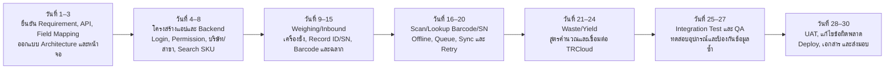
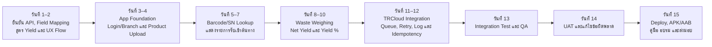
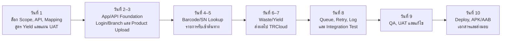
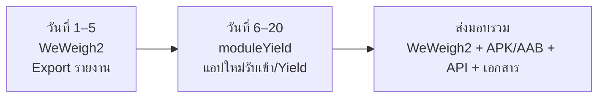
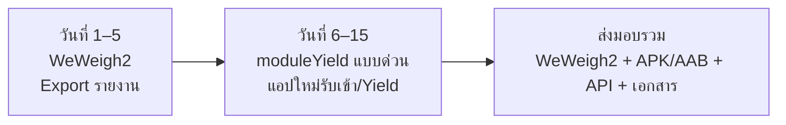

# ไทม์ไลน์การพัฒนาโครงการ TRCloud — SUNFORD

เอกสารนี้สรุปไทม์ไลน์จากขอบเขตงานต่อไปนี้:

- `requirements_new_app_full.md` — พัฒนา Full Application ใหม่ทั้งหมด
- `req_weweigh2+moduleYield.md` — ปรับ WeWeigh2 และพัฒนาแอปใหม่โมดูลรับเข้า/Yield

## สรุประยะเวลา

| ทางเลือก | แบบปกติ | แบบด่วน | หมายเหตุ |
|---|---:|---:|---|
| Full Application ใหม่ทั้งหมด | 30 วันทำการ | 15 วันทำการ | แบบด่วนต้องแบ่งทีมทำงานคู่ขนานและล็อกขอบเขตก่อนเริ่ม |
| WeWeigh2 — เพิ่ม Export รายงาน | 5 วันทำการ | 5 วันทำการ | คง Flow การชั่งเดิม แก้เฉพาะ Export และการสร้างไฟล์รายงาน |
| moduleYield — แอปใหม่รับเข้า/Yield | 15 วันทำการ | 10 วันทำการ | แบบด่วนต้องได้รับ API, Field Mapping และสูตร Yield ครบตั้งแต่วันแรก |
| WeWeigh2 + moduleYield กรณีทำต่อเนื่อง | 20 วันทำการ | 15 วันทำการ | คำนวณจาก WeWeigh2 5 วัน แล้วต่อด้วย moduleYield 15 หรือ 10 วัน |

> **นิยามวัน:** 1 วันหมายถึงวันทำการพัฒนาจริง ไม่รวมวันเสาร์–อาทิตย์ วันหยุด วันรอข้อมูล/API Credential/อุปกรณ์ วันรอ UAT และเวลาตรวจสอบของ Google Play

---

## 1. Full Application ใหม่ทั้งหมด — แบบปกติ 30 วัน

| ช่วงเวลา | งานหลัก | ผลลัพธ์ |
|---|---|---|
| วันที่ 1–3 | ยืนยัน Requirement, TRCloud API, Field Mapping, SN/Barcode Rule, สูตร Yield และอุปกรณ์ | Scope และ Technical Design พร้อมพัฒนา |
| วันที่ 4–8 | สร้าง Android App และ Integration API, Login, Permission, บริษัท/สาขา, Search SKU และ Item Detail | โครงสร้างระบบและข้อมูลพื้นฐานทำงานได้ |
| วันที่ 9–15 | พัฒนา Weighing/Inbound, เชื่อมเครื่องชั่ง, สร้าง Record ID/SN/Barcode, Preview/Print Label | Flow รับเข้าครบตั้งแต่เลือกสินค้าถึงพิมพ์ฉลาก |
| วันที่ 16–20 | Scan/Search Barcode/SN, แสดงรายการต้นทาง, Local Database, Queue, Sync, Retry และ Conflict | ค้นย้อนหลังและทำงานเมื่อการเชื่อมต่อขัดข้องได้ |
| วันที่ 21–24 | บันทึก Waste, คำนวณ Net Yield/Yield %, ส่งข้อมูลและรับ Transaction ID จาก TRCloud | Flow Waste/Yield ครบถ้วน |
| วันที่ 25–27 | Integration Test, Device Test, Error Mapping, Idempotency, Security และ Regression Test | รุ่นพร้อม UAT |
| วันที่ 28–30 | UAT, แก้ไข Defect ตามขอบเขต, Production Setup, APK/AAB, คู่มือและอบรม | รุ่นส่งมอบและ Production Release |

## 2. Full Application ใหม่ทั้งหมด — แบบด่วน 15 วัน

```mermaid
flowchart LR
    A["วันที่ 1<br/>ล็อก Scope, API, Mapping<br/>Architecture และแผนทดสอบ"]
    B["วันที่ 2–4<br/>App/API Foundation<br/>Login, Branch, Search SKU"]
    C["วันที่ 5–8<br/>Inbound + เครื่องชั่ง<br/>SN/Barcode/Label"]
    D["วันที่ 9–10<br/>Scan/Lookup<br/>Offline/Sync/Retry"]
    E["วันที่ 11–12<br/>Waste/Yield<br/>TRCloud Integration"]
    F["วันที่ 13<br/>Integration Test, Device Test และ UAT"]
    G["วันที่ 14<br/>แก้ไข Defect และ Regression Test"]
    H["วันที่ 15<br/>Deploy, APK/AAB<br/>เอกสารและส่งมอบ"]

    A --> B --> C --> D --> E --> F --> G --> H
```

เงื่อนไขของแบบด่วน:

- ใช้ทีมพัฒนาหลายคนทำ Android, Backend/API และ Integration คู่ขนานกัน
- Scope, UI, TRCloud API, Credential, Field Mapping, สูตร Yield และอุปกรณ์ทดสอบต้องพร้อมตั้งแต่วันแรก
- ผู้มีอำนาจตัดสินใจต้องตอบคำถามและยืนยันผลได้ภายในวันเดียวกัน
- UAT ต้องดำเนินการตามรอบที่กำหนดโดยไม่มีช่วงรอคิว
- ระยะเวลา 15 วันเป็นระยะเวลาบนปฏิทินการทำงานแบบเร่งด่วน ไม่ได้หมายความว่ากำลังพัฒนารวม 30 Developer-Days หายไป

---

## 3. WeWeigh2 — เพิ่ม Export รายงาน 5 วัน

| วัน | งานหลัก |
|---:|---|
| 1 | ยืนยันตำแหน่งปุ่ม Export, ตัวกรอง, คอลัมน์, ลำดับคอลัมน์, ชื่อหัวตาราง และรูปแบบ CSV/XLSX |
| 2 | พัฒนาปุ่ม Export และส่วนสร้างไฟล์จากข้อมูลตามตัวกรอง |
| 3 | ตรวจ Permission, ตั้งชื่อไฟล์, บันทึก/แชร์ไฟล์ และจัดการ Loading/Empty/Error |
| 4 | ทดสอบจำนวนและข้อมูลในไฟล์ พร้อม Regression Test เพื่อยืนยันว่า Flow Weighing เดิมไม่เปลี่ยน |
| 5 | UAT, แก้ไขข้อผิดพลาด, สร้าง Build และส่งมอบ WeWeigh2 รุ่นใหม่ |

---

## 4. moduleYield — แบบปกติ 15 วัน

| ช่วงเวลา | งานหลัก | ผลลัพธ์ |
|---|---|---|
| วันที่ 1–2 | ยืนยัน Product Source, TRCloud API, Field Mapping, Create/Update Policy, สูตร Yield และ UAT Criteria | Scope และ Mapping พร้อมพัฒนา |
| วันที่ 3–4 | สร้างแอปและ Integration API, Login/Branch, Product Upload และจัดเก็บ TRCloud Item ID | โครงสร้างแอปและ Product Integration ทำงานได้ |
| วันที่ 5–7 | Scan/Search Barcode/SN, ตรวจสิทธิ์ และแสดงรายละเอียดรายการรับเข้าต้นทาง | เลือกรายการต้นทางสำหรับ Yield ได้ |
| วันที่ 8–10 | รับน้ำหนักของเสีย, Validation, คำนวณ Net Yield/Yield % และแสดงผล | Flow Waste/Yield ทำงานครบ |
| วันที่ 11–12 | ส่งข้อมูลไป TRCloud, Transaction ID, Queue, Retry, Idempotency, Error/Transaction Log | Integration รองรับความผิดพลาดและไม่สร้างข้อมูลซ้ำ |
| วันที่ 13 | Integration Test, Formula Test, Permission Test และ Error Case | รุ่นพร้อม UAT |
| วันที่ 14 | UAT และแก้ไขข้อผิดพลาดตามขอบเขต | รุ่นผ่านการยืนยัน |
| วันที่ 15 | Production Setup, APK/AAB, เอกสาร, อบรมและส่งมอบ | พร้อมเปิดใช้งาน |

## 5. moduleYield — แบบด่วน 10 วัน

เงื่อนไขของแบบด่วน:

- TRCloud Test Account, API Credential, Request/Response ตัวอย่าง และ Error Code พร้อมใช้งานตั้งแต่วันแรก
- Field Mapping, นโยบาย SKU ซ้ำ, สูตร Yield, หน่วย, ทศนิยม และหลักการปัดเศษได้รับการยืนยันแล้ว
- มีข้อมูลตัวอย่างและผู้รับผิดชอบ UAT พร้อมทดสอบตามกำหนด
- การเปลี่ยน Scope หรือรอระบบภายนอกจะขยับวันส่งมอบตามจำนวนวันที่รอ

---

## 6. ภาพรวมกรณีเลือก WeWeigh2 + moduleYield

### แบบปกติ — รวม 20 วันทำการ

### แบบด่วน — รวม 15 วันทำการ

> หากมีทีมแยกกัน WeWeigh2 และ moduleYield สามารถเริ่มพร้อมกันได้ ทำให้ระยะเวลาบนปฏิทินเหลือประมาณ 15 วันในแบบปกติ หรือ 10 วันในแบบด่วน แต่กำลังพัฒนารวมของแต่ละส่วนยังเท่าเดิม

## เงื่อนไขเริ่มนับระยะเวลา

เริ่มนับวันพัฒนาเมื่อได้รับข้อมูลต่อไปนี้ครบถ้วน:

1. TRCloud Test Account, API Credential และ API Documentation
2. ตัวอย่าง Request/Response, Error Code และ Field Mapping
3. กฎ Record ID/SN/Barcode และนโยบาย SKU ซ้ำ
4. สูตร Yield, หน่วยน้ำหนัก, ทศนิยม และหลักการปัดเศษ
5. รูปแบบรายงาน Export, ตัวกรอง และคอลัมน์
6. ข้อมูลบริษัท สาขา สินค้า และรายการตัวอย่าง
7. เครื่องชั่ง เครื่องพิมพ์ และอุปกรณ์ Android สำหรับทดสอบ
8. เกณฑ์ UAT และผู้รับผิดชอบยืนยันผล

