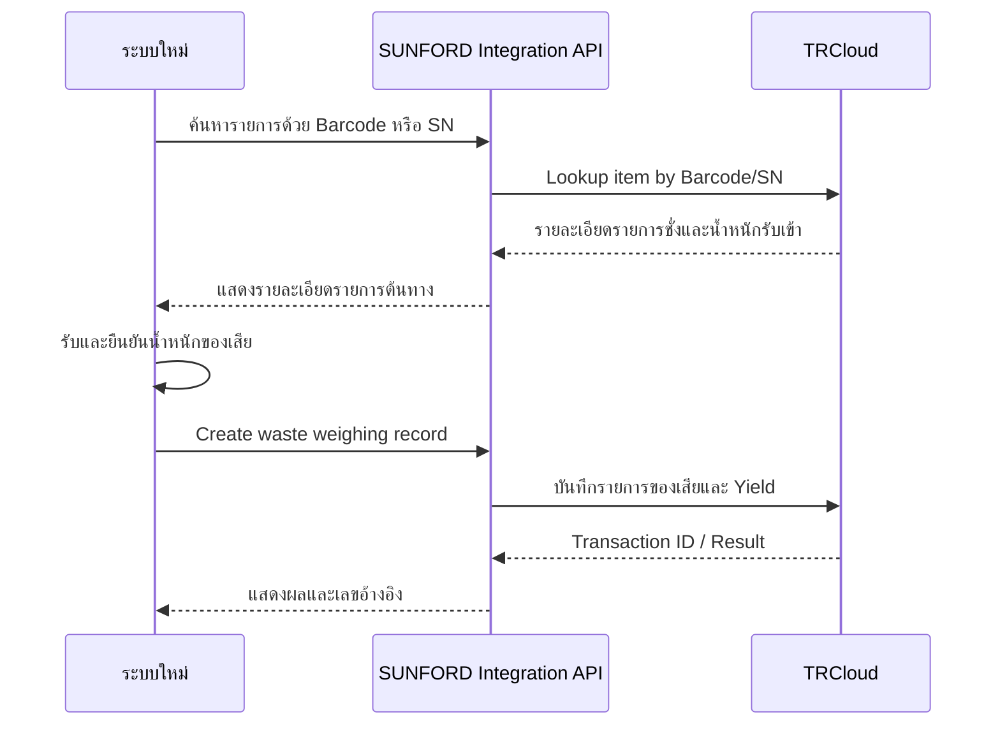

# ขอบเขตงาน WeWeigh2 + ระบบใหม่เชื่อมต่อ TRCloud และบันทึก Yield

**ชื่อโครงการ:** ใช้งาน WeWeigh2 สำหรับงานชั่งน้ำหนัก เพิ่มปุ่ม Export รายงาน และพัฒนาระบบใหม่สำหรับเชื่อมต่อ TRCloud กับงานรับเข้า/Yield

## 1. วัตถุประสงค์

โครงการนี้นำ WeWeigh2 มาใช้เฉพาะโมดูล **Weighing** โดยคงขั้นตอนการทำงานเดิมทั้งหมด และเพิ่มฟังก์ชันใน WeWeigh2 เพียงรายการเดียวคือ **ปุ่ม Export รายงาน**

ส่วนการส่งข้อมูลสินค้าไปยัง TRCloud และงานรับเข้าเพื่อบันทึก Yield ให้ดำเนินการใน **ระบบใหม่แยกจาก WeWeigh2** โดยไม่มีการเพิ่มหรือเปลี่ยนแปลง Flow รับเข้าภายใน WeWeigh2

ขอบเขตโครงการประกอบด้วย:

1. ใช้งานโมดูล Weighing เดิมของ WeWeigh2
2. เพิ่มปุ่ม Export ในหน้ารายงานของ WeWeigh2
3. พัฒนาระบบใหม่สำหรับส่งข้อมูลสินค้าไปยัง TRCloud
4. พัฒนาระบบใหม่สำหรับค้นหารายการรับเข้าด้วย Barcode/SN
5. บันทึกน้ำหนักของเสียและคำนวณ Yield ในระบบใหม่
6. ส่งผลรายการไปยัง TRCloud พร้อมสถานะและเลขอ้างอิง

## 2. การแบ่งขอบเขตตามระบบ

### 2.1 WeWeigh2

WeWeigh2 ใช้งานเฉพาะความสามารถเดิมของโมดูล Weighing และส่วนสนับสนุนที่จำเป็น เช่น Login, บริษัท/สาขา, เครื่องชั่ง, เครื่องพิมพ์, Offline Data, History และ Label

งานพัฒนาเพิ่มใน WeWeigh2 มีเพียง:

- ปุ่ม Export รายงาน
- การสร้างไฟล์รายงานจากข้อมูลตามตัวกรองที่ผู้ใช้เลือก
- การแจ้งผล Export สำเร็จหรือไม่สำเร็จ

### 2.2 ระบบใหม่

ระบบใหม่รับผิดชอบงานต่อไปนี้:

- ส่งข้อมูลสินค้าไปยัง TRCloud
- จัดเก็บ TRCloud Item ID หรือเลขอ้างอิงสินค้า
- ค้นหารายการรับเข้าด้วย Barcode/SN
- แสดงรายละเอียดรายการชั่งต้นทาง
- บันทึกน้ำหนักของเสีย
- คำนวณน้ำหนักสุทธิและ Yield
- ส่งข้อมูล Waste/Yield ไปยัง TRCloud
- แสดง Transaction ID และสถานะรายการ
- จัดเก็บ Transaction Log, Error Log และ Retry

### 2.3 ขอบเขตที่ยืนยันว่าไม่แก้ใน WeWeigh2

- ไม่เพิ่มเมนูรับเข้าใน WeWeigh2
- ไม่เพิ่มหน้าจอ Inbound/Yield ใน WeWeigh2
- ไม่เปลี่ยนขั้นตอนการสร้างหรือเลือกเอกสารงานชั่ง
- ไม่เปลี่ยนขั้นตอนการเลือกสินค้าและ Lot
- ไม่เปลี่ยนขั้นตอนอ่านหรือบันทึกน้ำหนัก
- ไม่เปลี่ยนโหมด Manual, Auto หรือ Continuous
- ไม่เปลี่ยนการสร้าง Barcode/QR Code และการพิมพ์ฉลาก
- ไม่เพิ่มการคำนวณ Yield ใน WeWeigh2
- ไม่ส่งข้อมูลรับเข้าหรือ Yield จาก WeWeigh2 ไปยัง TRCloud โดยตรง
- ไม่เปิดใช้งานหรือแก้ไขโมดูล Formulation

## 3. ความสามารถเดิมของ WeWeigh2 ที่นำมาใช้

### 3.1 ผู้ใช้งาน บริษัท และสาขา

- เข้าสู่ระบบตามวิธีการที่ WeWeigh2 รองรับ
- เลือกบริษัทและสาขาตามสิทธิ์
- ผู้ใช้เข้าถึงข้อมูลตาม Account Scope ที่ได้รับ
- รองรับ Session หมดอายุ การออกจากระบบ และการเข้าสู่ระบบใหม่
- บันทึกผู้ดำเนินการ บริษัท สาขา และวันเวลาของรายการ

### 3.2 เอกสารงานชั่ง

- แสดงรายการเอกสารงานชั่งที่ยังเปิดอยู่
- สร้างและเลือกเอกสารงานชั่ง
- แสดงเลขเอกสาร สถานะ จำนวนรายการ และน้ำหนักรวม
- บันทึกรายการชั่งภายใต้เอกสารที่เลือก
- ป้องกันการเพิ่มรายการใหม่ในเอกสารที่ปิดแล้ว
- ปิดเอกสารเมื่อดำเนินการเสร็จสิ้น

### 3.3 สินค้าและ Lot

- ค้นหาและเลือกสินค้า
- แสดงรหัสสินค้า ชื่อ หน่วย และช่วงควบคุมน้ำหนัก
- ระบุหรือสร้าง Lot สำหรับรายการชั่ง
- เชื่อมโยงสินค้า Lot เอกสาร สาขา และผู้ดำเนินการกับรายการชั่ง

### 3.4 การชั่งน้ำหนัก

- อ่านน้ำหนักแบบ Real-time จากเครื่องชั่ง
- ตรวจสอบสถานะการเชื่อมต่อและความนิ่งของเครื่องชั่ง
- แสดง Lower, Target และ Upper
- แสดงสถานะ LOW, PASS/OK และ HIGH
- บันทึกแบบ Manual, Auto หรือ Continuous ตามการตั้งค่า
- รองรับกฎบันทึกเฉพาะน้ำหนักที่อยู่ในช่วงที่ยอมรับได้
- ป้องกันการบันทึกน้ำหนักเดิมซ้ำในโหมดอัตโนมัติ

### 3.5 ประวัติ Offline และฉลาก

- แสดงประวัติการชั่งและข้อมูลสรุป
- แสดงสถานะ Pending, Synced, Failed และ Retry
- รองรับการทำงานแบบ Offline-first
- เชื่อมต่อเครื่องชั่งและเครื่องพิมพ์ตามรุ่นที่รองรับ
- สร้างและพิมพ์ Barcode/QR Code ตาม Template ที่กำหนด
- รองรับการพิมพ์ฉลากซ้ำ

## 4. ปุ่ม Export รายงานใน WeWeigh2

### 4.1 ตำแหน่งและการใช้งาน

- เพิ่มปุ่ม `Export` ในหน้ารายงานหรือหน้าประวัติที่ตกลง
- ผู้ใช้ต้องเลือกบริษัท สาขา ช่วงวันที่ หรือเงื่อนไขการค้นหาก่อน Export ตามสิทธิ์
- ระบบ Export เฉพาะข้อมูลที่อยู่ภายใต้สิทธิ์และตัวกรองของผู้ใช้
- การ Export ต้องไม่แก้ไขสถานะหรือข้อมูลรายการชั่งเดิม
- การ Export ต้องไม่กระทบ Flow การชั่งและการบันทึกน้ำหนัก
- แสดงสถานะกำลังสร้างไฟล์ ผลสำเร็จ หรือข้อผิดพลาด

### 4.2 ข้อมูลในรายงาน

ข้อมูลเบื้องต้นประกอบด้วย:

- Document ID/Document No.
- Record ID
- Barcode/SN ถ้ามี
- Product ID
- Product Code/SKU
- Product Name
- Lot
- Weight และ Unit
- Weight Status
- Company/Branch
- User/Operator
- Record Date-Time
- Remark
- Sync Status

คอลัมน์ ลำดับคอลัมน์ ชื่อหัวตาราง และรูปแบบไฟล์ เช่น CSV หรือ XLSX ต้องยืนยันก่อนเริ่มพัฒนา

### 4.3 ผลลัพธ์ของการ Export

- สร้างไฟล์ตามรูปแบบที่ยืนยัน
- ตั้งชื่อไฟล์โดยมีประเภทข้อมูลและวันเวลาที่ Export
- รองรับการบันทึกหรือแชร์ไฟล์ผ่านความสามารถของ Android
- แจ้งเตือนกรณีไม่มีข้อมูลตามตัวกรอง
- แจ้งเตือนกรณีสร้างไฟล์ไม่สำเร็จ
- ไม่ส่งไฟล์หรือข้อมูลไปยัง TRCloud อัตโนมัติ

## 5. ระบบใหม่สำหรับส่งข้อมูลสินค้าไปยัง TRCloud

### 5.1 การเลือกและตรวจสอบสินค้า

- แสดงรายการสินค้าตามแหล่งข้อมูลที่ตกลง
- ค้นหาและเลือกสินค้าเป็นรายรายการหรือหลายรายการ
- แสดงสถานะยังไม่ส่ง รอส่ง ส่งสำเร็จ หรือส่งไม่สำเร็จ
- ตรวจสอบข้อมูลบังคับ เช่น รหัสสินค้า ชื่อสินค้า และหน่วยสินค้า
- ป้องกันการส่งสินค้าซ้ำด้วยรหัสสินค้าและ Idempotency Key

### 5.2 ข้อมูลสินค้าที่ส่ง

ข้อมูลขั้นต่ำประกอบด้วย:

- Source Product ID
- Product Code/SKU
- Product Name
- Unit ID/Unit Name
- Barcode ถ้ามี
- Product Weight/Target Weight ถ้า TRCloud รองรับ
- Lower Control และ Upper Control ถ้า TRCloud รองรับ
- Company ID และ Branch ID ตาม Mapping ที่ตกลง
- Active Status
- Created/Updated Date-Time

แหล่งข้อมูลสินค้าและ Field Mapping ที่ส่งจริงต้องยืนยันร่วมกับ TRCloud API ก่อนเริ่มพัฒนา

### 5.3 ผลการส่งสินค้า

- เรียก TRCloud API เพื่อสร้างสินค้า หรืออัปเดตตามนโยบายที่ตกลง
- รับและจัดเก็บ `item_id` หรือเลขอ้างอิงที่ TRCloud ส่งกลับ
- เชื่อมโยง Source Product ID กับ TRCloud Item ID
- แสดงผลสำเร็จ ไม่สำเร็จ และข้อความผิดพลาด
- รองรับ Retry โดยไม่สร้างสินค้าซ้ำ
- กรณีพบ SKU เดิมใน TRCloud ต้องไม่เขียนทับอัตโนมัติจนกว่าจะยืนยันนโยบาย Create/Update

## 6. ระบบใหม่สำหรับรับเข้าและค้นหาด้วย Barcode/SN

- หน้าจอรับเข้า/Yield ต้องอยู่ในระบบใหม่ ไม่ใช่ WeWeigh2
- สแกน Barcode/SN ด้วยกล้องหรือเครื่องอ่าน Barcode
- รองรับการกรอก Barcode, Record ID หรือ SN ด้วยตนเอง
- ตรวจสอบรูปแบบข้อมูลก่อนส่งคำขอ
- เรียก API เพื่อค้นหารายการต้นทางด้วย Barcode/SN
- แสดงสินค้า SKU, Lot, น้ำหนักรับเข้า สาขา ผู้บันทึก และวันเวลา
- แจ้งเตือนเมื่อไม่พบรายการ ข้อมูลไม่ถูกต้อง หรือรายการไม่อยู่ในสถานะที่ดำเนินการได้
- ป้องกันผู้ใช้เปิดหรือบันทึกรายการของสาขาที่ไม่มีสิทธิ์

## 7. ระบบใหม่สำหรับบันทึกของเสียและ Yield

### 7.1 ขั้นตอนการทำงาน

### 7.2 การบันทึกน้ำหนักของเสีย

- เลือกรายการต้นทางจาก Barcode/SN
- รับน้ำหนักของเสียตามวิธีที่ยืนยันสำหรับระบบใหม่
- ตรวจสอบว่าน้ำหนักเป็นค่าบวกและไม่เกินน้ำหนักรับเข้า
- บันทึกสินค้า Lot สาขา ผู้ดำเนินการ วันเวลา และหมายเหตุ
- ส่งคำขอสร้าง Waste Weighing Record
- รับ Transaction ID หรือเลขอ้างอิงจากระบบปลายทาง
- ป้องกันรายการซ้ำด้วย Client Record ID และ Idempotency Key
- รองรับ Queue และ Retry เมื่ออินเทอร์เน็ตหรือ TRCloud ไม่พร้อมใช้งาน

### 7.3 การคำนวณ Yield

สูตรตั้งต้นสำหรับการยืนยัน:

- `Net Yield Weight = Inbound Weight - Waste Weight`
- `Yield (%) = (Net Yield Weight / Inbound Weight) × 100`

กฎการคำนวณ:

- น้ำหนักรับเข้าต้องมากกว่า 0
- น้ำหนักของเสียห้ามติดลบ
- น้ำหนักของเสียห้ามมากกว่าน้ำหนักรับเข้า
- เก็บค่าต้นทางและผลลัพธ์ไว้ตรวจสอบย้อนหลัง
- ยืนยันจำนวนตำแหน่งทศนิยมและหลักการปัดเศษก่อน UAT
- หาก TRCloud ใช้สูตรต่างจากนี้ ให้ยึด Business Rule ที่ยืนยันก่อนพัฒนา

### 7.4 ข้อมูลรายการ Yield

- Client Record ID
- TRCloud Transaction ID
- Source Record ID
- Barcode/SN
- TRCloud Item ID
- SKU และชื่อสินค้า
- Lot
- Company ID และ Branch ID
- Inbound Weight
- Waste Weight
- Net Yield Weight
- Yield Percentage
- Weight Unit
- Remark
- Record Date-Time
- User ID
- Sync Status
- Error Message ถ้ามี

## 8. SUNFORD Integration API

- เชื่อมต่อระบบใหม่กับ TRCloud
- ไม่จัดเก็บ TRCloud API Credential ไว้ในแอปโดยตรง
- รับส่งข้อมูลผ่าน HTTPS
- รองรับ Product Upload, Barcode/SN Lookup และ Waste/Yield Record
- แปลงข้อมูลตาม Field Mapping ที่ยืนยัน
- ใช้ Idempotency Key กับทุกคำขอที่สร้างหรือแก้ไขข้อมูล
- กำหนด Timeout, Retry และ Exponential Backoff
- จัดเก็บ Request/Response Status, Transaction ID และ Error Mapping
- ซ่อน Credential และข้อมูลอ่อนไหวออกจาก Log

สถานะรายการเชื่อมต่อขั้นต่ำ:

- `PENDING`
- `SENDING`
- `SUCCESS`
- `RETRYING`
- `FAILED`
- `CONFLICT`

## 9. การทดสอบและ UAT

### 9.1 WeWeigh2

- ทดสอบว่า Flow Weighing เดิมยังทำงานเหมือนเดิม
- ทดสอบปุ่ม Export ตามสิทธิ์และตัวกรอง
- ทดสอบข้อมูลและจำนวนรายการในไฟล์เทียบกับหน้ารายงาน
- ทดสอบกรณีไม่มีข้อมูลและสร้างไฟล์ไม่สำเร็จ
- ทดสอบว่า Export ไม่เปลี่ยนข้อมูลหรือสถานะรายการชั่ง
- ทดสอบว่าไม่มีเมนูหรือ Flow รับเข้า/Yield ถูกเพิ่มใน WeWeigh2

### 9.2 ระบบใหม่และ TRCloud

- ทดสอบส่งสินค้ารายการเดียวและหลายรายการ
- ทดสอบ SKU ซ้ำ ข้อมูลไม่ครบ และ TRCloud ไม่ตอบสนอง
- ทดสอบการจัดเก็บ TRCloud Item ID
- ทดสอบค้นหาด้วย Barcode, Record ID และ SN
- ทดสอบกรณีไม่พบรายการหรือไม่มีสิทธิ์
- ทดสอบการบันทึกน้ำหนักของเสียและ Transaction ID
- ทดสอบสูตร Net Yield Weight และ Yield Percentage
- ทดสอบการป้องกันข้อมูลซ้ำ Queue, Retry และ Error Log
- เปิดระบบให้ลูกค้าทดสอบ UAT และแก้ไขข้อผิดพลาดตามขอบเขตที่ตกลง

## 10. การติดตั้งและส่งมอบ

- ส่งมอบ WeWeigh2 รุ่นที่เพิ่มปุ่ม Export รายงาน
- ส่งมอบระบบใหม่ตาม Platform ที่ยืนยัน
- ติดตั้ง SUNFORD Integration API บน Environment ที่ตกลง
- ตั้งค่าการเชื่อมต่อ TRCloud สำหรับ Test/UAT และ Production
- ส่งมอบเอกสารรูปแบบรายงานและ Field Mapping
- ส่งมอบเอกสาร API Mapping
- ส่งมอบคู่มือ Export, Product Upload และ Inbound/Yield
- ส่งมอบ Source Code ตามเงื่อนไขที่ตกลง
- อบรมการใช้งานออนไลน์ 1 ครั้ง
- สนับสนุน UAT และการเปิดใช้งานจริง
- รับประกันแก้ไขข้อผิดพลาดตามขอบเขต 30 วันหลังส่งมอบ

## 11. ขอบเขตที่ไม่รวม

- การเปลี่ยนแปลง Flow รับเข้าภายใน WeWeigh2
- การเพิ่มหน้าจอ Product Upload, Inbound หรือ Yield ใน WeWeigh2
- การส่งข้อมูลไปยัง TRCloud โดยตรงจาก WeWeigh2
- การเปลี่ยนแปลงโมดูล Weighing เดิมนอกเหนือจากปุ่ม Export รายงาน
- โมดูล Formulation และการชั่งตามสูตร
- การสร้างหรือแก้ไขสูตรการผลิตและ Batch
- ระบบเบิก โอนย้าย ยืนยันรับปลายทาง หรือคืนสินค้า
- Dashboard และรายงานวิเคราะห์นอกเหนือจากรายงาน Export และผล Yield ที่ระบุ
- การเปลี่ยนแปลงระบบภายใน TRCloud ที่อยู่นอก API ที่เปิดให้ใช้งาน
- การจัดหาหรือสมัครใช้บริการ TRCloud
- การจัดหาเครื่องชั่ง เครื่องพิมพ์ อุปกรณ์ Android และอุปกรณ์เครือข่าย

## 12. ข้อมูลที่ต้องยืนยันก่อนประเมิน Developer-Days

- ตำแหน่งปุ่ม Export และหน้ารายงานต้นทาง
- ตัวกรอง คอลัมน์ และรูปแบบไฟล์ Export
- Platform และรูปแบบหน้าจอของระบบใหม่
- แหล่งข้อมูลสินค้าที่จะส่งไป TRCloud
- TRCloud Test Account และ API Credential
- API สำหรับสร้าง/อัปเดตสินค้า
- API สำหรับค้นหารายการด้วย Barcode/SN
- API สำหรับสร้าง Waste Weighing Record และบันทึก Yield
- ตัวอย่าง Request/Response และ Error Code
- Field Mapping และนโยบายเมื่อพบ SKU เดิม
- สูตร Yield หน่วยน้ำหนัก จำนวนทศนิยม และหลักการปัดเศษ
- ข้อมูลบริษัท สาขา สินค้า และรายการรับเข้าตัวอย่าง
- เกณฑ์ UAT และผู้รับผิดชอบยืนยันผล

ระยะเวลาพัฒนาต้องประเมินเป็น **Developer-Days ที่ทำงานจริง** หลังจากข้อมูลข้างต้นได้รับการยืนยัน โดยไม่นับวันรอข้อมูล วันรอ UAT วันหยุด หรือระยะเวลารอระบบภายนอก

## 13. เกณฑ์การยอมรับงานหลัก

1. WeWeigh2 ยังคงทำงานตาม Flow Weighing เดิม
2. WeWeigh2 มีการเปลี่ยนแปลงเพียงปุ่ม Export และส่วนสร้างไฟล์รายงาน
3. ผู้ใช้ Export รายงานตามสิทธิ์และตัวกรองได้
4. การ Export ไม่เปลี่ยนแปลงข้อมูลหรือสถานะรายการชั่ง
5. ไม่มีเมนูหรือ Flow รับเข้า/Yield เพิ่มใน WeWeigh2
6. ระบบใหม่ส่งข้อมูลสินค้าไป TRCloud ได้โดยไม่สร้างข้อมูลซ้ำ
7. ระบบใหม่จัดเก็บ TRCloud Item ID หรือเลขอ้างอิงได้
8. ระบบใหม่ค้นหารายการรับเข้าด้วย Barcode/SN ได้
9. ระบบใหม่บันทึกน้ำหนักของเสียและคำนวณ Yield ตามสูตรที่ยืนยันได้
10. ระบบใหม่แสดง Transaction ID และสถานะรายการจาก TRCloud ได้
11. เมื่อ API ขัดข้อง รายการสามารถ Retry ได้โดยไม่สร้างข้อมูลซ้ำ
12. ผู้ดูแลตรวจสอบสถานะและข้อผิดพลาดย้อนหลังได้
