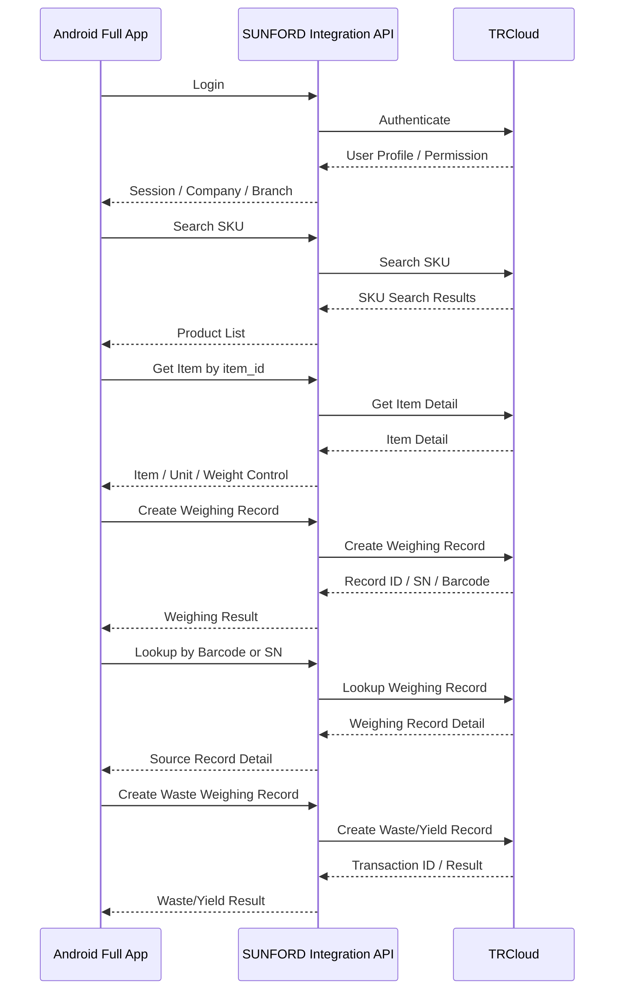

# ขอบเขตงานพัฒนาแอปใหม่ทั้งหมด (Full Application)

**ชื่อโครงการ:** พัฒนาแอปพลิเคชัน Android ใหม่ทั้งหมด สำหรับค้นหาสินค้า ชั่งรับเข้า สร้าง SN/Barcode และบันทึก Yield เชื่อมต่อ TRCloud

## 1. วัตถุประสงค์

พัฒนาแอปพลิเคชัน Android และระบบเชื่อมต่อ Backend ใหม่ทั้งหมด โดยไม่ใช้หรือดัดแปลง WeWeigh2 เพื่อรองรับกระบวนการทำงานตั้งแต่เข้าสู่ระบบ ค้นหาสินค้าจาก TRCloud บันทึกการชั่งรับเข้า สร้าง Record ID/SN และ Barcode ค้นหารายการย้อนหลังด้วย Barcode/SN บันทึกน้ำหนักของเสีย และคำนวณ Yield

ขอบเขต Full Application ประกอบด้วย 2 โมดูลธุรกิจหลัก:

1. **Weighing/Inbound:** ค้นหาสินค้า ชั่งรับเข้า บันทึกรายการ และสร้าง SN/Barcode
2. **Waste/Yield:** ค้นหารายการต้นทาง บันทึกน้ำหนักของเสีย และคำนวณ Yield

Login, Permission, Branch, Offline/Sync, Integration API, Label และ Transaction Log เป็นฟังก์ชันสนับสนุนของแอป

เอกสารนี้เป็นทางเลือก **พัฒนาใหม่ทั้งหมด** แยกจากทางเลือก WeWeigh2 + แอปโมดูล Yield

## 2. ภาพรวมขั้นตอนการทำงาน

## 3. ระบบเข้าสู่ระบบและแยกสาขา

- เข้าสู่ระบบผ่านข้อมูลผู้ใช้งานที่เชื่อมต่อกับ TRCloud
- รับข้อมูล User Profile และ Permission
- รับข้อมูลบริษัทและสาขาตามสิทธิ์
- กรณีผู้ใช้มีสิทธิ์มากกว่าหนึ่งสาขา ให้เลือกสาขาก่อนเริ่มงาน
- ผู้ใช้ทั่วไปเข้าถึงข้อมูลเฉพาะสาขาของตนเอง
- ผู้ดูแลระบบเข้าถึงหลายสาขาตามสิทธิ์
- บันทึก User ID, Company ID, Branch ID และวันเวลาของทุก Transaction
- รองรับการออกจากระบบและ Session หมดอายุ
- แจ้งเตือนเมื่อเข้าสู่ระบบไม่สำเร็จหรือไม่มีสิทธิ์ใช้งาน

## 4. ระบบค้นหาและเลือกสินค้า

- ค้นหาสินค้าด้วย SKU Code หรือชื่อสินค้า
- เรียกข้อมูลรายการสินค้าจาก TRCloud
- แสดงผลการค้นหา SKU
- เลือกสินค้าด้วย `item_id`
- เรียกดูรายละเอียดสินค้าจาก TRCloud
- แสดง Item ID, SKU, ชื่อสินค้า, หน่วยสินค้า และข้อมูลที่เกี่ยวข้อง
- แสดงค่า Lower, Target และ Upper ถ้ามี
- รองรับกรณีไม่พบสินค้า
- รองรับกรณีข้อมูลสินค้าไม่ครบหรือ TRCloud ไม่ตอบสนอง
- จัดเก็บข้อมูลสินค้าที่จำเป็นสำหรับการทำงาน Offline ตามขอบเขตที่ตกลง

## 5. โมดูล Weighing/Inbound

### 5.1 การสร้างรายการรับเข้า

- เลือกสินค้าที่ต้องการรับเข้า
- ระบุ Lot ของสินค้า
- กรอกหรือรับค่าน้ำหนักจากเครื่องชั่ง
- ตรวจสอบรูปแบบ หน่วย ความนิ่ง และความถูกต้องของน้ำหนัก
- รองรับการเชื่อมต่อเครื่องชั่งตามรุ่นและ Protocol ที่ตกลงจำนวน 1 รูปแบบ
- ระบุหมายเหตุของรายการรับเข้า
- บันทึกสาขา ผู้ดำเนินการ และวันเวลา
- ส่งคำขอ Create Weighing Record
- รับผลการบันทึก Record ID, SN และ Barcode
- แสดงสถานะสำเร็จหรือไม่สำเร็จ
- ป้องกันการส่งรายการซ้ำ
- รองรับ Queue และ Retry เมื่ออินเทอร์เน็ตหรือ API ขัดข้อง

### 5.2 ข้อมูลรายการรับเข้า

ข้อมูลขั้นต่ำประกอบด้วย:

- Client Record ID
- User ID
- Company ID
- Branch ID
- TRCloud Item ID
- SKU
- Product Name
- Lot
- Weight
- Weight Unit
- Remark
- Record Date-Time
- Record ID
- SN
- Barcode
- Record Status
- Sync Status

### 5.3 กฎการบันทึก

- ต้องเลือกบริษัท สาขา และสินค้าก่อนบันทึก
- น้ำหนักต้องมากกว่า 0 และใช้หน่วยที่กำหนด
- ป้องกันผู้ใช้บันทึกเข้าสาขาที่ไม่มีสิทธิ์
- สร้าง Client Record ID ก่อนส่งข้อมูลเพื่อรองรับ Idempotency
- รายการที่บันทึกสำเร็จต้องเชื่อมโยงกับ Record ID/SN ที่ไม่ซ้ำ
- เมื่อส่งไม่สำเร็จต้องแสดงสาเหตุและสถานะ Retry

## 6. ระบบสร้าง SN และ Barcode

- สร้าง SN หรือรับ SN จากผลการบันทึกรายการ
- กำหนด Record ID/SN ให้ไม่ซ้ำกัน
- เชื่อมโยง SN กับ SKU, Lot, Weight, Record Date-Time และสาขาที่รับเข้า
- สร้าง Barcode ตามรูปแบบที่ยืนยัน
- รองรับ EAN-13, Code 128 หรือ QR Code ตาม Business Rule
- คำนวณ Check Digit สำหรับรูปแบบที่ต้องใช้
- แสดง Record ID, SN และ Barcode บนหน้าจอผลลัพธ์
- สร้างฉลากจากข้อมูลรายการรับเข้า
- เชื่อมต่อเครื่องพิมพ์ฉลากตามรุ่นที่ตกลงจำนวน 1 รูปแบบ
- สั่งพิมพ์และพิมพ์ฉลากซ้ำ
- เก็บประวัติผู้ดำเนินการและเวลาที่พิมพ์

รูปแบบการประกอบ SN และ Barcode จาก SKU, Record Date-Time, Lot, Weight, Prefix และ Running/Random Value ต้องยืนยันก่อนเริ่มพัฒนา ไม่ให้ยึดค่าตัวอย่างในภาพเป็นรูปแบบ Production โดยอัตโนมัติ

แนะนำให้ใช้ Code 128 หรือ QR Code เป็นรหัสหลักสำหรับติดตาม SN เนื่องจาก Barcode ที่ประกอบจาก SKU และน้ำหนักอาจซ้ำได้เมื่อสินค้าและน้ำหนักเท่ากัน

## 7. ระบบสแกนและค้นหา Barcode/SN

- สแกน Barcode/SN ด้วยกล้องอุปกรณ์ Android หรือเครื่องอ่าน Barcode
- รองรับการกรอก Barcode, Record ID หรือ SN ด้วยตนเอง
- ตรวจสอบรูปแบบข้อมูลก่อนส่งคำขอ
- ค้นหารายการชั่งต้นทางผ่าน TRCloud
- แสดง Record ID, SN, Barcode, SKU, Lot, น้ำหนักรับเข้า และหน่วย
- แสดงสาขา ผู้บันทึก วันเวลา และสถานะรายการ
- แจ้งเตือนเมื่อไม่พบข้อมูล Barcode/SN ไม่ถูกต้อง หรือรายการไม่สามารถดำเนินการต่อได้
- ป้องกันผู้ใช้เปิดรายการของสาขาที่ไม่มีสิทธิ์

## 8. โมดูล Waste/Yield

### 8.1 การบันทึกน้ำหนักของเสีย

- เลือกรายการต้นทางจากผลการค้นหา Barcode/SN
- แสดงรายละเอียดรายการชั่งต้นทางก่อนบันทึก
- กรอกหรือรับค่าน้ำหนักของเสียจากเครื่องชั่งตามวิธีที่ตกลง
- ตรวจสอบหน่วยและความถูกต้องของน้ำหนักของเสีย
- ตรวจสอบว่าน้ำหนักของเสียเป็นค่าบวกและไม่เกินน้ำหนักรับเข้า
- บันทึกสินค้า Lot สาขา ผู้ดำเนินการ วันเวลา และหมายเหตุ
- ส่งคำขอ Create Waste Weighing Record
- รับ Transaction ID หรือเลขอ้างอิงจาก TRCloud
- แสดงผลสำเร็จ ไม่สำเร็จ และสถานะการส่งข้อมูล
- ป้องกันรายการซ้ำด้วย Client Record ID และ Idempotency Key
- รองรับ Queue และ Retry เมื่ออินเทอร์เน็ตหรือ TRCloud ไม่พร้อมใช้งาน

### 8.2 การคำนวณ Yield

สูตรตั้งต้นสำหรับการยืนยัน:

- `Net Yield Weight = Inbound Weight - Waste Weight`
- `Yield (%) = (Net Yield Weight / Inbound Weight) × 100`

กฎการคำนวณ:

- น้ำหนักรับเข้าต้องมากกว่า 0
- น้ำหนักของเสียห้ามติดลบ
- น้ำหนักของเสียห้ามมากกว่าน้ำหนักรับเข้า
- ต้องใช้หน่วยน้ำหนักเดียวกันก่อนคำนวณ
- เก็บค่าต้นทางและผลลัพธ์ไว้ตรวจสอบย้อนหลัง
- ยืนยันจำนวนตำแหน่งทศนิยมและหลักการปัดเศษก่อน UAT
- หาก TRCloud ใช้สูตรหรือหน่วยนับต่างจากนี้ ให้ยึด Business Rule ที่ยืนยันก่อนพัฒนา

### 8.3 ข้อมูล Waste/Yield Record

- Client Waste Record ID
- TRCloud Transaction ID
- Source Record ID
- Barcode/SN
- TRCloud Item ID
- SKU และชื่อสินค้า
- Lot
- Company ID และ Branch ID
- Inbound Weight
- Waste Weight
- Net Yield Weight
- Yield Percentage
- Weight Unit
- Remark
- Record Date-Time
- User ID
- Sync Status
- Error Message ถ้ามี

## 9. การแยกข้อมูลตามสาขาและ Audit Log

- ทุกรายการรับเข้าและ Yield ต้องผูกกับ Company ID และ Branch ID
- ผู้ใช้เห็นเฉพาะรายการตามสิทธิ์
- ผู้ดูแลระบบค้นหาและตรวจสอบหลายสาขาได้ตามสิทธิ์
- ป้องกันการบันทึกข้อมูลเข้าสาขาที่ไม่มีสิทธิ์
- เก็บ Audit Log การเข้าถึง การบันทึก การพิมพ์ และการ Retry
- บันทึกผู้ดำเนินการ วันเวลา และ Device ID ที่เกี่ยวข้อง

## 10. SUNFORD Integration API

- พัฒนาระบบกลางใหม่เพื่อเชื่อมต่อแอป Android กับ TRCloud
- รองรับ Login, User Profile และ Permission
- รองรับข้อมูลบริษัทและสาขา
- รองรับ Search SKU และ Item Detail
- รองรับ Create Weighing Record
- รองรับ Lookup by Barcode/SN
- รองรับ Create Waste Weighing Record และ Yield Result
- แปลงข้อมูลระหว่างรูปแบบของแอปกับ TRCloud
- จัดเก็บ TRCloud API Credential ไว้ใน Backend
- ไม่จัดเก็บ TRCloud API Key ไว้ในแอปโดยตรง
- รับส่งข้อมูลผ่าน HTTPS
- ใช้ Idempotency Key กับทุกคำขอที่สร้างหรือแก้ไขข้อมูล
- กำหนด Timeout, Retry และ Exponential Backoff
- จัดเก็บ Request/Response Status, Transaction ID และ Error Mapping
- ซ่อน Credential และข้อมูลอ่อนไหวออกจาก Log

สถานะรายการเชื่อมต่อขั้นต่ำ:

- `PENDING`
- `SENDING`
- `SUCCESS`
- `RETRYING`
- `FAILED`
- `CONFLICT`

## 11. การทำงานแบบ Offline และ Sync

- บันทึกข้อมูลลง Local Database ก่อนเมื่อ Business Rule อนุญาต
- จัดเก็บรายการที่รอส่งใน Outbox
- Sync เมื่อมีอินเทอร์เน็ต หรือเมื่อผู้ใช้กด Sync Now/Retry
- แสดงสถานะ Pending, Synced, Failed และ Retrying
- รายการที่ส่งไม่สำเร็จต้องไม่หายจากประวัติ
- Retry ต้องไม่สร้าง Weighing Record หรือ Waste/Yield Record ซ้ำ
- กรณี Session หมดอายุให้หยุด Sync และเข้าสู่ระบบใหม่
- กรณีข้อมูลขัดแย้งให้แสดง Conflict และรอผู้ดูแลดำเนินการ

หมายเหตุ: Search SKU, Item Detail และ Lookup Barcode/SN ต้องใช้อินเทอร์เน็ต เว้นแต่ตกลงให้เตรียมข้อมูลต้นทางไว้ในเครื่องล่วงหน้า

## 12. หน้าจอของแอป Android

- Splash/Login
- เลือกบริษัทและสาขา
- Search SKU
- Product/Item Detail
- Create Weighing Record
- Weighing Result: Record ID/SN/Barcode
- Label Preview/Print
- Scan/Search Barcode/SN
- Weighing Record Detail
- Create Waste Weighing Record
- Yield Result/Transaction Detail
- Weighing/Waste History
- Sync Queue/Error/Retry Detail
- Settings/Logout

ทุกหน้าจอต้องรองรับสถานะ Loading, Empty, Success, Error และ Retry ตามความเหมาะสม

## 13. แอปพลิเคชันและ Google Play Store

- พัฒนา Native Android Application ใหม่ทั้งหมด
- จัดทำ App Name, App Icon และ Splash Screen ตามที่ยืนยัน
- รองรับสิทธิ์กล้อง Bluetooth และพื้นที่จัดเก็บตามฟังก์ชันที่ใช้
- สร้าง APK และ Android App Bundle
- ทดสอบบนอุปกรณ์ Android จริง
- เผยแพร่ผ่าน Google Play Developer Account ของ SUNFORD
- จัดเตรียมข้อมูลแอปและส่งตรวจจำนวน 1 ครั้ง
- สามารถโอนแอปไปยัง Google Play Developer Account ของลูกค้าได้ภายหลัง
- บัญชีปลายทางต้องผ่านเงื่อนไขของ Google
- ระยะเวลาตรวจสอบของ Google ไม่นับเป็น Developer-Days

## 14. การทดสอบและ UAT

- ทดสอบ Login, User Profile, Permission และสาขา
- ทดสอบ Search SKU และ Item Detail
- ทดสอบการรับค่าน้ำหนักจากเครื่องชั่งรุ่นที่ตกลง
- ทดสอบ Create Weighing Record
- ทดสอบการสร้าง/รับ Record ID, SN และ Barcode
- ทดสอบความไม่ซ้ำของ SN และ Barcode
- ทดสอบการสร้างและพิมพ์ฉลาก
- ทดสอบสแกนและค้นหาด้วย Barcode, Record ID และ SN
- ทดสอบการแสดง Weighing Record Detail
- ทดสอบ Create Waste Weighing Record
- ทดสอบสูตร Net Yield Weight และ Yield Percentage
- ทดสอบกรณีน้ำหนักรับเข้าเป็น 0 น้ำหนักของเสียติดลบ หรือของเสียมากกว่าน้ำหนักรับเข้า
- ทดสอบการป้องกันข้อมูลซ้ำ Queue, Retry และ Error Log
- ทดสอบกรณีอินเทอร์เน็ตหรือ TRCloud ไม่ตอบสนอง
- ทดสอบบนอุปกรณ์ Android เครื่องชั่ง และเครื่องพิมพ์จริง
- เปิดระบบให้ลูกค้าทดสอบ UAT
- แก้ไขข้อผิดพลาดตามขอบเขตที่ตกลง

## 15. การติดตั้งและส่งมอบ

- ติดตั้ง SUNFORD Integration API บน Environment ที่ตกลง
- ตั้งค่าการเชื่อมต่อ TRCloud สำหรับ Test/UAT และ Production
- ส่งมอบ APK และ Android App Bundle
- ส่งมอบเอกสาร SN/Barcode Rule
- ส่งมอบเอกสาร Field Mapping และ API Mapping
- ส่งมอบคู่มือการติดตั้งและใช้งาน
- ส่งมอบ Source Code ตามเงื่อนไขที่ตกลง
- อบรมการใช้งานออนไลน์ 1 ครั้ง
- สนับสนุน UAT และการเปิดใช้งานจริง
- รับประกันแก้ไขข้อผิดพลาดตามขอบเขต 30 วันหลังส่งมอบ

## 16. ขอบเขตที่ไม่รวม

- การนำ WeWeigh2 มาใช้หรือแก้ไข WeWeigh2
- โมดูล Formulation และการชั่งตามสูตร
- Dashboard และรายงานวิเคราะห์นอกเหนือจากประวัติที่ระบุ
- ระบบเบิกสินค้าไปยังสาขา
- ระบบโอนย้ายสินค้าระหว่างสาขา
- ระบบยืนยันรับสินค้าที่สาขาปลายทาง
- สถานะสินค้าระหว่างขนส่ง
- ระบบคืนสินค้าและบริหารคลัง
- การเปลี่ยนแปลงระบบภายใน TRCloud ที่อยู่นอก API ที่เปิดให้ใช้งาน
- การจัดหาหรือสมัครใช้บริการ TRCloud
- การจัดหาเครื่องชั่ง เครื่องพิมพ์ อุปกรณ์ Android และอุปกรณ์เครือข่าย
- การรองรับอุปกรณ์เพิ่มเติมนอกเหนือจากรุ่นและ Protocol ที่ตกลง

## 17. ข้อมูลที่ต้องได้รับก่อนเริ่มพัฒนา

- ชื่อแอป App Icon และรูปแบบหน้าจอที่ยืนยัน
- TRCloud Test Account และ Production Account ตามช่วงทดสอบ
- TRCloud API Credential และวิธี Authentication
- API สำหรับ Login/User Profile/Permission
- API สำหรับ Search SKU และ Item Detail
- API สำหรับ Create Weighing Record
- API สำหรับ Lookup Barcode/SN
- API สำหรับ Create Waste Weighing Record และ Yield Result
- ตัวอย่าง Request/Response และ Error Code
- Field Mapping ระหว่างแอปกับ TRCloud
- กฎการสร้าง Record ID/SN และ Barcode
- สูตร Yield หน่วยน้ำหนัก จำนวนทศนิยม และหลักการปัดเศษ
- ข้อมูลบริษัท สาขา สินค้า และรายการตัวอย่าง
- เครื่องชั่ง เครื่องพิมพ์ และอุปกรณ์ Android สำหรับทดสอบ
- เกณฑ์ UAT และผู้รับผิดชอบยืนยันผล

## 18. ระยะเวลาพัฒนา

ใช้กำลังพัฒนารวม **30 Developer-Days**

- 1 Developer-Day หมายถึง Developer 1 คนทำงานพัฒนาจริง 1 วันทำการ
- นับเฉพาะวันที่มีการพัฒนาจริงตั้งแต่วันจันทร์ถึงวันศุกร์
- ไม่รวมวันเสาร์ วันอาทิตย์ วันหยุดนักขัตฤกษ์ และวันหยุดตามประกาศของบริษัท
- ไม่รวมวันรอข้อมูล วันรอ API Credential วันรออุปกรณ์ วันรอ UAT และระยะเวลาตรวจสอบของ Google
- หากใช้ Developer หลายคนทำงานพร้อมกัน ระยะเวลาบนปฏิทินอาจสั้นลง แต่กำลังพัฒนารวมยังคงเป็น 30 Developer-Days

การเริ่มนับ Developer-Days ต้องได้รับข้อมูลและอุปกรณ์ตามหัวข้อ 17 ครบถ้วนแล้ว

## 19. เกณฑ์การยอมรับงานหลัก

1. แอป Android และ Integration API ถูกพัฒนาใหม่ทั้งหมดโดยไม่พึ่ง WeWeigh2
2. ผู้ใช้ Login และเลือกบริษัท/สาขาตามสิทธิ์ได้
3. ผู้ใช้ค้นหา SKU และดู Item Detail จาก TRCloud ได้
4. ผู้ใช้บันทึก Weighing Record และได้รับ Record ID/SN/Barcode ได้
5. Record ID/SN/Barcode ไม่ซ้ำตามกฎที่ยืนยัน
6. ผู้ใช้สแกนหรือค้นหารายการด้วย Barcode/SN ได้
7. ผู้ใช้บันทึก Waste Weighing Record จากรายการต้นทางได้
8. แอปคำนวณน้ำหนักสุทธิและ Yield ตามสูตรที่ยืนยันได้
9. แอปแสดง Transaction ID และสถานะรายการจาก TRCloud ได้
10. เมื่อ API ขัดข้อง รายการสามารถ Retry ได้โดยไม่สร้างข้อมูลซ้ำ
11. ผู้ดูแลตรวจสอบสถานะและข้อผิดพลาดย้อนหลังได้
12. แอปผ่าน UAT ตาม Flow ตั้งแต่ Login จนถึง Waste/Yield Result
