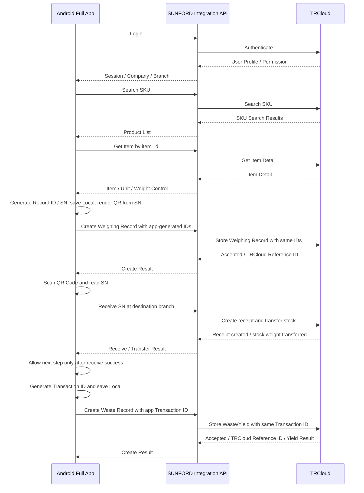

# AppWeighing

**ขอบเขตโครงการ:** พัฒนา Android Full Application ใหม่ทั้งหมด สำหรับค้นหาสินค้า ชั่งรับเข้า สร้าง SN/QR Code/Barcode และบันทึก Yield เชื่อมต่อ TRCloud

## 1. วัตถุประสงค์

พัฒนาแอปพลิเคชัน Android และระบบเชื่อมต่อ Backend ใหม่ทั้งหมด เพื่อรองรับกระบวนการทำงานตั้งแต่เข้าสู่ระบบ ค้นหาสินค้าจาก TRCloud บันทึกการชั่งรับเข้า สร้าง Record ID/SN พร้อม QR Code และ Barcode ที่ Encode ค่า SN สแกน QR Code เพื่อรับสินค้าและย้าย Stock เข้าสาขาที่สแกน บันทึกน้ำหนักของเสีย และคำนวณ Yield

ขอบเขต Full Application ประกอบด้วย 2 โมดูลธุรกิจหลัก:

1. **Weighing/Inbound:** ค้นหาสินค้า ชั่งรับเข้า บันทึกรายการ และสร้าง SN/QR Code/Barcode
2. **Waste/Yield:** ค้นหารายการต้นทาง บันทึกน้ำหนักของเสีย และคำนวณ Yield

Login, Permission, Branch, Network Error/Retry, Integration API, Label และ Transaction Log เป็นฟังก์ชันสนับสนุนของแอป

## 2. ภาพรวมขั้นตอนการทำงาน

## 3. ระบบเข้าสู่ระบบและแยกสาขา

- เข้าสู่ระบบผ่านข้อมูลผู้ใช้งานที่เชื่อมต่อกับ TRCloud
- รับข้อมูล User Profile และ Permission
- รับข้อมูลบริษัทและสาขาตามสิทธิ์
- กรณีผู้ใช้มีสิทธิ์มากกว่าหนึ่งสาขา ให้เลือกสาขาก่อนเริ่มงาน
- ผู้ใช้ทั่วไปเข้าถึงข้อมูลเฉพาะสาขาของตนเอง
- ผู้ดูแลระบบเข้าถึงหลายสาขาตามสิทธิ์
- บันทึก User ID, Company ID, Branch ID และวันเวลาของทุก Transaction
- รองรับการออกจากระบบและ Session หมดอายุ
- แจ้งเตือนเมื่อเข้าสู่ระบบไม่สำเร็จหรือไม่มีสิทธิ์ใช้งาน

## 4. ระบบค้นหาและเลือกสินค้า

- ค้นหาสินค้าด้วย SKU Code หรือชื่อสินค้า
- เรียกข้อมูลรายการสินค้าจาก TRCloud
- แสดงผลการค้นหา SKU
- เลือกสินค้าด้วย `item_id`
- เรียกดูรายละเอียดสินค้าจาก TRCloud
- แสดง Item ID, SKU, ชื่อสินค้า, หน่วยสินค้า และข้อมูลที่เกี่ยวข้อง
- รองรับกรณีไม่พบสินค้า
- รองรับกรณีข้อมูลสินค้าไม่ครบหรือ TRCloud ไม่ตอบสนอง
- จัดเก็บสถานะข้อมูลสินค้าที่จำเป็นสำหรับป้องกันข้อมูลสูญหายระหว่างการใช้งาน

## 5. โมดูล Weighing/Inbound

### 5.1 การสร้างรายการรับเข้า

- เลือกสินค้าที่ต้องการรับเข้า
- กรอกหรือรับค่าน้ำหนักจากเครื่องชั่ง
- ตรวจสอบรูปแบบ หน่วย ความนิ่ง และความถูกต้องของน้ำหนัก
- รองรับการเชื่อมต่อเครื่องชั่งที่ SUNFORD เป็นผู้เลือกและจัดเตรียม
- ระบุหมายเหตุของรายการรับเข้า
- บันทึกสาขา ผู้ดำเนินการ และวันเวลา
- แอปสร้าง Client Record ID, Record ID และ SN ก่อนส่งข้อมูล พร้อมสร้าง QR Code และ Barcode จากค่า SN เดียวกัน
- บันทึกสถานะรายการและรหัสที่จำเป็นภายในเครื่องก่อนส่งคำขอ เพื่อป้องกันข้อมูลสูญหายเมื่อ Request ขัดข้อง
- ส่ง Record ID, SN และข้อมูลรายการเดิมไปกับคำขอ Create Weighing Record ผ่าน Integration API
- รับผลยืนยันการบันทึกและ TRCloud Reference ID โดย TRCloud ห้ามสร้างหรือเปลี่ยน Record ID/SN
- แสดงสถานะสำเร็จหรือไม่สำเร็จ
- ป้องกันการส่งรายการซ้ำ
- รองรับ Retry เมื่ออินเทอร์เน็ตหรือ API ขัดข้อง

### 5.2 ข้อมูลรายการรับเข้า

ข้อมูลขั้นต่ำประกอบด้วย:

- Client Record ID
- User ID
- Company ID
- Source Branch ID
- TRCloud Item ID
- SKU
- Product Name
- Weight
- Weight Unit
- Remark
- Record Date-Time
- Record ID
- SN
- QR Code ที่ Encode ค่า SN
- Record Status
- Request Status

### 5.3 กฎการบันทึก

- ต้องเลือกบริษัท สาขา และสินค้าก่อนบันทึก
- สาขาที่สร้างรายการชั่งเข้าคือสาขาปัจจุบันจาก Session ที่ Login และห้ามให้ผู้ใช้ระบุสาขาใน Request Body
- น้ำหนักต้องมากกว่า 0 และใช้หน่วยที่กำหนด
- ป้องกันผู้ใช้บันทึกเข้าสาขาที่ไม่มีสิทธิ์
- แอปสร้าง Client Record ID, Record ID และ SN ก่อนบันทึกลง Local Database
- Client Record ID ใช้เป็น Idempotency Key เมื่อส่งคำขอ
- รายการในเครื่องต้องเชื่อมโยงกับ Record ID/SN ที่แอปสร้างและไม่ซ้ำใน Local Database
- เมื่อ TRCloud รับรายการชั่งสำเร็จให้เพิ่มน้ำหนักสุทธิของ SN เข้า Stock รวมของสาขาต้นทาง
- พิมพ์ QR Code ได้หลัง TRCloud ยืนยัน SN สำเร็จแล้วเท่านั้น
- หาก SN ซ้ำก่อนพิมพ์ แอปต้องสร้าง Record ID/SN และ Idempotency Key ใหม่แล้วส่งอีกครั้ง
- เมื่อส่งไม่สำเร็จต้องแสดงสาเหตุและสถานะ Retry

## 6. ระบบสร้าง Record ID, SN, QR Code และ Barcode ภายในแอป

- Android App เป็นผู้สร้าง Client Record ID, Record ID และ SN ทั้งหมด พร้อมสร้าง QR Code และ Barcode จากค่า SN เดียวกัน
- สร้างรหัสและบันทึกลง Local Database ก่อนเรียก TRCloud API
- กำหนด Record ID/SN ให้ไม่ซ้ำกันในข้อมูล Local และไม่เปลี่ยนหลังบันทึก
- เชื่อมโยง SN กับ SKU, Weight, Record Date-Time และสาขาที่รับเข้า
- QR Code ต้อง Encode ค่า SN เป็น Plain Text ตรงตัว โดยไม่มี Prefix, URL, JSON, ช่องว่าง หรืออักขระขึ้นบรรทัดใหม่
- Barcode ใช้รูปแบบ Code 128 และ Encode ค่า SN เป็น Plain Text ค่าเดียวกับ QR Code
- QR Code และ Barcode ไม่ใช่ Identifier ใหม่ และไม่เพิ่ม Field `barcode` ใน API
- แอปใช้ QR Code สำหรับ Scan Receive; Barcode เป็นข้อมูลบนฉลากและไม่เพิ่ม Lookup API
- แอปต้องตรวจความไม่ซ้ำใน Local Database ก่อนบันทึกและก่อนพิมพ์ฉลาก
- TRCloud ต้องรับและจัดเก็บ Record ID/SN ตามค่าที่แอปส่ง ห้ามสร้างใหม่หรือเปลี่ยนค่า
- ถ้า TRCloud พบค่าซ้ำจากอุปกรณ์อื่น ต้องตอบ Conflict โดยไม่แก้รหัสให้อัตโนมัติ
- แสดง Record ID, SN และ QR Code บนหน้าจอผลลัพธ์
- สร้างฉลากจากข้อมูลรายการรับเข้า โดยแสดงเฉพาะชื่อสินค้า, วันที่–เวลาบันทึก, QR Code และ Barcode
- ใช้ Label Template ขนาด `6 × 4 cm`
- วันที่–เวลาบันทึกบนฉลากใช้รูปแบบ `dd/MM/yyyy HH:mm:ss` ตามเขตเวลา `Asia/Bangkok`
- เชื่อมต่อเครื่องพิมพ์ฉลากที่ SUNFORD เป็นผู้เลือกและจัดเตรียม
- สั่งพิมพ์และพิมพ์ฉลากซ้ำ
- เก็บประวัติผู้ดำเนินการและเวลาที่พิมพ์
- รองรับการสร้างและพิมพ์ฉลากของรายการชั่งเข้าที่บันทึกแล้ว

รูปแบบ Record ID, SN, QR Code และ Barcode ให้เป็นไปตาม API Contract v1 ใน [`development_plan_full_app_15_days.md`](./development_plan_full_app_15_days.md) โดยใช้ตัวอย่าง SKU `00001` และ SN `00001202608311230999` เป็นกรณีตรวจรับ

## 7. ระบบสแกน QR Code เพื่อรับสินค้าและย้าย Stock

- สแกน QR Code ด้วยกล้องอุปกรณ์ Android แล้วอ่านค่า SN
- รองรับการกรอก SN ด้วยตนเอง
- ตรวจสอบรูปแบบข้อมูลก่อนส่งคำขอ
- ส่ง SN ไปยัง Receive API โดยสาขารับอ้างอิงจากสาขาปัจจุบันของ Session ที่ Login
- สาขาที่ Login ต้องเป็นคนละสาขากับสาขาต้นทาง ห้ามย้าย Stock กลับเข้าสาขาเดิม
- TRCloud ต้องสร้าง Receipt และโอน Stock ตามน้ำหนักสุทธิของ SN มายังสาขาที่สแกน
- หนึ่ง SN แทนสินค้าหนึ่งรายการที่มีน้ำหนักสุทธิ และยอด Stock ของสาขารวมตามน้ำหนักของทุก SN
- ลดยอดน้ำหนัก Stock ของสาขาต้นทางและเพิ่มยอดน้ำหนัก Stock ของสาขาที่สแกนด้วยค่าเดียวกัน
- การสร้าง Receipt, ย้าย Stock และปรับยอดน้ำหนักต้องสำเร็จใน Transaction เดียวกัน
- แสดง Record ID, SN, QR Code, SKU, น้ำหนักรับเข้า, สาขาต้นทาง และสาขาปลายทาง
- แอปอนุญาตให้ทำ Waste/Yield ต่อเมื่อ TRCloud สร้าง Receipt ที่สาขาที่ Login สำเร็จแล้วเท่านั้น
- แจ้งเตือนเมื่อไม่พบข้อมูล SN, รูปแบบ SN ไม่ถูกต้อง หรือรายการไม่สามารถดำเนินการต่อได้
- ป้องกันการรับ Stock เข้าสาขาที่ผู้ใช้ไม่มีสิทธิ์
- ตรวจ Permission `STOCK_RECEIVE` จาก Access Token
- ใช้ผู้รับจาก Access Token และใช้เวลารับจาก TRCloud Server เท่านั้น
- ป้องกันการสแกนซ้ำและการย้าย Stock ซ้ำด้วย Idempotency Key
- หนึ่ง SN สร้าง Receipt ได้เพียงหนึ่งครั้ง และ Android App/API ไม่รองรับการยกเลิกหรือแก้สาขารับ
- กรณีรับผิดสาขา ให้ผู้มีสิทธิ์แก้ผ่าน TRCloud Admin เท่านั้น พร้อมปรับ Receipt และยอดน้ำหนักของสาขาที่ได้รับผลกระทบใน Transaction เดียว โดยไม่เพิ่ม API
- สาขารับใหม่ต้องไม่ใช่สาขาต้นทางของ SN และต้องคง SN, Receipt Reference ID และประวัติเดิมไว้

## 8. โมดูล Waste/Yield

### 8.1 การบันทึกน้ำหนักของเสีย

- เลือกรายการต้นทางจากผล Scan Receive ที่สำเร็จ
- อนุญาตให้ทำ Waste/Yield เฉพาะ SN ที่มี Receipt อยู่ ณ สาขาปัจจุบันที่ Login
- เมื่อทำ Waste/Yield สำเร็จ ให้หัก Waste Weight จาก Stock รวมตามน้ำหนักและกำหนด `yield_finalized: true`
- SN ที่ Finalize แล้วต้องไม่สามารถสแกนเพื่อเริ่มบันทึก Waste/Yield ซ้ำได้อีก
- แสดงรายละเอียดรายการชั่งต้นทางก่อนบันทึก
- กรอกหรือรับค่าน้ำหนักของเสียจากเครื่องชั่งตามวิธีที่ SUNFORD กำหนด
- ตรวจสอบหน่วยและความถูกต้องของน้ำหนักของเสีย
- ตรวจสอบว่าน้ำหนักของเสียเป็นค่าบวกและไม่เกินน้ำหนักรับเข้า
- บันทึกสินค้า สาขา ผู้ดำเนินการ วันเวลา และหมายเหตุ
- แอปสร้าง Client Waste Record ID และ Transaction ID แล้วบันทึก Local Database ก่อน
- ส่ง Transaction ID และข้อมูลเดิมในคำขอ Create Waste Weighing Record ผ่าน Integration API
- รับผลยืนยันการบันทึกและ TRCloud Reference ID โดย TRCloud ห้ามเปลี่ยน Transaction ID ของแอป
- แสดงผลสำเร็จ ไม่สำเร็จ และสถานะการส่งข้อมูล
- ป้องกันรายการซ้ำด้วย Client Record ID และ Idempotency Key
- รองรับ Retry เมื่ออินเทอร์เน็ตหรือ TRCloud ไม่พร้อมใช้งาน

### 8.2 การคำนวณ Yield

สูตรของ Contract v1:

- `Net Yield Weight = Inbound Weight - Waste Weight`
- `Yield (%) = (Net Yield Weight / Inbound Weight) × 100`

กฎการคำนวณ:

- น้ำหนักรับเข้าต้องมากกว่า 0
- น้ำหนักของเสียห้ามติดลบ
- น้ำหนักของเสียห้ามมากกว่าน้ำหนักรับเข้า
- ต้องใช้หน่วยน้ำหนักเดียวกันก่อนคำนวณ
- เก็บค่าต้นทางและผลลัพธ์ไว้ตรวจสอบย้อนหลัง
- หน่วยกลางของ Contract v1 คือ `KG`
- น้ำหนักใช้ทศนิยมไม่เกิน 2 ตำแหน่ง
- Yield Percentage ใช้ทศนิยม 2 ตำแหน่ง
- ใช้การปัดเศษแบบ `ROUND_HALF_UP`
- TRCloud ต้องคำนวณและคืนผลลัพธ์ตาม Contract; หากระบบภายในใช้หน่วยอื่นต้องแปลงเป็น `KG` ก่อนตอบกลับ
- การเปลี่ยนสูตร, หน่วย, จำนวนทศนิยมหรือหลักการปัดเศษต้องได้รับการยืนยันจาก SUNFORD และออก Contract Revision

### 8.3 ข้อมูล Waste/Yield Record

- Client Waste Record ID
- App Transaction ID
- TRCloud Reference ID หลังบันทึก
- Source Record ID
- Source SN
- TRCloud Receipt Reference ID
- TRCloud Item ID
- SKU และชื่อสินค้า
- Company ID, Source Branch ID และ Receiving Branch ID
- Inbound Weight
- Waste Weight
- Net Yield Weight
- Yield Percentage
- Weight Unit
- Remark
- Record Date-Time
- User ID
- Request Status
- Error Message ถ้ามี

## 9. การแยกข้อมูลตามสาขาและ Audit Log

- ทุกรายการรับเข้าและ Yield ต้องผูกกับ Company ID และ Branch ID
- ทุกการสแกนรับต้องบันทึก Source Branch ID, Destination Branch ID, ผู้รับ และวันเวลารับ
- Stock ต้องถูกย้ายไปยัง Destination Branch ID ก่อนทำ Waste/Yield
- ผู้ใช้เห็นเฉพาะรายการตามสิทธิ์
- ผู้ดูแลระบบค้นหาและตรวจสอบหลายสาขาได้ตามสิทธิ์
- ป้องกันการบันทึกข้อมูลเข้าสาขาที่ไม่มีสิทธิ์
- เก็บ Audit Log การเข้าถึง การบันทึก การพิมพ์ และการ Retry
- บันทึกผู้ดำเนินการ วันเวลา และ Device ID ที่เกี่ยวข้อง
- การแก้กรณีรับผิดสาขาทำได้เฉพาะผ่าน TRCloud Admin โดยผู้มีสิทธิ์ และไม่เพิ่ม Integration API
- หากยังไม่ทำ Waste/Yield ให้ย้าย `transferred_weight` จากสาขารับเดิมไปสาขารับใหม่; หากทำ Waste/Yield แล้ว ให้ย้าย `net_yield_weight` และเปลี่ยนสาขาอ้างอิงของ Receipt/Waste/Yield ที่เกี่ยวข้อง โดยทุกการเปลี่ยนแปลงต้องสำเร็จใน Database Transaction เดียวกัน
- Audit Log การแก้สาขาต้องเก็บ SN, Receipt Reference ID, สาขาต้นทาง, สาขารับเดิม, สาขารับใหม่, น้ำหนักที่ย้าย, ยอดก่อนและหลังของสาขาที่ได้รับผลกระทบ, เหตุผล, ผู้แก้ และเวลาจาก TRCloud Server โดยห้ามลบประวัติเดิม

## 10. SUNFORD Integration API

- พัฒนาระบบกลางใหม่เพื่อเชื่อมต่อแอป Android กับ TRCloud
- SUNFORD เป็นผู้กำหนด API Contract v1 และให้ TRCloud พัฒนา API ตาม Contract
- ใช้ API Contract v1 ใน [`development_plan_full_app_15_days.md`](./development_plan_full_app_15_days.md) เป็นข้อกำหนด Endpoint, Field, Authentication, Validation, Error Code, Idempotency และ Versioning
- ใช้ JSON Type ตาม Contract โดย Identifier, SKU และ SN เป็น `string`; น้ำหนักและ Yield เป็น `number`; สถานะจริง/เท็จเป็น `boolean`; และรายการข้อมูลเป็น `array`
- TRCloud API มีทั้งหมด 6 Endpoints เท่านั้น: Login, Search SKU, Get Item, Create Weighing, Receive by SN/Stock Transfer และ Create Waste Weighing
- User Profile, Permission, Company และ Branch ต้องคืนมาพร้อม Login โดยไม่แยก Endpoint
- History, Label, Transaction State, Retry UI และ Audit Log ของ SUNFORD ไม่ทำให้เพิ่ม TRCloud Endpoint
- Android Application ติดต่อ SUNFORD Integration API เท่านั้นและไม่เรียก TRCloud โดยตรง
- ระหว่างรอ TRCloud ส่งมอบ Endpoint จริง SUNFORD สามารถใช้ Mock Server ตาม Contract v1 เพื่อเดินงานพัฒนาคู่ขนาน
- รองรับ Login, User Profile และ Permission
- รองรับข้อมูลบริษัทและสาขา
- รองรับ Search SKU และ Item Detail
- รองรับ Create Weighing Record
- รองรับ Receive by SN ที่อ่านจาก QR Code หรือกรอกด้วยตนเอง พร้อมย้าย Stock เข้าสาขาที่สแกน
- รองรับ Create Waste Weighing Record และ Yield Result
- แปลงข้อมูลระหว่างรูปแบบของแอปกับ TRCloud
- จัดเก็บ TRCloud API Credential ไว้ใน Backend
- ไม่จัดเก็บ TRCloud API Key ไว้ในแอปโดยตรง
- รับส่งข้อมูลผ่าน HTTPS
- ใช้ Idempotency Key กับทุกคำขอที่สร้างหรือแก้ไขข้อมูล
- กำหนด Timeout, Retry และ Exponential Backoff
- จัดเก็บ Request/Response Status, Transaction ID และ Error Mapping
- ซ่อน Credential และข้อมูลอ่อนไหวออกจาก Log
- TRCloud ต้องรับ Client Record ID, Record ID, SN และ Transaction ID ที่แอปสร้าง โดยไม่สร้างหรือแก้ค่าเหล่านี้

สถานะรายการเชื่อมต่อขั้นต่ำ:

- `PENDING`
- `SENDING`
- `SUCCESS`
- `RETRYING`
- `FAILED`
- `CONFLICT`

## 11. การเชื่อมต่อระบบและการป้องกันข้อมูลสูญหาย

- แอปต้องเชื่อมต่ออินเทอร์เน็ตและเข้าถึง SUNFORD Integration API ได้ตลอดการใช้งาน
- ฟังก์ชัน Login, Search SKU, Item Detail, Create Weighing, Scan Receive และ Waste/Yield เปิดใช้งานเมื่อเชื่อมต่อระบบสำเร็จเท่านั้น
- บันทึกสถานะ Weighing Record และ Waste/Yield Record ที่จำเป็นลง Local Database เพื่อป้องกันข้อมูลสูญหายเมื่อ Request ขัดข้อง
- สร้าง Client Record ID, Record ID, SN และ Transaction ID ในแอปก่อนส่งคำขอ
- แสดงสถานะ Pending, Success, Failed และ Retrying
- รายการที่ส่งไม่สำเร็จต้องไม่หายจากประวัติ
- Retry ต้องไม่สร้าง Weighing Record หรือ Waste/Yield Record ซ้ำ
- กรณี Session หมดอายุให้หยุดการส่งข้อมูลและเข้าสู่ระบบใหม่
- กรณีข้อมูลขัดแย้งให้แสดง Conflict และรอผู้ดูแลดำเนินการ
- ถ้า TRCloud แจ้ง Identifier Conflict ห้ามแอปเปลี่ยน SN ที่พิมพ์เป็น QR Code ไปแล้วโดยอัตโนมัติ

หมายเหตุ: การสแกน QR Code เพื่อรับสินค้าและย้าย Stock ต้องเชื่อมต่ออินเทอร์เน็ต สาขารับอ้างอิงจาก Session ที่ Login และต้องสร้าง Receipt สำเร็จก่อนทำขั้นตอนถัดไป

## 12. หน้าจอของแอป Android

- Splash/Login
- เลือกบริษัทและสาขา
- Search SKU
- Product/Item Detail
- Create Weighing Record
- Weighing Result: Record ID/SN/QR Code
- Label Preview/Print
- Scan QR Code/Receive Stock
- Weighing Record Detail
- Create Waste Weighing Record
- Yield Result/Transaction Detail
- Weighing/Waste History
- Transaction Status/Error/Retry Detail
- Settings/Logout

ทุกหน้าจอต้องรองรับสถานะ Loading, Empty, Success, Error และ Retry ตามความเหมาะสม

## 13. แอปพลิเคชันและ Google Play Store

- พัฒนา Native Android Application ใหม่ทั้งหมด
- จัดทำ App Name, App Icon และ Splash Screen ตามที่ยืนยัน
- รองรับสิทธิ์กล้อง Bluetooth และพื้นที่จัดเก็บตามฟังก์ชันที่ใช้
- สร้าง APK และ Android App Bundle
- ทดสอบบนอุปกรณ์ Android จริง
- เผยแพร่ผ่าน Google Play Developer Account ของ SUNFORD
- จัดเตรียมข้อมูลแอปและส่งตรวจจำนวน 1 ครั้ง
- สามารถโอนแอปไปยัง Google Play Developer Account ของลูกค้าได้ภายหลัง
- บัญชีปลายทางต้องผ่านเงื่อนไขของ Google
- ระยะเวลาตรวจสอบของ Google ไม่นับเป็น Developer-Days

## 14. การทดสอบและ UAT

- ทดสอบ Login, User Profile, Permission และสาขา
- ทดสอบ Search SKU และ Item Detail
- ทดสอบการรับค่าน้ำหนักจากเครื่องชั่งที่ SUNFORD จัดเตรียม
- ทดสอบ Create Weighing Record
- ทดสอบแอปสร้าง Record ID, SN, QR Code และ Barcode ก่อนส่งคำขอ
- ทดสอบว่า Create Weighing เพิ่มน้ำหนักสุทธิของ SN เข้า Stock รวมของสาขาต้นทางและพิมพ์ฉลากได้หลัง TRCloud ยืนยัน SN
- ทดสอบว่า TRCloud เก็บ Record ID/SN ตามค่าที่แอปส่งโดยไม่เปลี่ยน
- ทดสอบความไม่ซ้ำของ SN
- ทดสอบการสร้างและพิมพ์ Label Template ขนาด `6 × 4 cm` ที่มีเฉพาะชื่อสินค้า, วันที่–เวลาบันทึก, QR Code และ Barcode
- ทดสอบว่า QR Code และ Barcode อ่านกลับมาเป็น SN ค่าเดียวกัน โดยแอปใช้ QR Code สำหรับ Scan Receive
- ทดสอบสแกน QR Code, อ่าน SN และส่ง Receive Request พร้อมสาขาปลายทาง
- ทดสอบว่า TRCloud สร้าง Receipt, ย้าย Stock และปรับยอดน้ำหนักใน Transaction เดียวกัน
- ทดสอบลดยอดน้ำหนักสาขาต้นทางและเพิ่มยอดน้ำหนักสาขาที่สแกนตามน้ำหนักสุทธิของ SN
- ทดสอบว่าระบบปฏิเสธเมื่อสาขาที่ Login ตรงกับสาขาต้นทาง
- ทดสอบ Permission `STOCK_RECEIVE`, ผู้รับจาก Access Token และเวลารับจาก TRCloud
- ทดสอบสองสาขาสแกน SN เดียวกันพร้อมกันแล้วมีเพียงรายการเดียวสำเร็จ
- ทดสอบว่าแอปไม่อนุญาตให้ทำ Waste/Yield ก่อน Receive สำเร็จ
- ทดสอบการแสดง Weighing Record และ Stock Detail หลังรับสินค้า
- ทดสอบ Create Waste Weighing Record
- ทดสอบว่า Waste/Yield ใช้สาขาจาก Session ที่ Login, หัก Waste Weight และกำหนด `yield_finalized: true`
- ทดสอบว่า SN ที่ Finalize แล้วไม่สามารถสแกนเพื่อเริ่มบันทึกซ้ำ
- ทดสอบสูตร Net Yield Weight และ Yield Percentage
- ทดสอบกรณีน้ำหนักรับเข้าเป็น 0 น้ำหนักของเสียติดลบ หรือของเสียมากกว่าน้ำหนักรับเข้า
- ทดสอบการป้องกันข้อมูลซ้ำ, Retry และ Error Log
- ทดสอบกรณีอินเทอร์เน็ตหรือ TRCloud ไม่ตอบสนอง
- ทดสอบบนอุปกรณ์ Android เครื่องชั่ง และเครื่องพิมพ์จริง
- เปิดระบบให้ลูกค้าทดสอบ UAT
- แก้ไขข้อผิดพลาดตามขอบเขตที่ตกลง

## 15. การติดตั้งและส่งมอบ

- ติดตั้ง SUNFORD Integration API บน Environment ที่ตกลง
- ตั้งค่าการเชื่อมต่อ TRCloud สำหรับ Test/UAT และ Production
- ส่งมอบ APK และ Android App Bundle
- ส่งมอบเอกสาร SN/QR Code/Barcode Rule
- ส่งมอบเอกสาร Field Mapping และ API Mapping
- ส่งมอบคู่มือการติดตั้งและใช้งาน
- ส่งมอบ Source Code ตามเงื่อนไขที่ตกลง
- อบรมการใช้งานออนไลน์ 1 ครั้ง
- สนับสนุน UAT และการเปิดใช้งานจริง
- รับประกันแก้ไขข้อผิดพลาดตามขอบเขต 30 วันหลังส่งมอบ

## 16. ขอบเขตที่ไม่รวม

- โมดูล Formulation และการชั่งตามสูตร
- Dashboard และรายงานวิเคราะห์นอกเหนือจากประวัติที่ระบุ
- ระบบเบิกสินค้าไปยังสาขา
- สถานะสินค้าระหว่างขนส่ง
- ระบบคืนสินค้าและบริหารคลัง
- การเปลี่ยนแปลงระบบภายใน TRCloud ที่อยู่นอก API ที่เปิดให้ใช้งาน
- การจัดหาหรือสมัครใช้บริการ TRCloud
- การจัดหาอุปกรณ์ Android, กล้อง และเครือข่ายอินเทอร์เน็ต ณ จุดใช้งานหรือ UAT

## 17. ข้อมูลและความร่วมมือที่ต้องได้รับ

- ชื่อแอปกำหนดเป็น `AppWeighing` พร้อม App Icon หรือ Brand Reference ถ้ามี
- รหัสสี RGB สำหรับ Theme ของแอปที่ทางบริษัทกำหนด
- Technical Contact ของ TRCloud สำหรับ Development, Integration Test และ UAT
- หนังสือหรือข้อความยืนยันว่า TRCloud รับและจะพัฒนาตาม API Contract v1 ใน `development_plan_full_app_15_days.md`
- TRCloud Sandbox Base URL, Credential และ Test User ตามกำหนดส่งมอบใน Contract
- OpenAPI 3.1, API Collection และ Test Data ที่ตรงกับ Contract
- Production Base URL และ Production Credential ก่อน Production Release
- Field Mapping ให้ใช้ชื่อตาม Contract v1; การเปลี่ยนแปลงต้องได้รับการยืนยันจาก SUNFORD
- ใช้กฎ Record ID/SN/QR Code/Barcode ตาม Contract v1
- ใช้สูตร Yield, หน่วย `KG`, จำนวนทศนิยม และการปัดเศษตาม Contract v1
- ข้อมูลบริษัท สาขา สินค้า และรายการตัวอย่าง
- เกณฑ์ UAT และผู้รับผิดชอบยืนยันผล

### 17.1 Deadline ข้อมูลจากทางบริษัท

| Deadline (`Asia/Bangkok`) | ข้อมูลที่ทางบริษัทต้องส่ง |
|---|---|
| จันทร์ 7 กันยายน 2026 เวลา 09:00 น. | ยืนยันชื่อ `AppWeighing`, ค่า RGB, Brand Reference และผู้มีอำนาจยืนยันงาน |
| จันทร์ 7 กันยายน 2026 เวลา 12:00 น. | รายชื่อ Company/Branch, สาขาทดสอบ, User Role และ Permission |
| อังคาร 8 กันยายน 2026 เวลา 12:00 น. | SKU/ชื่อสินค้าตัวอย่างและ Flow สำหรับ UAT |
| ศุกร์ 18 กันยายน 2026 เวลา 12:00 น. | รายชื่อ Tester/Approver, ยืนยันช่วงทดสอบ UAT วันที่ 21 กันยายน และยืนยันความพร้อมของอุปกรณ์ Android/กล้อง/เครือข่าย ณ จุด UAT |
| จันทร์ 21 กันยายน 2026 เวลา 16:00 น. | ผล UAT พร้อมรายการ Pass/Fail และการยืนยันจากผู้มีอำนาจ |

### 17.2 Deadline จาก TRCloud

TRCloud ต้องส่ง Contract Confirmation, Sandbox/Credential, API ทั้ง 6 เส้น, OpenAPI/API Collection, Test Data และการสนับสนุน UAT ตามกำหนดราย Endpoint ในหัวข้อ 4.3 ของ [`development_plan_full_app_15_days.md`](./development_plan_full_app_15_days.md) โดยรายการที่ส่งช้าต้องบันทึกเป็น Blocker พร้อม Owner และผลกระทบต่อกำหนดส่ง

การออกแบบ UI และการพัฒนา Mock Server/API Adapter เริ่มได้ตั้งแต่วันที่ 1 โดยไม่ต้องรอ TRCloud พัฒนา Endpoint ครบ แต่ Milestone ที่ต้องเชื่อมข้อมูลจริงจะไม่ถือว่าผ่านจนกว่า TRCloud Sandbox จะพร้อมและทดสอบสำเร็จ

เครื่องชั่ง เครื่องพิมพ์ Protocol/SDK/Driver และ Label Template ขนาด `6 × 4 cm` เป็นความรับผิดชอบของ SUNFORD ส่วนอุปกรณ์ Android, กล้อง และเครือข่าย ณ จุดใช้งาน/UAT เป็นความรับผิดชอบของทางบริษัทหรือผู้ดูแลสถานที่

## 18. ระยะเวลาพัฒนา

กำหนดระยะเวลาโครงการรวม **15 วันตามปฏิทิน** ตั้งแต่วันจันทร์ที่ 7 กันยายน 2026 ถึงวันจันทร์ที่ 21 กันยายน 2026 โดยทำงานวันจันทร์ถึงวันเสาร์และหยุดเฉพาะวันอาทิตย์ จึงมีวันพัฒนาจริง **13 วันทำการ** และใช้กำลังพัฒนารวม **26 Developer-Days**

- 1 Developer-Day หมายถึง Developer 1 คนทำงานพัฒนาจริง 1 วันทำการ
- นับวันที่มีการพัฒนาจริงตั้งแต่วันจันทร์ถึงวันเสาร์
- หยุดเฉพาะวันอาทิตย์ที่ 13 และ 20 กันยายน 2026
- วันหยุดนักขัตฤกษ์หรือวันหยุดตามประกาศของบริษัทอื่นภายในช่วงนี้ให้นับเป็นวันทำงานตามแผน
- ไม่รวมวันรอข้อมูล วันรอ API Credential วันรออุปกรณ์ วันรอ UAT และระยะเวลาตรวจสอบของ Google
- ใช้ Developer 2 คนทำงานพร้อมกัน รวมกำลังพัฒนา 26 Developer-Days

การเริ่มนับ Developer-Days ต้องได้รับข้อมูลและอุปกรณ์ตามหัวข้อ 17 ครบถ้วนแล้ว

## 19. เกณฑ์การยอมรับงานหลัก

1. แอป Android และ Integration API ถูกพัฒนาใหม่ทั้งหมดตามขอบเขตที่กำหนด
2. ผู้ใช้ Login และเลือกบริษัท/สาขาตามสิทธิ์ได้
3. ผู้ใช้ค้นหา SKU และดู Item Detail จาก TRCloud ได้
4. แอปสร้าง Weighing Record, Record ID และ SN พร้อมสร้าง QR Code/Barcode และเพิ่มน้ำหนักสุทธิเข้า Stock ของสาขาต้นทาง
5. Record ID/SN ที่แอปสร้างไม่ซ้ำใน Local Database และ TRCloud เก็บค่าเดิมโดยไม่เปลี่ยน
6. ผู้ใช้สแกน QR Code เพื่ออ่าน SN และรับสินค้าเข้าสาขาที่กำลังปฏิบัติงานได้
7. TRCloud สร้าง Receipt, ย้ายน้ำหนัก Stock มายังสาขาที่สแกน และปรับยอดทั้งสองสาขาได้ครบใน Transaction เดียว
8. แอปไม่อนุญาตให้ทำขั้นตอนถัดไปจนกว่า Receive และ Stock Transfer จะสำเร็จ
9. ผู้ใช้บันทึก Waste Weighing Record จากรายการที่รับเข้าสาขาแล้ว โดย SN ถูก Finalize และเริ่มบันทึกซ้ำไม่ได้
10. แอปคำนวณน้ำหนักสุทธิและ Yield ตามสูตรที่ยืนยันได้
11. แอปแสดง Transaction ID ที่สร้างในเครื่อง พร้อม TRCloud Reference ID และสถานะหลังบันทึกได้
12. เมื่อ API ขัดข้อง รายการสามารถ Retry ได้โดยไม่สร้างข้อมูลหรือย้าย Stock ซ้ำ
13. ผู้ดูแลตรวจสอบสถานะและข้อผิดพลาดย้อนหลังได้
14. แอปผ่าน UAT ตาม Flow ตั้งแต่ Login จนถึง Waste/Yield Result
15. กรณีรับผิดสาขา ผู้มีสิทธิ์แก้ผ่าน TRCloud Admin ได้ พร้อมปรับยอดน้ำหนักและเก็บ Audit Log ครบถ้วน โดยไม่เพิ่ม API
